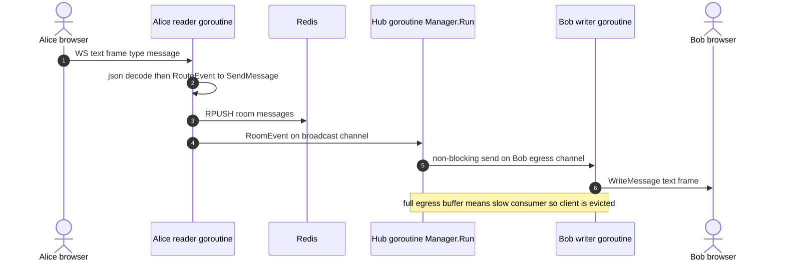
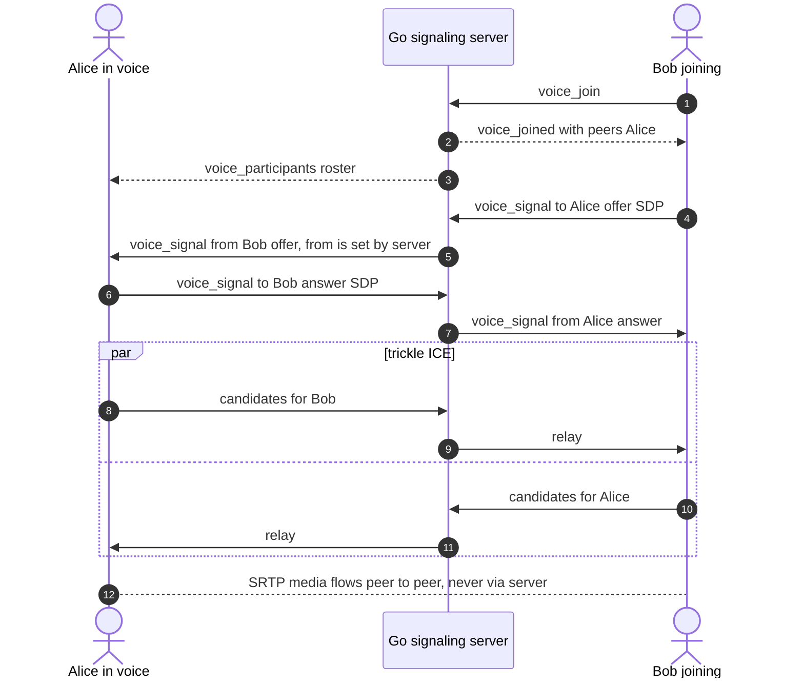

# TTL-Based Temporary Chat System – Architecture

This system implements **ephemeral, TTL-based chat rooms** using **Redis** as the primary datastore and **WebSockets** for real-time messaging.

All rooms, messages, and user memberships automatically expire after a configured TTL.

---

## High-Level Overview

* **Admin** creates a chat room
* A **Room ID** is generated and shared with participants
* Users join the room using the Room ID (and optional password)
* WebSocket connection is established for real-time messaging
* **TTL starts when admin starts chat or first message is sent**
* When TTL expires, **all room data is automatically deleted**

---

## Actors

* **Admin** – Creates and manages the room
* **Client/User** – Joins room and participates in chat
* **Redis** – Stores room metadata, messages, and members
* **WebSocket Server** – Handles real-time messaging

---

## API & Flow

### Step 1: Create Room (Admin)

**Endpoint**

```http
POST /createRoom
```

**Request Body**

```json
{
  "roomName": "string",
  "password": "string"
}
```

**Response**

```json
{
  "roomId": "string"
}
```

* Room is created without TTL initially
* TTL starts when admin starts chat or sends first message

---

### Step 2: Join Room (Client)

**Endpoint**

```http
POST /joinRoom
```

**Request Body**

```json
{
  "roomId": "string",
  "password": "string"
}
```

**Client-Side Session**

```json
{
  "sessionId": "string",
  "userId": "string"
}
```

* `userId` is generated based on username or UUID
* Stored in `localStorage` to persist across reloads

---

### Step 3: WebSocket Connection

**Endpoint**

```http
/ws
```

**Connection Metadata**

```json
{
  "sessionId": "string",
  "userId": "string",
  "socketId": "string"
}
```

* All messages flow through WebSocket
* Server validates room existence and TTL

---

## Redis Data Model

### 1. Room Metadata

```text
room:<roomId>  → HASH
```

```json
{
  "admin": "adminId",
  "roomName": "string",
  "ttl": "time"
}
```

**TTL**

```redis
EXPIRE room:<roomId> <ttl_in_seconds>
```

---

### 2. Room Messages

```text
room:messages:<roomId> → LIST
```

Each entry:

```json
{
  "message": "string",
  "timestamp": "DateTime",
  "userId": "string"
}
```

**TTL**

```redis
EXPIRE room:messages:<roomId> <ttl_in_seconds>
```

---

### 3. Room Members

```text
room:roomUser:<roomId> → SET
```

```text
[userId1, userId2, userId3, ...]
```

**TTL**

```redis
EXPIRE room:roomUser:<roomId> <ttl_in_seconds>
```

---

## TTL Lifecycle

> **Note:** the current code starts the TTL at room creation (`CreateChatRoom` sets `EXPIRE`), and the messages list currently never expires due to a bug. See [docs/01-system-overview.md §7](./docs/01-system-overview.md). The bullets below describe the intended design.

* TTL is **not started at room creation**
* TTL starts when:

  * Admin clicks **Start Chat**, OR
  * First message is sent
* All related keys share the same TTL
* When TTL expires:

  * Room metadata is deleted
  * Messages are deleted
  * User membership is deleted
  * Room becomes inaccessible

---

## Admin Actions

### Delete Room Manually

```redis
DEL room:<roomId>
DEL room:messages:<roomId>
DEL room:roomUser:<roomId>
```

This immediately invalidates the room for all users.

---

## Client-Side Persistence

* `userId` stored in `localStorage`
* Allows session continuity across reloads
* No server-side authentication required (ephemeral design)

---

## Voice & Video Chat (WebRTC)

* Audio/video is **peer-to-peer (full mesh)**; the server never sees media, only relays signaling over the existing `/ws` connection
* Voice roster (incl. mute/camera state) is **in memory only** (not in Redis) and is cleared on disconnect / room expiry
* Max **8** participants per room (mesh cost grows O(n²)); video is capped at 640×360 @ ≤30fps, ~500 kbps per peer
* Each peer connection always negotiates one audio + one video slot; toggling the camera swaps the track (`replaceTrack`) with no renegotiation

| Event (client → server) | Payload | Purpose |
|---|---|---|
| `voice_join` | `""` | Join voice; server replies `voice_joined` with peers to call |
| `voice_leave` | `""` | Leave voice |
| `voice_mute` | `"true"` / `"false"` | Update own mute state |
| `voice_video` | `"true"` / `"false"` | Update own camera state |
| `voice_signal` | `{"to": userId, "data": {...}}` | Relay SDP offer/answer or ICE candidate |

Server → client: `voice_joined`, `voice_participants` (`[{userId, muted, video}]`), `voice_user_left`, `voice_signal` (`from` is set by the server), `voice_error`.

Optional TURN config (frontend `.env`), needed for users behind strict NATs:

```
NEXT_PUBLIC_TURN_URL=turn:turn.example.com:3478
NEXT_PUBLIC_TURN_USERNAME=...
NEXT_PUBLIC_TURN_CREDENTIAL=...
```

Microphone/camera access requires HTTPS (or `localhost`).

---

## Architecture Deep Dive

Full docs are in [`docs/`](./docs/README.md), with 79 Mermaid sequence diagrams covering every flow:

| Doc | Covers |
|---|---|
| [01 · System overview](./docs/01-system-overview.md) | Components, API, auth, Redis model, room/TTL lifecycle, end-to-end message flow |
| [02 · WebSocket architecture](./docs/02-websocket-architecture.md) | Handshake, frames, heartbeats, close codes, hub pattern, fan-out, slow consumers, reconnects, CSWSH, WS auth |
| [03 · Goroutines & concurrency](./docs/03-goroutines-and-concurrency.md) | Scheduler + netpoller, goroutine/channel inventory, locking, concurrency hazards and fixes, 1M-connection memory math |
| [04 · WebRTC signaling](./docs/04-webrtc-signaling.md) | SDP/ICE/STUN/TURN/DTLS-SRTP, signaling protocol, glare, `replaceTrack` camera toggle, mesh vs SFU vs MCU |
| [05 · Scaling to millions](./docs/05-scaling-to-millions.md) | Stateless gateways, pub/sub fan-out, room sharding, ordering, reconnect storms, multi-region, SFU + TURN fleets, roadmap |
| [06 · Interview guide](./docs/06-interview-guide.md) | Pitch, system-design walkthrough, 60+ Q&A, gotchas, cheat sheet, whiteboard drills |

### Backend in one picture: goroutines per message

Each WebSocket connection gets two goroutines: a reader, which runs the event handlers, and a single writer, which owns the socket for writes. One hub goroutine (`Manager.Run`) handles register, unregister and broadcast.



### WebRTC signaling in one picture

The server only relays signaling messages. Audio and video go peer-to-peer.



### Scaling path (summary)

1. **Fix the bugs:** WS auth, exact-match origin allow-list, message TTL, no hub self-send, client reconnect with backoff.
2. **Run multiple instances:** stateless WS gateways plus Redis pub/sub fan-out, with presence and voice roster moved out of process memory.
3. **Shard rooms:** consistent hashing of rooms onto owner shards, per-room sequence numbers, resumable reconnect.
4. **Media through an SFU:** LiveKit, mediasoup or Pion, with simulcast and a coturn TURN fleet with ephemeral credentials.
5. **Go multi-region:** geo routing, a home region per room, cascaded SFUs.

Details, capacity math and trade-offs are in [docs/05](./docs/05-scaling-to-millions.md).

---

## Key Design Principles

* ⚡ **O(1) Redis access**
* 🧹 **Automatic cleanup via TTL**
* 🔒 **No permanent data storage**
* 🚀 **Real-time messaging with WebSockets**
* 🧠 **Simple, scalable, and stateless backend**

---
