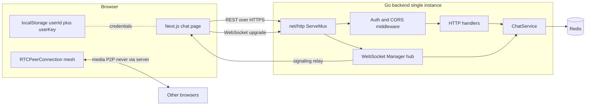
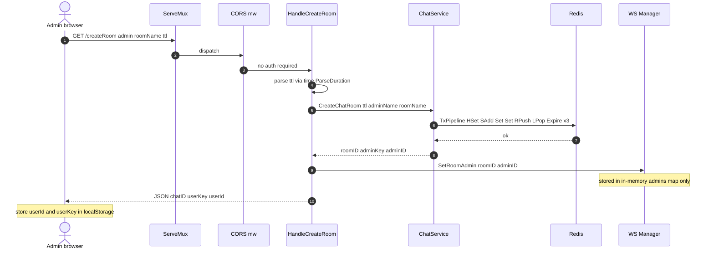
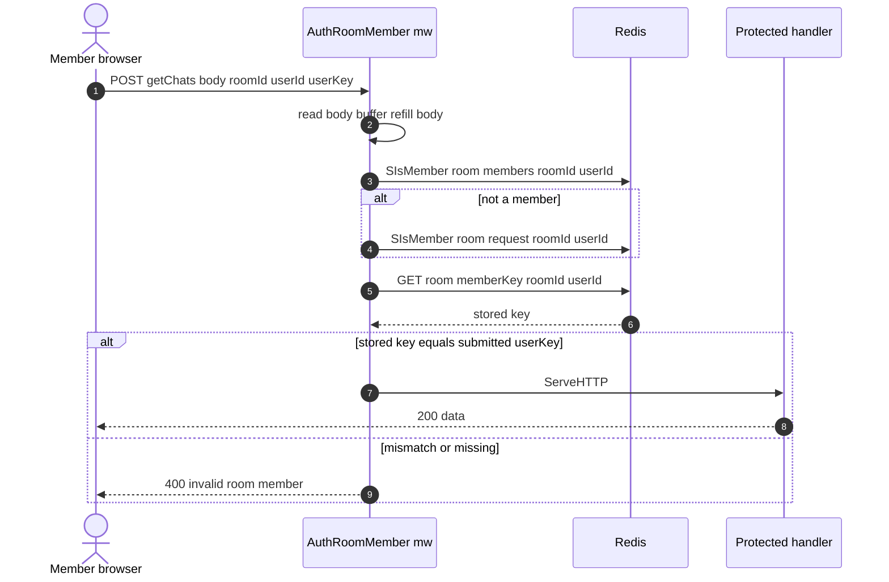
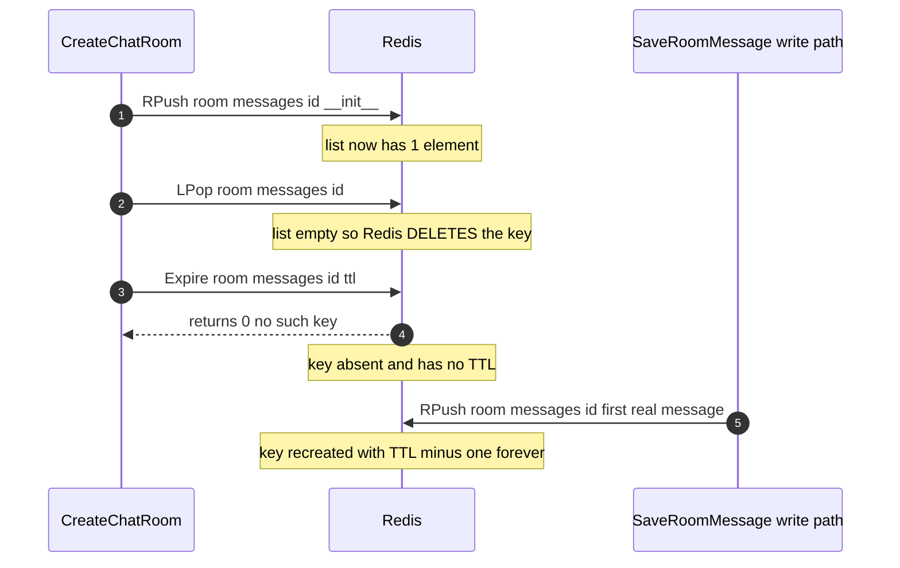
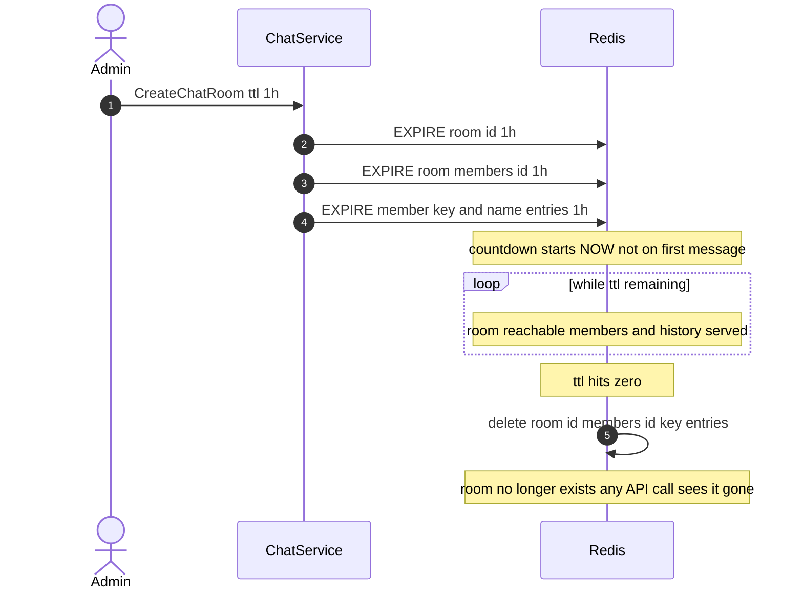
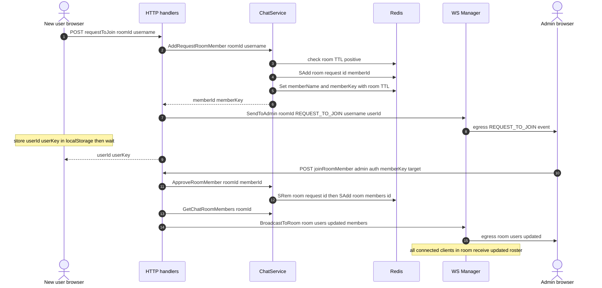
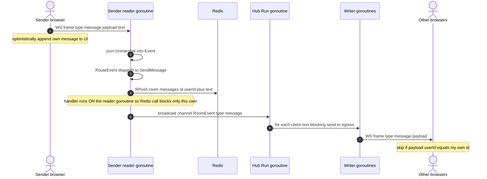
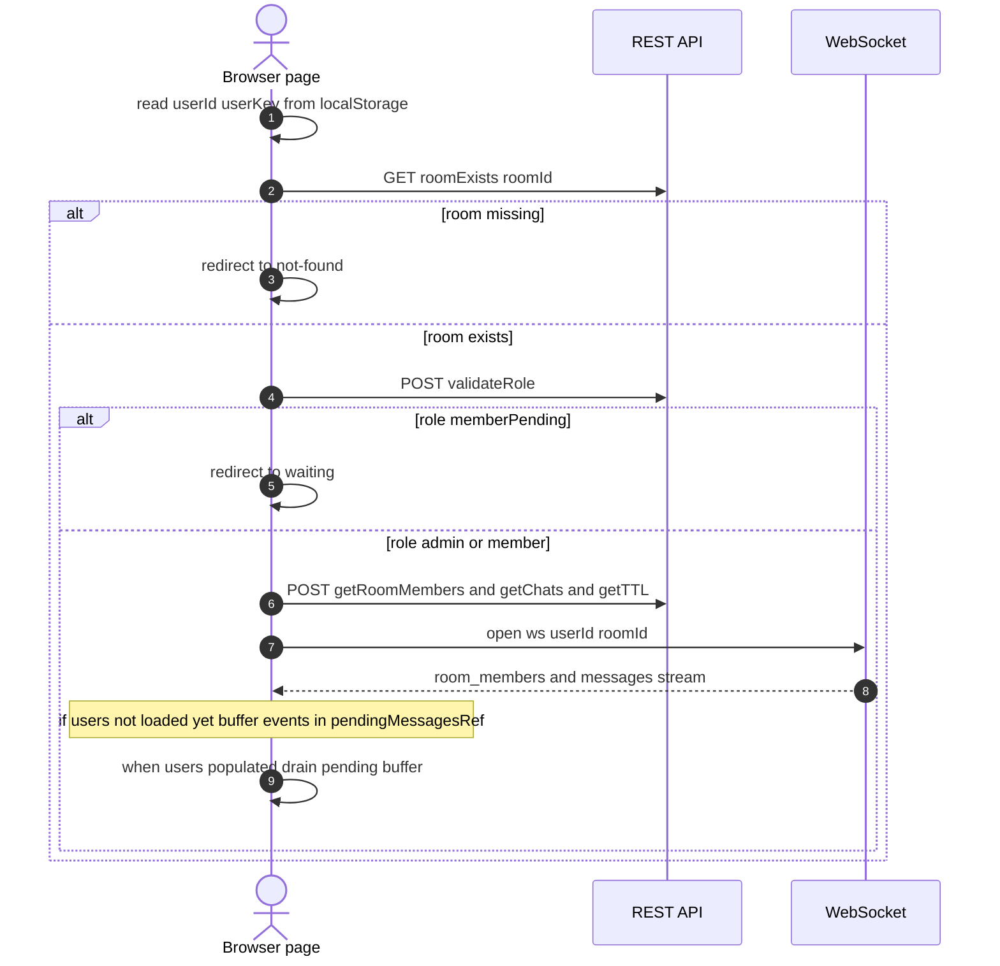
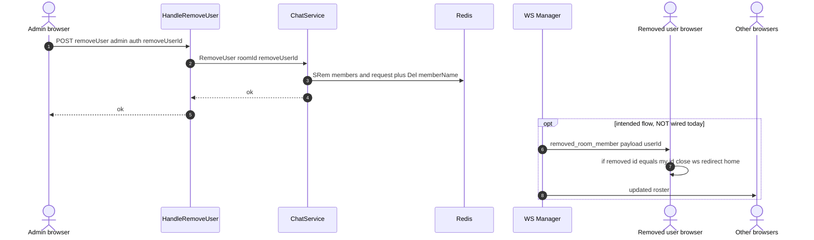
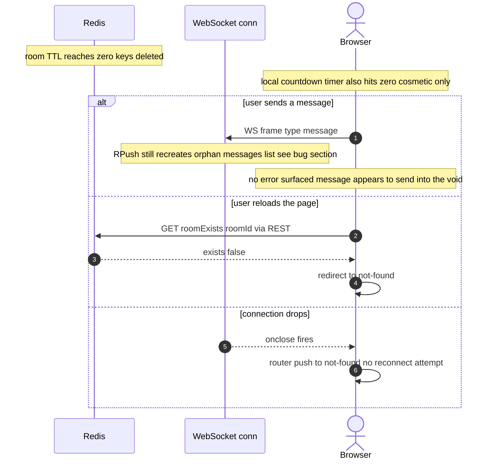

# 01 — System Overview

> Part of the TTL-Based Chat documentation set.
> Next: [WebSocket architecture](./02-websocket-architecture.md) ·
> [Goroutines and concurrency](./03-goroutines-and-concurrency.md) ·
> [WebRTC signaling](./04-webrtc-signaling.md) ·
> [Scaling to millions](./05-scaling-to-millions.md) ·
> [Interview guide](./06-interview-guide.md)

This document is the ground-level map of the system: what it is, why it is built
this way, and how a request actually travels through the code. Everything here is
checked against the source, not the top-level `README.md`. Where the code and the
README disagree, the code wins and the disagreement is called out explicitly.

Audience: engineers preparing for senior real-time-systems interviews. The goal is
not just "what the system does" but "why these trade-offs, and what breaks."

---

## 1. What the system is

A **TTL-based ephemeral chat system**. Admins create a room, share the room ID,
members request to join, the admin approves, and everyone chats over WebSockets in
real time. Rooms also support **WebRTC voice and video** in a full-mesh topology
where the server never touches media — it only relays signaling.

The defining property is **ephemerality**:

- No user accounts, no passwords, no database of record.
- Identity is a short random `userId` plus a `userKey` secret stored in the
  browser's `localStorage`.
- All room state lives in **Redis with a TTL**. When the TTL expires, Redis deletes
  the keys and the room simply stops existing.

Think of it as a disappearing conference room. You get a door code, you talk, and
when the timer runs out the room is gone with everything in it.

### Design goals (and the non-goals)

| Goal | How it shows up in the code |
|---|---|
| Zero-signup, instant rooms | `/createRoom` returns a room ID plus admin credentials in one GET call |
| Automatic cleanup | Every Redis key is created with `EXPIRE`; no cron, no janitor process |
| Real-time text | One WebSocket per client, a central in-process hub fans messages out |
| Real-time voice/video | WebRTC full mesh P2P, server is signaling-only |
| Simple, stateless-ish backend | Business state in Redis, only live connection state in memory |

**Non-goals** (important to state, because interviewers probe them): durable message
history, delivery guarantees, horizontal scale-out of the WebSocket layer, strong
authentication, and multi-region. The current code is a single-instance design. How
to lift each of these limitations is the subject of
[05-scaling-to-millions.md](./05-scaling-to-millions.md).

---

## 2. Component topology

This is one of the few places a static diagram earns its keep.



Read it as three planes:

1. **REST control plane** — create room, join, approve, fetch members/history/TTL.
   Stateless request/response, one goroutine per request (net/http default).
2. **WebSocket data plane** — the live message stream and all voice signaling. One
   long-lived connection per client, owned by the in-memory hub.
3. **WebRTC media plane** — audio/video packets flow browser-to-browser. The server
   is deliberately *not* on this path.

The split matters: control-plane calls are cheap and bursty, the data plane is
long-lived and stateful, and the media plane is where bandwidth lives. Keeping media
off the server is what lets a tiny box host a video call at all.

---

## 3. Tech stack and why

| Layer | Choice | Why this choice |
|---|---|---|
| Backend language | **Go 1.22** | Cheap goroutines map naturally to "one reader + one writer per connection"; the runtime's epoll-based netpoller makes 10k+ idle connections affordable |
| HTTP router | **net/http `ServeMux`** | Zero dependencies, enough for a dozen routes; no framework magic to explain in an interview |
| WebSocket lib | **gorilla/websocket** | De-facto standard, gives raw control of read/write deadlines, ping/pong, and buffer sizes |
| Datastore | **Redis (go-redis v9)** | TTL is a first-class feature (`EXPIRE`), O(1) hash/set/list ops, and `EXPIRE` *is* the cleanup mechanism — no separate deletion job |
| Frontend | **Next.js 16 (App Router), React 19** | Fast page bootstrap, client components for the live socket, easy Vercel deploy |
| HTTP client | **axios** | Simple promise API for the REST bootstrap sequence |
| Media | **WebRTC (browser native)** | P2P audio/video with no media server; the backend only shuffles SDP and ICE |

The through-line: pick tools where the hard part (connection fan-out, TTL cleanup,
NAT traversal) is handled by the runtime, Redis, or the browser — not by hand-rolled
code. The backend stays small.

Entry point is `backend/cmd/server/main.go`, which calls
`internal/app/app.go` `Run()`. `Run()` wires Redis, the `ChatService`, the WebSocket
`Manager`, the handlers and middleware, registers routes on a `ServeMux`, starts the
hub with `go WSmanager.Run()`, and blocks in `http.ListenAndServe`.

---

## 4. The HTTP request lifecycle on net/http

Three mechanics are worth understanding because they repeat across every handler.

**1. ServeMux dispatch.** `app.go` registers routes. Some are bare
`HandleFunc` (public), others are wrapped in auth middleware via `mux.Handle(path,
middleware.AuthX(http.HandlerFunc(handler)))`. The whole mux is then wrapped once in
the `CORS` middleware. So the outermost layer is always CORS, then (optionally) auth,
then the handler.

**2. The body re-read pattern.** This appears in nearly every handler and in the auth
middleware. The problem: `r.Body` is an `io.ReadCloser` that can only be read once.
Auth middleware needs the body (to read `roomId`/`userId`/`userKey`), and so does the
handler behind it. The fix used everywhere:

```go
bodyBytes, _ := io.ReadAll(r.Body)
defer r.Body.Close()
r.Body = io.NopCloser(bytes.NewBuffer(bodyBytes)) // refill for the next reader
var req SomeRequest
json.Unmarshal(bodyBytes, &req)
```

Read the body into memory, then replace `r.Body` with a fresh reader over the same
bytes so the next layer can read it again. It is a common and legitimate pattern, but
note the cost: the body is fully buffered in memory and parsed twice (once in
middleware, once in the handler). For small JSON bodies this is fine. A cleaner
alternative is to parse once in the middleware and pass the parsed struct down via
`context.Context` — worth mentioning if an interviewer asks how you'd tidy it.

**3. One goroutine per request.** `net/http` spawns a goroutine per incoming request.
Handlers that call Redis block that goroutine on the network, which is fine — the Go
scheduler parks it and runs others. The only shared mutable state a handler touches
is the WebSocket `Manager` (e.g. `HandleCreateRoom` calls `wsManager.SetRoomAdmin`,
`HandleJoinRoom` calls `wsManager.BroadcastToRoom`), and those methods take the
manager's lock. This cross-plane locking from HTTP goroutines is a real concurrency
concern — see [03-goroutines-and-concurrency.md](./03-goroutines-and-concurrency.md).

Here is the create-room flow end to end, showing dispatch, the service pipeline, and
the hub call.



Notice `/createRoom` is a **GET** that mutates state and returns secrets in the
response body. That is unusual (GETs should be safe/idempotent) and the credentials
end up in query strings and server logs. Flagged under Known gaps.

### 4.1 HTTP API reference

All routes are declared in `internal/app/app.go`. Handlers live in
`internal/handler/handler.go`; auth in `internal/middlewares/middleware.go`.

| Method | Path | Auth | Purpose |
|---|---|---|---|
| GET | `/health` | none | Liveness probe |
| GET | `/createRoom?admin=&roomName=&ttl=` | none | Create a room; returns `chatID`, `userKey`, `userId`; `ttl` is a Go duration like `1h`; also calls `SetRoomAdmin` |
| GET | `/roomExists?roomId=` | none | Returns `exists` and `roomName` |
| POST | `/requestToJoin` | none | Create a pending member; pushes `REQUEST_TO_JOIN` to the admin via the hub |
| POST | `/joinRoomMember` | admin | Approve a pending member; broadcasts `room_users_updated` |
| POST | `/getRequestMembers` | admin | List pending join requests |
| POST | `/getRoomMembers` | member | List approved members |
| POST | `/validateRole` | member | Returns `admin`, `member`, or `memberPending` |
| POST | `/getTTL` | member | Remaining room TTL as a string |
| POST | `/getChats` | member | Full message history for the room |
| POST | `/removeUser` | admin | Remove a member from the room |
| POST | `/saveMessage` | member | REST message save (chat normally goes over WS instead) |
| POST | `/send`, `/getChatAdmin` | mixed | Legacy/aux endpoints |
| GET | `/ws?userId=&roomId=` | **none at upgrade** | WebSocket endpoint |

The important asymmetry: REST endpoints are guarded by `userKey`/`adminKey`
middleware, but **the WebSocket upgrade is not**. `/ws` trusts whatever `userId` and
`roomId` arrive in the query string. See the auth section and
[02-websocket-architecture.md](./02-websocket-architecture.md).

---

## 5. The auth model

There are no sessions and no JWTs. On room creation (admin) or approval (member) the
server generates two random strings via `lib.RandomString`:

- `userId` — an 8-character public identifier.
- `userKey` — a 12-character secret.

Both are returned to the browser and stored in `localStorage`. On every protected
REST call the client sends `roomId`, `userId`, and `userKey` in the JSON body. The
middleware validates them against Redis:

- **Member** (`AuthRoomMemberMiddleware` → `ValidateRoomMember`): the `userId` must be
  in `room:members:<roomId>` **or** `room:request:<roomId>`, and the stored secret at
  `room:memberKey:<roomId>:<userId>` must equal the submitted `userKey`.
- **Admin** (`AuthAdminMiddleware` → `ValidateAdminKey`): compares the submitted
  `adminKey` against `room:memberKey:<roomId>:<adminId>`. (Note: the function name
  says "admin key" but it reads the per-member key entry, not a separate
  `room:adminKey:<roomId>` — that admin-key entry is written at creation but not what
  gets checked. Harmless today, confusing later.)



### Trade-offs of this model

**Why it exists:** it matches the ephemeral design. No account system, no password
reset, no email. A room is a capability — holding the `userKey` *is* the
authorization. When the room's TTL expires, the keys vanish and access is revoked for
free.

**What it costs:**

- `localStorage` is readable by any script on the page, so an XSS bug leaks the
  secret. There is no `HttpOnly` cookie protection.
- The secret is a bearer token with no rotation and no revocation short of removing
  the user or letting the room expire.
- The WebSocket upgrade does not check `userKey` at all — knowing a `userId` and
  `roomId` is enough to open a socket and impersonate that user on the data plane.
- CORS is set to `Access-Control-Allow-Origin: "*"` (with a stray trailing space in
  the header value), so any origin can call the REST API.

For an ephemeral toy/demo this is a reasonable simplification. For anything real you
want the key out of `localStorage` (or at least a short-lived signed token), the
WebSocket upgrade validated, and a tight CORS allow-list. These fixes are detailed in
[02-websocket-architecture.md](./02-websocket-architecture.md) and
[05-scaling-to-millions.md](./05-scaling-to-millions.md).

---

## 6. The Redis data model

All keys are namespaced by room ID. The room ID is `time.Now().UnixNano()` as a
string, generated in `CreateChatRoom`.

| Key | Type | Written by | TTL at creation? | Access complexity |
|---|---|---|---|---|
| `room:<id>` | HASH `{roomName, adminId}` | `CreateChatRoom` | yes, `EXPIRE ttl` | `HSet`/`HGet` O(1) |
| `room:members:<id>` | SET of userIds | `CreateChatRoom`, `ApproveRoomMember` | yes, `EXPIRE ttl` | `SAdd`/`SIsMember`/`SRem` O(1), `SMembers` O(N) |
| `room:request:<id>` | SET of pending userIds | `AddRequestRoomMember` | **no EXPIRE set** | same as above |
| `room:memberName:<id>:<uid>` | STRING username | create / request | yes, `Set` with ttl | `Get`/`Set` O(1) |
| `room:memberKey:<id>:<uid>` | STRING secret | create / request | yes, `Set` with ttl | `Get`/`Set` O(1) |
| `room:adminKey:<id>` | STRING admin secret | `CreateChatRoom` | yes, `Set` with ttl | O(1) (written, not read by auth) |
| `room:messages:<id>` | LIST of JSON strings | WS `SaveRoomMessage` (`RPush`) | **broken — see below** | `RPush`/`LRange` O(1)/O(N) |

Why these types:

- **HASH** for room metadata groups related fields under one key with O(1) field
  access and a single `EXPIRE`.
- **SET** for membership gives O(1) "is this user a member?" (`SIsMember`), which is
  exactly the auth hot path, plus natural dedup.
- **STRING** per-user for name and key gives O(1) lookup by `(room, user)` without
  scanning a hash. The downside is key sprawl: a 50-person room has ~100 of these
  little keys. For millions of rooms that is a lot of keys — a hash per room would be
  denser. A reasonable trade for simplicity at this scale.
- **LIST** for messages gives O(1) append (`RPush`) and ordered read (`LRange 0 -1`).
  History is bounded by the room TTL rather than trimmed, so there is no `LTRIM`.

### 6.1 Request-set TTL gap

`room:request:<id>` never gets an `EXPIRE`. Its *entries* are indirectly bounded —
the per-user name/key strings inside it do expire — but the set key itself can
outlive the room's intended lifetime if nobody is ever approved or removed. In
practice the room hash expiring is what signals "room gone," so this is a minor leak,
but it is a real inconsistency worth noting.

### 6.2 The messages-TTL bug (verified)

This is the single most interesting correctness bug in the codebase and a great
interview talking point because it hinges on exact Redis semantics.

**What the code does at room creation** (`CreateChatRoom`, in the `TxPipeline`):

```go
pipe.RPush(ctx, messageKey, "__init__") // push a placeholder
pipe.LPop(ctx, messageKey)              // immediately pop it
pipe.Expire(ctx, messageKey, ttl)       // try to set TTL on the list
```

The intent was clearly "create the list key and stamp a TTL on it up front." But:

1. `RPush` creates the list with one element.
2. `LPop` removes that element. **A Redis list with zero elements is deleted
   automatically** — an empty aggregate type does not exist as a key.
3. `Expire` now runs against a key that no longer exists, so it returns `0` (no key to
   expire) and does nothing.

Net result at creation: `room:messages:<id>` **does not exist** and has **no TTL**.

**What the write path does** (`internal/websocket/event.go`, `SaveRoomMessage`):

```go
pipe := m.rdb.Client.Pipeline()
pipe.RPush(context.Background(), key, data)
// pipe.Expire(context.Background(), key, ttl)  <-- COMMENTED OUT
pipe.Exec(context.Background())
```

The first real message `RPush` *recreates* the key — but with **no TTL** (`TTL` would
report `-1`, "exists, no expiry"). The `Expire` line is commented out, so the write
path never stamps a TTL either.

**Consequence:** every room's message list leaks. The room hash, members, and keys all
expire on schedule and the room becomes inaccessible, but the orphaned
`room:messages:<id>` list lives forever, slowly filling Redis. (Independently
verified against Redis: after this sequence, `EXPIRE` returns `0` and `TTL` returns
`-1`.)



**The fix.** Apply the TTL after each append, in the same pipeline that writes the
message, so the list is always re-stamped to the room's remaining lifetime:

```go
func SaveRoomMessage(m *Manager, roomID string, msg ChatMessage) error {
    key := "room:messages:" + roomID
    data, err := json.Marshal(msg)
    if err != nil {
        return err
    }

    ctx := context.Background()
    // Mirror the room's remaining TTL so messages die with the room.
    ttl, err := m.rdb.Client.TTL(ctx, "room:"+roomID).Result()
    if err != nil || ttl <= 0 {
        ttl = time.Hour // sensible fallback if the room has no TTL
    }

    pipe := m.rdb.Client.Pipeline()
    pipe.RPush(ctx, key, data)
    pipe.Expire(ctx, key, ttl) // re-stamp on every write
    _, err = pipe.Exec(ctx)
    return err
}
```

And drop the pointless `RPush __init__; LPop` dance from `CreateChatRoom` — you cannot
hold a TTL on an empty list, so there is nothing to initialize. Let the first message
create the key, and let `SaveRoomMessage` own the TTL. (This file documents the bug
only; applying the change is a code edit, not part of this doc task.)

---

## 7. Room and TTL lifecycle (as the code actually works)

**README claims:** TTL starts when the admin "starts chat" or the first message is
sent.

**The code does the opposite.** `CreateChatRoom` sets `EXPIRE ttl` on the room hash,
members set, and the per-user keys **at creation time**, inside the transaction
pipeline. The `ttl` comes straight from the `?ttl=` query param. There is no
"start chat" trigger anywhere in the backend. The countdown begins the instant the
room is created.

This is a meaningful difference. A room created with `ttl=1h` dies one hour after
creation whether anyone ever joins or speaks. If the admin creates a room and then
spends 50 minutes sharing the link and waiting for people, the actual usable window is
10 minutes. The README's "TTL starts on first message" would be friendlier, but it is
not what runs.

The frontend reads remaining TTL once via `/getTTL`, parses the Go duration string
(e.g. `59m59s`) into seconds, and runs a local 1-second countdown timer. The client
clock is cosmetic; Redis is the source of truth and the key simply disappears when it
hits zero.



---

## 8. Request-to-join and admin approval

Joining is a two-step handshake: a prospective member registers a *pending* identity,
the admin sees a live notification, and approval promotes them from the request set to
the members set.



Two things to notice:

- `SendToAdmin` looks up the admin's live client in the in-memory `admins` and
  `clients` maps. If the admin is **not currently connected** (e.g. the server
  restarted and lost the maps, or the admin's tab is closed), the request event is
  silently dropped — the admin never learns someone wants in. The pending member sits
  in `room:request:<id>` and can only be discovered when the admin reloads and calls
  `/getRequestMembers`.
- `HandleJoinRoom` calls `BroadcastToRoom` **directly from the HTTP goroutine**, not
  through the hub's channel. That means an HTTP request goroutine takes the manager's
  read lock and iterates the room — a second entry point into shared state besides the
  hub. More on why that is risky in
  [03-goroutines-and-concurrency.md](./03-goroutines-and-concurrency.md).

---

## 9. Sending a message end to end

Text chat does **not** go through REST in normal operation. The client sends a WS
frame; the server persists it to Redis and fans it out to the room.

The envelope on the wire is always `{"type": string, "payload": string}`. The payload
is itself a string, so when it carries structured data it is JSON encoded *inside*
that string — double-encoded. The outbound chat event wraps
`{"userId": "...", "payload": "<text>"}` as a JSON string in the payload field.



Key properties and the reasoning:

- **The handler runs on the sender's own reader goroutine.** `RouteEvent` is called
  inline inside `ReadMessages`. So the Redis `RPush` happens on that goroutine. Good:
  different users' messages are handled in parallel, each on its own goroutine. Bad: a
  slow Redis stalls *that user's* reads (including their pings), and there is no
  `context` timeout on the Redis call — it uses `context.Background()`.
- **Persist-then-broadcast.** The message is written to Redis first, then pushed to
  the hub's `broadcast` channel. The hub's single `Run` goroutine drains the channel
  and calls `BroadcastToRoom`, which does a **non-blocking** send to each client's
  64-slot `egress` channel. A client whose egress is full gets evicted
  (`go m.removeClient(client)`).
- **Each connection has exactly one writer goroutine.** gorilla/websocket forbids
  concurrent writes to a connection, so every client has a dedicated `WriteMessages`
  goroutine that is the sole writer, selecting over `egress` and a ping ticker.
- **Sender dedup is client-side.** The sender appends its own message to the UI
  immediately (optimistic), and when the broadcast echoes back the frontend drops any
  `message` whose `userId` equals its own. There is no server-side "don't echo to
  sender" logic.

The full connection/goroutine model is the subject of
[02-websocket-architecture.md](./02-websocket-architecture.md) and
[03-goroutines-and-concurrency.md](./03-goroutines-and-concurrency.md).

---

## 10. Frontend bootstrap (page load)

When a user opens `/chat/<roomId>`, the page runs a careful sequence before it will
open a socket. The ordering matters: the socket must not be opened until the user's
role is known, and incoming messages must not be processed until the member roster is
loaded (otherwise messages can't be attributed to names).

Steps, from `frontend/app/chat/[roomId]/page.tsx`:

1. Read `userId` and `userKey` from `localStorage`. If missing, show the join modal.
2. `GET /roomExists`. If the room is gone, redirect to a not-found page.
3. `POST /validateRole`. Branch on the result: `admin`/`member` continue;
   `memberPending` redirects to a waiting page; empty role shows the join modal.
4. Once `role` is set, fetch in a second effect: `/getRequestMembers` (admins only),
   `/getRoomMembers`, `/getChats`, `/getTTL`. The members response fills both a plain
   list and a `Map<userId, user>` ref used to resolve names.
5. Only after role is known does a third effect open the WebSocket to
   `/ws?userId=&roomId=` (swapping `http`→`ws` on the backend URL).

The subtle part is the **pending-message buffer**. The socket can connect and start
delivering events before the `/getRoomMembers` response lands. If a message arrives
while `usersRef.current.length === 0`, it is pushed into `pendingMessagesRef` instead
of being processed. A `useEffect` keyed on `users` drains that buffer once the roster
is populated. This prevents the race where an early message can't be mapped to a
sender name.



---

## 11. Removing a user

An admin can evict a member. The REST side updates Redis; the live side must also tell
everyone and kick the removed user's socket.



Note the gap: `RemoveUser` in the service only edits Redis. The `removed_room_member`
broadcast and socket teardown live in the manager method `RemoveUserFromRoom`, which
is **not called** from `HandleRemoveUser` in the current wiring — and that method has
its own deadlock bug (an early `return` while holding the write lock). So today a
removed user loses REST access (their membership is gone) but their WebSocket may stay
open until the next ping failure, and the "you were removed" redirect may not fire
server-side. The frontend does handle `removed_room_member` if it arrives. This is
tracked in Known gaps and dissected in
[03-goroutines-and-concurrency.md](./03-goroutines-and-concurrency.md).

---

## 12. TTL expiry — what a client sees

There is no server push on expiry. Redis deletes the keys lazily/actively, and clients
discover the room is gone on their next interaction.



The honest summary: expiry is **not** cleanly signaled on the live channel. A user
mid-session after expiry keeps a working-looking socket (the connection object is
still open) until they reload or the connection drops. On `ws.onclose` the frontend
immediately redirects to not-found and does **not** try to reconnect — so any
transient network blip looks identical to room death to the user.

---

## 13. Design decisions and trade-offs

**Redis TTL as the cleanup engine.** The best decision in the system. There is no
deletion job, no scanning for stale rooms, no reaper goroutine. You set `EXPIRE` once
and Redis guarantees the data is gone. The cost is that *everything* that should die
with the room must be created with a matching TTL — and the one place this was done
wrong (the messages list) is exactly where the leak is. The pattern is only as good as
its weakest key.

**In-process hub for fan-out.** A single `Manager` holds all live connections and a
`Run` goroutine fans messages to per-connection `egress` channels. This is simple,
fast (no network hop for fan-out), and easy to reason about on one box. The trade-off
is that it is fundamentally single-instance: the hub's maps are in local memory, so
two backend instances cannot see each other's connections. Scaling past one box
requires a shared backplane (Redis Pub/Sub or a stream) — see
[05-scaling-to-millions.md](./05-scaling-to-millions.md).

**Server as signaling-only for media.** WebRTC full mesh keeps all audio/video
browser-to-browser. The server relays a few kilobytes of SDP and ICE and never sees a
media packet. This is why a tiny instance can host a video call. The cost is that mesh
is O(n²) in connections and each peer uploads n−1 copies of its stream, which is why
the room is capped at 8 participants. Beyond ~6–8, you need an SFU (media server),
which is a completely different cost and ops profile — covered in
[04-webrtc-signaling.md](./04-webrtc-signaling.md).

**Capability-based auth over accounts.** `userId` + `userKey` in `localStorage` is a
perfect fit for throwaway rooms: nothing to manage, revocation-by-expiry for free. The
cost is weak security (bearer token in JS-readable storage, unauthenticated WS
upgrade, wildcard CORS). Fine for a demo, not for production.

**Mixed concurrency model (channels + mutex).** The hub communicates via channels
(the actor style, "share memory by communicating"), but handlers and HTTP goroutines
also lock the manager's embedded `sync.RWMutex` directly. Two coordination mechanisms
for the same state is a smell: it is why `HandleJoinRoom` can broadcast from an HTTP
goroutine and why there are self-send and lock-ordering hazards. The clean version
picks one owner. Full analysis in
[03-goroutines-and-concurrency.md](./03-goroutines-and-concurrency.md).

**Double-encoded WS envelope.** `{"type", "payload"}` with payload-as-string is simple
to route (type switch on a string) but forces nested JSON to be stringified, which is
awkward and error-prone (every structured payload is parsed twice). A typed envelope
with a `json.RawMessage` payload would be cleaner. The current form is fine for a
handful of event types.

---

## 14. Known gaps

These are real, verified issues. They are excellent interview material because each
has a clear root cause and a concrete fix. The concurrency ones are expanded in
[03-goroutines-and-concurrency.md](./03-goroutines-and-concurrency.md); security and
scale in [05-scaling-to-millions.md](./05-scaling-to-millions.md).

1. **Messages never expire** (Section 6.2). `LPOP` deletes the empty list so the
   creation-time `EXPIRE` no-ops, and the write path's `Expire` is commented out. The
   `room:messages:<id>` list leaks forever. Fix: stamp TTL on every `RPush`.

2. **README/TTL mismatch** (Section 7). TTL starts at creation, not on first message.
   Either fix the README or defer the first `EXPIRE` until the room goes active.

3. **`room:request:<id>` has no TTL** (Section 6.1). Minor leak of the pending-request
   set key.

4. **Unauthenticated WebSocket upgrade.** `/ws` trusts `userId`/`roomId` from the
   query string with no `userKey` check. Anyone who knows the IDs can connect and
   impersonate. Fix: validate the key (or a short-lived signed ticket) during upgrade,
   and don't put long-lived secrets in query strings (proxies log them).

5. **Wildcard CORS and loose origin check.** REST allows `*` (with a stray trailing
   space in the header). The WebSocket `checkOrigin` is fail-open (allows empty origin
   and allows everything if the env var is unset) and uses a prefix match, so a
   lookalike like `https://app.example.com.evil.com` passes. Fix: exact-match
   allow-list.

6. **Admin notifications are lost on restart.** The `admins` and `clients` maps are
   in-memory. A restart (e.g. a free-tier instance spinning down) empties them, so
   `SendToAdmin` can't find the admin and `REQUEST_TO_JOIN` events vanish until a
   reload. Fix: persist admin identity in Redis (it already is, in the room hash) and
   look it up there, or rebuild the map on reconnect.

7. **`RemoveUserFromRoom` deadlock and the removal gap** (Sections 11). The manager's
   eviction method takes the write lock and returns early without unlocking when the
   room is missing, and it closes `egress` while a writer may still send on it. It is
   also not wired into `HandleRemoveUser`, so eviction only updates Redis today.

8. **Self-send hub stall and slow-consumer eviction gap** (Section 9). The hub pushes
   onto its own `broadcast` channel from inside `addClient`/`removeClient`; under a
   burst that can block the hub on itself. Slow clients are evicted with
   `go m.removeClient` but their connection/egress aren't closed there, leaking a
   writer goroutine until ping failure.

9. **`/createRoom` is a state-mutating GET returning secrets.** Secrets land in query
   strings and logs. Should be a POST with the body carrying inputs and the response
   carrying credentials over TLS.

10. **No `-race` verification in this environment.** The race detector could not run
    here (no cgo). The concurrency hazards above are from reading the code; confirming
    them under load wants `go test -race` and a stress harness.

---

Continue to [02-websocket-architecture.md](./02-websocket-architecture.md) for the
connection lifecycle, the hub's channels and locks, and the per-connection goroutine
model.
