# 02 · WebSocket Architecture

> Part of the TTL-based chat architecture series.
> See also: [01 · System Overview](./01-system-overview.md) · [03 · Goroutines and Concurrency](./03-goroutines-and-concurrency.md) · [04 · WebRTC Signaling](./04-webrtc-signaling.md) · [05 · Scaling to Millions](./05-scaling-to-millions.md) · [06 · Interview Guide](./06-interview-guide.md)

This document explains the real-time transport layer of the system: the WebSocket protocol itself at senior/staff depth, then exactly how *this* Go server (`backend/internal/websocket/`) implements a hub, a reader/writer goroutine pair per connection, and room fan-out. It is written for engineers prepping for senior real-time-systems interviews, so it goes heavy on the *why* and the *trade-offs*, and it calls out the real bugs in this codebase as study material.

Code under discussion:

- `backend/internal/websocket/manager.go` — the hub (`Manager`), `ServeWS`, `Run`, `addClient`, `removeClient`, `BroadcastToRoom`, `SendToAdmin`, `RemoveUserFromRoom`, `checkOrigin`.
- `backend/internal/websocket/client.go` — `Client`, `ReadMessages`, `WriteMessages`, `pongHandler`, timeouts.
- `backend/internal/websocket/event.go` — the `Event` envelope, `RouteEvent` registry, `SendMessage`, `SaveRoomMessage`.
- `backend/internal/websocket/voice.go` — voice signaling handlers (covered in depth in [04](./04-webrtc-signaling.md); referenced here for the event table).
- `frontend/app/chat/[roomId]/page.tsx` — the browser side: `new WebSocket(...)`, `ws.onmessage`, `ws.onclose`.
- `backend/internal/app/app.go` — wiring: `go WSmanager.Run()` is started once.

---

## 1. Why WebSocket at all

A chat room needs **server push**: when Alice sends a message, Bob must see it without asking. Plain HTTP is request/response — the client speaks first, the server answers, the connection is done. There is no way for the server to initiate. Everything else is a workaround for that one limitation.

### 1.1 The options, ranked by how much they fight HTTP

| Technique | How push works | Latency | Overhead per message | Bidirectional | Connections held open | Notes |
|---|---|---|---|---|---|---|
| Short polling | Client re-requests every N seconds | Up to N seconds | Full HTTP request + response headers every poll | No (client pulls) | None (new request each time) | Simple, but wasteful and laggy. 1000 clients polling every 2s = 500 req/s of mostly-empty responses. |
| Long polling | Client requests, server **holds** the request until it has data, then responds, client immediately re-requests | Near-real-time on delivery, but a gap between responses | One full HTTP round trip **per message batch** | No | One per client while hanging | Better latency, but each message still pays HTTP header cost and you reconnect constantly. Head-of-line issues. |
| Server-Sent Events (SSE) | One long-lived HTTP response, server streams `text/event-stream` chunks | Real-time | Tiny per event (just the event framing) | **No** — server to client only | One per client | Great for feeds/notifications. Auto-reconnect + `Last-Event-ID` built in. But the client can only talk back over a *separate* HTTP request. Text only. Limited by browser per-domain connection caps on HTTP/1.1. |
| WebSocket | One TCP connection, upgraded once, then full-duplex frames | Real-time | ~2–14 bytes of frame header per message | **Yes** | One per client | Full-duplex, binary or text, low overhead. You own the protocol on top. No built-in reconnect/auth — you build those. |

For a chat with voice signaling you need the client to send (chat messages, SDP offers, ICE candidates, mute toggles) *and* the server to push (new messages, roster changes, relayed signals) over the **same** low-latency pipe. That is exactly full-duplex, so WebSocket is the right primitive. SSE would force signaling replies onto a second channel; long polling would add a round trip per signal, which is fatal for ICE where candidates trickle in fast.

The honest trade-off: WebSocket gives you a raw duplex byte pipe and **nothing else**. No reconnect, no delivery guarantees, no auth, no backpressure, no message framing above the WS frame. Every one of those is your job. Most of this document is about the pieces this server built and the pieces it skipped.

### 1.2 Why not just HTTP/2 or HTTP/3 streams?

Interviewers like this follow-up. HTTP/2 has server push (now largely deprecated) and multiplexed streams, but there is no browser API to do arbitrary bidirectional messaging over an HTTP/2 stream from JavaScript — `fetch` streams are half-duplex in practice. WebSocket remains the portable browser primitive for duplex. (WebTransport over HTTP/3 is the emerging answer and is worth mentioning, but it is not what this codebase uses.)

---

## 2. The upgrade handshake

A WebSocket connection *starts life as an HTTP/1.1 request* and is then "upgraded" in place. The same TCP socket is reused; only the protocol spoken over it changes.

The client sends a normal `GET` with special headers:

```
GET /ws?userId=abc&roomId=xyz HTTP/1.1
Host: api.example.com
Upgrade: websocket
Connection: Upgrade
Sec-WebSocket-Key: dGhlIHNhbXBsZSBub25jZQ==
Sec-WebSocket-Version: 13
Origin: https://app.example.com
```

The server, if it accepts, replies:

```
HTTP/1.1 101 Switching Protocols
Upgrade: websocket
Connection: Upgrade
Sec-WebSocket-Accept: s3pPLMBiTxaQ9kYGzzhZRbK+xOo=
```

The magic is `Sec-WebSocket-Accept`. The server takes the client's `Sec-WebSocket-Key`, concatenates the fixed GUID `258EAFA5-E914-47DA-95CA-C5AB0DC85B11`, SHA-1 hashes it, and base64-encodes the result. This is **not** security — the GUID is public. It only proves the server actually understood the WebSocket handshake and is not some cache or proxy blindly echoing headers. It prevents a confused intermediary from accidentally "succeeding."

After the `101`, there is no more HTTP. Both sides now speak the WebSocket **framing protocol** over the same socket.

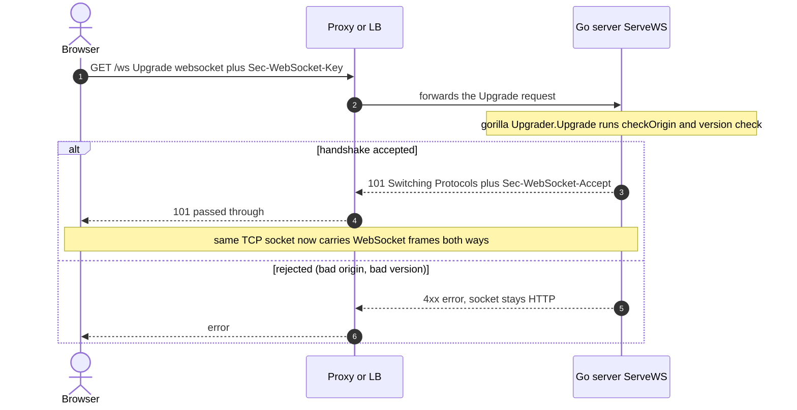

In this server the whole handshake is one line in `ServeWS` (`manager.go`):

```go
conn, err := websocketUpgrader.Upgrade(w, r, nil)
```

The `websocketUpgrader` is configured with `CheckOrigin: checkOrigin`, `ReadBufferSize: 1024`, `WriteBufferSize: 1024`. Those 1 KB buffers matter for memory math at scale — see [03 · Goroutines and Concurrency](./03-goroutines-and-concurrency.md).

---

## 3. The frame format

Once upgraded, every message is wrapped in a **frame**. You rarely touch this directly (gorilla does it), but senior interviews probe it.

A frame header is 2 to 14 bytes:

```
 0                   1                   2                   3
 0 1 2 3 4 5 6 7 8 9 0 1 2 3 4 5 6 7 8 9 0 1 2 3 4 5 6 7 8 9 0 1
+-+-+-+-+-------+-+-------------+-------------------------------+
|F|R|R|R| opcode|M| Payload len |    Extended payload length    |
|I|S|S|S|  (4)  |A|     (7)     |             (16/64)           |
|N|V|V|V|       |S|             |                               |
| |1|2|3|       |K|             |                               |
+-+-+-+-+-------+-+-------------+-------------------------------+
|     Masking-key (if MASK set, 4 bytes)        | Payload Data  |
+-----------------------------------------------+---------------+
```

Key fields:

- **FIN (1 bit)** — is this the last fragment of a message? A single logical message can be split across multiple frames (fragmentation). FIN=1 means "message complete."
- **Opcode (4 bits)** — what kind of frame:
  - `0x1` text (UTF-8) — this server sends these: `WriteMessage(websocket.TextMessage, data)`.
  - `0x2` binary.
  - `0x8` close.
  - `0x9` ping.
  - `0xA` pong.
  - `0x0` continuation (part of a fragmented message).
- **MASK (1 bit)** and **Masking-key (4 bytes)** — see below.
- **Payload length** — a clever variable encoding: 7 bits if the payload is ≤125 bytes; if the 7-bit value is `126`, the next 2 bytes are the real length (up to 64 KB); if `127`, the next 8 bytes are the real length (up to 2^63). This keeps small messages small — a one-byte chat message has a tiny header — while still allowing huge payloads. (It also means a malicious client can *claim* a huge length, which is why read limits exist — section 6.)

### 3.1 Why client-to-server frames must be masked

Every frame **from a browser client** must set MASK=1 and XOR its payload with a random 4-byte key. Server-to-client frames must **not** be masked. This asymmetry looks weird until you know the history.

The threat is **cache poisoning on transparent proxies**. Before WebSocket was widely understood, a malicious page could open a raw-looking connection and craft bytes that an unaware HTTP proxy might interpret as a *second* HTTP request (request smuggling), poisoning a shared cache for other users. Masking with a per-frame random key means the attacker cannot control the exact bytes on the wire, so they cannot reliably forge a cacheable HTTP request. The server unmasks before reading. It is defense against intermediaries, not against the server. (Interview soundbite: "masking is anti-cache-poisoning for proxies, not confidentiality — use `wss` for confidentiality.")

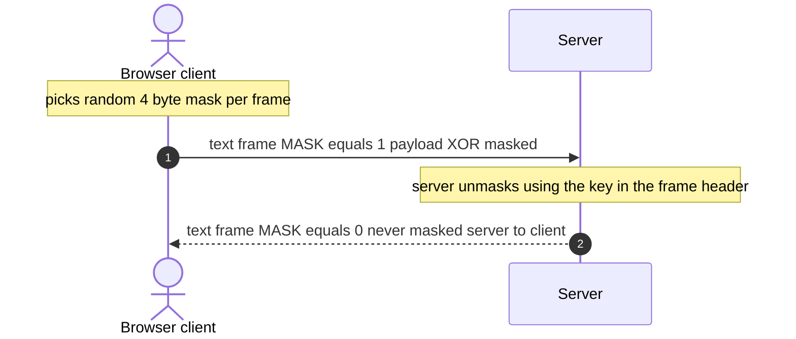

---

## 4. Control frames: ping, pong, close

Three opcodes are **control frames**: close (`0x8`), ping (`0x9`), pong (`0xA`). Rules the spec imposes:

- Control frames may be injected **in the middle** of a fragmented data message.
- They must be ≤125 bytes and must not be fragmented.
- A ping **must** be answered with a pong carrying the same payload.

gorilla handles pong replies to incoming pings automatically. This server uses ping/pong as a **heartbeat**, covered in section 7.

---

## 5. The close handshake and close codes

A clean shutdown is a two-way exchange, like a TCP FIN handshake. One side sends a close frame (opcode `0x8`) with a 2-byte status code and optional reason; the peer echoes a close frame; then the TCP socket closes.

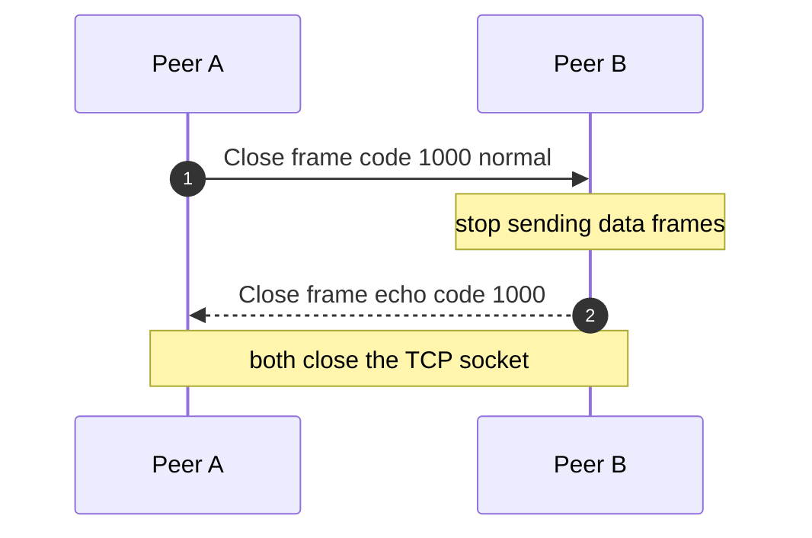

Close codes worth knowing (and tied to this codebase):

| Code | Meaning | Where it matters here |
|---|---|---|
| 1000 | Normal closure | The intended case when a user leaves. |
| 1001 | Going away (tab closed, server shutdown) | Browser reload/close fires this. gorilla's `IsUnexpectedCloseError` treats 1001 as *expected* in `ReadMessages`. |
| 1006 | Abnormal closure, **no close frame seen** | TCP died, proxy idle-timeout killed it, network dropped. You never get a clean close. This is the one that forces you to rely on heartbeats. Also treated as expected by this server's error filter. |
| 1008 | Policy violation | Good code to send when you reject on auth/origin (this server does not currently use it — it just rejects the HTTP upgrade). |
| 1009 | **Message too big** | Peer sent a frame larger than the receiver's read limit. **Directly relevant:** this server sets `SetReadLimit(maxMessageSize)` and `maxMessageSize` was raised from 512 B to 32 KB. See section 6. |

In `client.go`, `WriteMessages` writes a close frame when the egress channel is closed:

```go
case message, ok := <-c.egress:
    if !ok {
        if err := c.connection.WriteMessage(websocket.CloseMessage, nil); err != nil {
            log.Println("conection closed : ", err)
        }
        return
    }
```

Note it sends an **empty** close message (no code). A more correct implementation sends `websocket.FormatCloseMessage(websocket.CloseNormalClosure, "")` so the peer learns *why*. Minor, but interviewers notice.

---

## 6. The read limit: the 512 B → 32 KB fix and code 1009

`client.go`:

```go
const maxMessageSize = 32 * 1024
...
c.connection.SetReadLimit(maxMessageSize)
```

`SetReadLimit` tells gorilla the maximum message size it will accept. If a peer sends more, gorilla returns an error and (per the WebSocket spec) the connection should be closed with code **1009 (message too big)**.

Why this constant changed matters. The original value was **512 bytes**, which is fine for chat text. But this app relays **WebRTC SDP offers/answers** over the same socket (see [04](./04-webrtc-signaling.md)). An SDP blob is typically **2–6 KB**, and once it is JSON-encoded *and* wrapped in the double-encoded payload envelope (section 9), it grows further. At 512 bytes every voice join would hit the read limit, the read loop would error out, and the connection would die — voice would appear totally broken while chat worked.

Raising it to 32 KB fixes voice while still bounding memory: a malicious client cannot force the server to buffer megabytes per frame. The comment in the code says exactly this:

```go
// WebRTC SDP offers/answers are typically 2-6 KB (more once JSON-escaped),
// so the limit must comfortably exceed that.
```

Trade-off: too low breaks real traffic (voice); too high lets one client pin a lot of memory and makes a cheap DoS. 32 KB is a reasonable middle for "chat text + SDP." If you later send larger payloads, raise it *and* reconsider whether those payloads belong on the signaling socket at all.

---

## 7. Heartbeats: ping 9s, pongWait 10s, and why ping < pongWait

TCP can die silently. A yanked network cable, a laptop sleeping, a proxy quietly dropping an idle connection — none of these necessarily deliver a close frame. You get a **1006** at best, often nothing until a write fails much later. So you cannot trust "the socket is open" to mean "the peer is alive." You need an application-level heartbeat.

This server's heartbeat (`client.go`):

```go
var (
    pongWait     = 10 * time.Second
    pingInterval = (pongWait * 9) / 10   // = 9 seconds
)
```

How it works:

1. On connect, `ReadMessages` sets a read deadline: `SetReadDeadline(now + pongWait)`. If nothing arrives within 10s, `ReadMessage` returns a timeout error and the read loop exits — the connection is torn down.
2. `WriteMessages` runs a ticker every `pingInterval` (9s) and sends a `PingMessage`.
3. A healthy client's WebSocket stack auto-replies with a pong.
4. The server's `pongHandler` fires and **pushes the read deadline forward** another 10s:

```go
func (c *Client) pongHandler(pongMsg string) error {
    return c.connection.SetReadDeadline(time.Now().Add(pongWait))
}
```

So the server pings at 9s, expects a pong before the 10s deadline, and if it arrives, resets the clock. **The invariant is `pingInterval < pongWait`.** If ping ≥ pongWait, the read deadline would expire *before* you ever send the next ping, and every healthy connection would be killed as a false positive. The 9/10 ratio leaves a 1-second budget for round-trip + jitter. (In production over the public internet, these values are aggressive — 10s is tight for a mobile client on a bad link. A common choice is pong wait ~60s, ping ~54s. Tighter detection costs more wakeups and more false kills; looser detection means dead connections linger. This app chose fast detection, which pairs well with ephemeral rooms.)

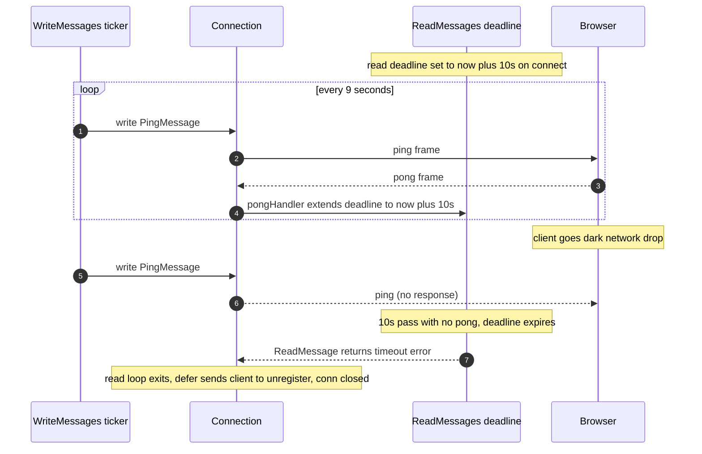

This is the only reliable way the server learns about **1006**-style silent death. Without it, a crashed browser would hold a goroutine, an egress buffer, and a room slot indefinitely.

---

## 8. The hub (Manager) pattern

The server uses the classic **hub** (sometimes "actor") pattern. One `Manager` owns all connection state; connections talk to it through channels.

`Manager` fields (`manager.go`):

```go
type Manager struct {
    clients    ClientList            // userId -> *Client  (GLOBAL across rooms)
    rooms      map[string]ClientList // roomId -> (userId -> *Client)
    admins     map[string]string     // roomId -> adminUserId (in memory only)
    register   chan *Client          // buffer 64
    unregister chan *Client          // buffer 64
    broadcast  chan RoomEvent        // buffer 128
    sync.RWMutex                     // embedded
    handlers   map[string]EventHandler
    voice      map[string]map[string]*voiceMember
    rdb        *db.RedisClient
}
```

`Run` is started **once** in `app.go`:

```go
go WSmanager.Run()
```

and loops forever selecting over the three channels:

```go
func (m *Manager) Run() {
    for {
        select {
        case client := <-m.register:
            m.addClient(client)
        case client := <-m.unregister:
            m.removeClient(client)
        case msg := <-m.broadcast:
            m.BroadcastToRoom(msg.RoomID, msg.Event)
        }
    }
}
```

The *idea* of the hub is beautiful: a single goroutine owns the maps, so register/unregister/broadcast are serialized and you never race on the maps. "Share memory by communicating."

**But this server does not fully commit to the pattern** — and that is the single most important thing to understand here. It *also* has an embedded `sync.RWMutex`, and lots of code (`addClient`, `removeClient`, the voice handlers, even HTTP handlers via `SendToAdmin`/`RemoveUserFromRoom`) locks the manager directly instead of going through the hub goroutine. So it is a **mixed model**: part actor, part shared-memory-with-locks. That mix is where the bugs live (section 12 and [03](./03-goroutines-and-concurrency.md)).

### 8.1 The Client struct

`client.go`:

```go
type Client struct {
    ID         string            // uuid per connection
    UserID     string            // from query string
    RoomID     string            // from query string
    connection *websocket.Conn
    manager    *Manager
    egress     chan Event        // buffer 64 — per-connection outbound queue
    JoinedAt   time.Time
}
```

`ID` is a per-connection UUID, distinct from `UserID`. That distinction is what makes **stale-connection detection** possible (section 11): two `*Client` with the same `UserID` but different `ID` can coexist briefly during a reload race.

---

## 9. The reader/writer goroutine pair

Each connection gets **exactly two goroutines**, launched in `ServeWS`:

```go
m.register <- client
go client.ReadMessages()
go client.WriteMessages()
```

### 9.1 Why a single writer

gorilla/websocket's contract: **at most one goroutine may write to a connection at a time, and at most one may read.** Concurrent writes corrupt the frame stream (two goroutines interleaving frame bytes = garbage on the wire). So the design is:

- **One reader goroutine** (`ReadMessages`): the only thing that calls `conn.ReadMessage()`.
- **One writer goroutine** (`WriteMessages`): the only thing that calls `conn.WriteMessage()`.

Everything that wants to *send* to a client does **not** write the socket directly — it pushes an `Event` onto `client.egress`, and the single writer goroutine drains that channel and writes. This serializes all writes through one goroutine without any lock on the socket. The channel *is* the lock.

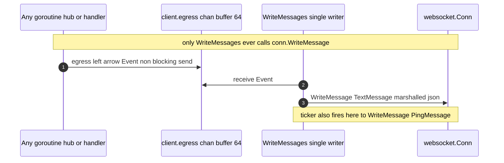

### 9.2 The reader runs handlers inline

`ReadMessages`:

```go
for {
    _, payload, err := c.connection.ReadMessage()
    if err != nil { ... break }

    var request Event
    if err := json.Unmarshal(payload, &request); err != nil {
        log.Println("invalid event payload:", err)
        continue   // tolerate garbage, do NOT break the loop
    }
    if err := c.manager.RouteEvent(request, c); err != nil {
        log.Println("error handling error : ", err)
    }
}
```

Two important design choices:

1. **Malformed frames `continue`, they do not `break`.** One bad JSON payload must not kill the whole connection. Good robustness instinct.
2. **The handler runs on the reader goroutine.** `RouteEvent` → `SendMessage` → `SaveRoomMessage` (a synchronous Redis `RPUSH`) all run *inline on the read loop*. This means handlers for different connections run in parallel (one per connection), which is nice, but a slow Redis stalls *that user's* reads — including their pongs — and no `context` timeout bounds the Redis call. See issue 4 in section 12.

### 9.3 The egress channel as a bounded outbound queue

`egress := make(chan Event, 64)`. This buffered channel is the per-connection send queue. Its depth (64) is a backpressure knob:

- If the writer keeps up, egress stays near-empty.
- If the client is slow (bad network, big burst), events pile up. At 64 it is full.
- A full egress is the signal that this consumer is **too slow** — see fan-out and eviction (section 10).

---

## 10. Fan-out: BroadcastToRoom

When something must reach everyone in a room (a chat message, a roster update), it goes through `broadcast` and ends up in `BroadcastToRoom`:

```go
func (m *Manager) BroadcastToRoom(roomID string, event Event) {
    m.RLock()
    defer m.RUnlock()
    room, ok := m.rooms[roomID]
    if !ok { return }
    for _, client := range room {
        select {
        case client.egress <- event:          // non-blocking send
        default:
            go m.removeClient(client)          // egress full -> evict
        }
    }
}
```

The `select { case ... default: }` is a **non-blocking send**. If a client's egress has room, enqueue. If it is full (slow consumer), do **not** block the whole room on one slow client — instead evict them. This is the key fan-out design decision: **one slow client must never slow down everyone else.**

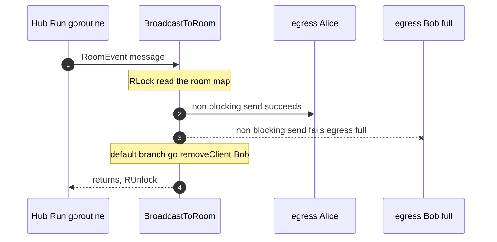

### 10.1 Backpressure options and what this server chose

When a consumer cannot keep up, you have four classic choices. Senior interviews love this list:

| Strategy | What it does | Trade-off |
|---|---|---|
| **Block** | Sender waits until the slow consumer drains | One slow client freezes the whole room. Never do this in fan-out. |
| **Drop** | Silently discard the message for the slow client | Fast, but the client misses data with no signal. Fine for presence/typing, bad for chat. |
| **Evict** (this server) | Kick the slow client entirely | The room stays fast. The slow client must reconnect and resync. Clean, if your client can resync. |
| **Coalesce** | Replace stale queued items with the latest (e.g. keep only newest roster) | Great for *state* events (roster, presence) where only the latest matters. Needs a smarter queue than a plain channel. |
| **Bounded queue + spill** | Keep a deeper ring buffer, maybe to disk/Redis | Absorbs bursts, more memory, more complexity. |

This server **evicts** on a full egress. Reasonable for a chat where the client can refetch via `/getChats`. **But there is a real bug in the eviction path** — see issue 3 below: `go m.removeClient(client)` removes the client from the maps but never closes `egress` or the socket, so the writer goroutine lingers until a ping write finally fails. The eviction is "logical" but not "physical."

---

## 11. Reconnect and stale-connection detection

Reloads and flaky networks produce a nasty race: the **new** connection can register *before* the **old** one's read loop notices it died and unregisters. Without care, the newcomer would be immediately wiped out by the straggler's cleanup. This server handles it with the per-connection `ID` and careful checks.

`removeClient` ignores stale connections:

```go
current, registered := m.rooms[c.RoomID][c.UserID]
if registered && current != c {
    m.Unlock()
    return   // a NEWER *Client is registered under this userId; do not remove it
}
```

`addClient` drops the stale *voice* session of the same user:

```go
if member, ok := m.voice[c.RoomID][c.UserID]; ok && member.client != c {
    staleVoice = m.removeVoiceMemberLocked(c.RoomID, c.UserID, nil)
}
```

So the rule is: **state is keyed by `UserID`, but ownership is checked by pointer identity (`*Client`).** The newest connection wins; an older connection's teardown is a no-op if it is no longer the registered one.

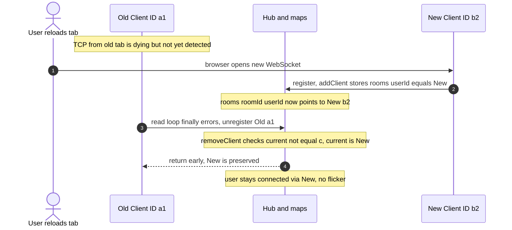

### 11.1 What a robust client reconnect should do (this one does not)

The frontend reconnect story is **weak** and this is excellent interview contrast material. In `frontend/app/chat/[roomId]/page.tsx`:

```js
ws.onclose = () => {
  console.log("WebSocket closed")
  router.push(`${roomId}/not-found`)   // give up, navigate away
}
```

On *any* close — including a transient network blip or a Render free-tier spin-down — the client **gives up and routes to a not-found page**. There is no reconnect at all. A production real-time client should:

1. **Reconnect with exponential backoff + jitter.** Retry after ~1s, 2s, 4s, 8s… capped, each with random jitter so a server restart does not cause a thundering herd of synchronized reconnects.
2. **Resume, do not just reconnect.** Track the last message you saw (a sequence number, or a Redis Streams entry ID) and ask the server for everything after it on reconnect. WebSocket gives **no** delivery guarantee; a message sent while you were disconnected is gone unless you can replay it.
3. **Idempotency.** On resume you may receive a message you already have (at-least-once replay). Tag each message with a stable id and dedupe on the client so replays do not duplicate the UI.

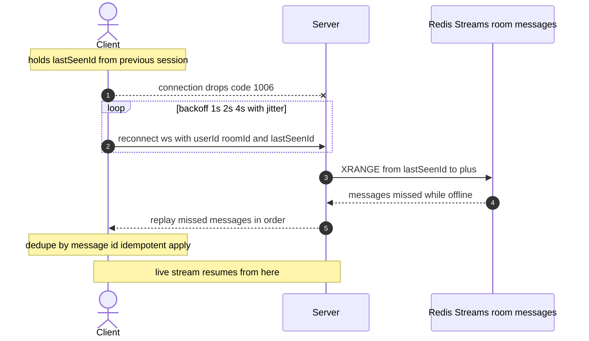

This is the single biggest gap between this toy and a production system, and it is almost entirely a *client* concern plus a *message-id/streams* concern on the server. The server already uses a Redis `LIST` for messages (`room:messages:<id>`); switching to **Redis Streams** would give every message a monotonic ID for free, which is exactly what resume needs. See [05 · Scaling to Millions](./05-scaling-to-millions.md) for the Streams-based fan-out design.

---

## 12. Known concurrency bugs (study these — they are the good interview material)

These are real in the current code. Each is a classic trap. [03 · Goroutines and Concurrency](./03-goroutines-and-concurrency.md) covers them in full depth; summarized here because they are inseparable from the hub design.

### 12.1 Self-send deadlock risk (hub blocks on itself)

`addClient` and `removeClient` run **inside** the `Run` goroutine (the hub). But they push onto `m.broadcast`:

```go
m.broadcast <- RoomEvent{ RoomID: c.RoomID, Event: Event{Type: "room_members", ...} }
m.broadcast <- RoomEvent{ RoomID: c.RoomID, Event: Event{Type: "user_joined", ...} }
```

`m.broadcast` is drained **only by `Run` itself**. So the hub is sending to a channel that only the hub reads — while the hub is busy inside `addClient` and therefore *not* in its `select` draining `broadcast`. This works **only** as long as the 128-slot buffer has room. Under a burst of joins/leaves (e.g. a room filling up fast, or a reconnect storm after a restart), the buffer fills, the send blocks, and because the only drainer is the blocked goroutine itself — **the entire server deadlocks**.

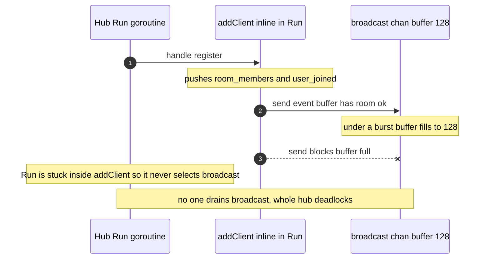

**Fix:** inside the hub, call `BroadcastToRoom` **directly** instead of posting to your own input channel, or run a separate fan-out goroutine that owns `broadcast`. Rule: *a goroutine must never do a blocking send to a channel that only it drains.*

### 12.2 `RemoveUserFromRoom` early-return without Unlock

> Note: nothing calls `RemoveUserFromRoom` today (`HandleRemoveUser` only edits Redis), so these bugs are latent. They will bite the moment someone wires it up, which is the obvious next step for admin kicks.

```go
func (m *Manager) RemoveUserFromRoom(roomId, userId string) {
    m.Lock()
    clients, ok := m.rooms[roomId]
    if !ok {
        return   // <-- returns while STILL HOLDING the lock
    }
    ...
    close(clients[userId].egress)   // closes egress...
    clients[userId].connection.Close()
    ...
    m.Unlock()
    m.broadcast <- ...
}
```

Two bugs: (a) the early `return` on a missing room leaves `m.Lock()` held forever → every future lock attempt deadlocks the server. (b) It `close`s `egress` directly; later a `BroadcastToRoom` or the voice path could `select { case client.egress <- event }` on that **closed** channel → **panic (send on closed channel)**. **Fix:** `defer m.Unlock()`; make a *single* owner responsible for closing egress; guard with `sync.Once` or a `done` channel so no one sends after close.

### 12.3 Eviction leaks the writer goroutine

`BroadcastToRoom`'s eviction does `go m.removeClient(client)`, which deletes the client from the maps but **never closes `egress` or the socket**. The `WriteMessages` goroutine keeps running until its next ping write fails (up to 9s later), and the socket stays open until then. So eviction is logical, not physical, and leaks a goroutine + a socket for seconds under load. **Fix:** have eviction trigger a proper teardown (close the socket / signal the writer via a `done` channel) rather than only unlinking from the maps.

### 12.4 Unbounded, untimed Redis on the read goroutine

`SaveRoomMessage` runs `RPUSH` with `context.Background()` on the reader goroutine. No timeout. A slow or stalled Redis blocks that user's read loop, which blocks their pong processing, which can get them killed by their own heartbeat — a self-inflicted disconnect caused by backend latency. **Fix:** `context.WithTimeout`, and consider moving the write off the read path (enqueue to a persistence worker).

### 12.5 `clients` map is global by `userId`

`clients map[userId]*Client` is **not** scoped per room. If the same `userId` is in two rooms (the app's auth does not prevent this), the two connections collide in `clients`, and `SendToAdmin` / stale detection get confused. **Fix:** key by `(roomId, userId)` or by connection `ID`.

### 12.6 Mixed concurrency model

As noted in section 8, the server uses both the hub channels *and* a shared `RWMutex` that handlers and HTTP goroutines take directly. Two owners of the same state is the root cause of 12.1–12.3. **Pick one owner**: either everything goes through the hub (pure actor, no exported mutex), or everything uses the mutex (no self-sending hub). The cleanest refactor is "hub owns the maps; nobody else locks them; the hub calls `BroadcastToRoom` inline."

### 12.7 In-memory state lost on restart

`rooms`, `voice`, and especially `admins` live only in memory. On a Render free-tier spin-down and restart, `admins` is empty, so `SendToAdmin` can no longer deliver `REQUEST_TO_JOIN` to the admin — new join requests silently vanish. Combined with the client's "give up on close" behavior (section 11.1), a restart is effectively an outage. **Fix:** persist admin/room membership in Redis (it is already partly there) and rebuild in-memory routing lazily on connect. Covered in [05](./05-scaling-to-millions.md).

### 12.8 Run the race detector

The data races implied above (two owners touching the same maps, send-on-closed-channel) are exactly what `go test -race` catches. It could not be run in the authoring environment (no cgo), but it is the first thing to do: `go test -race ./...` plus a load test that joins/leaves rapidly.

---

## 13. Proxies, load balancers, TLS

WebSocket connections are long-lived, which fights a lot of default infrastructure:

- **Idle timeouts.** Load balancers (ALB, nginx, Cloudflare) drop connections idle for N seconds (ALB default 60s). Your heartbeat (section 7) must be **shorter** than the LB idle timeout, or the LB kills your "idle" socket even though the app thinks it is healthy. This app's 9s ping is well under typical LB timeouts, so it is safe there.
- **Upgrade pass-through.** The proxy must forward `Upgrade` and `Connection` headers and support the `101`. nginx needs `proxy_set_header Upgrade $http_upgrade; proxy_set_header Connection "upgrade";` and HTTP/1.1.
- **Buffering.** Proxies that buffer responses break streaming — disable response buffering on the WS route.
- **Sticky sessions.** With more than one backend instance, a WebSocket must stay pinned to the instance that holds its hub state (this server's hub is in-memory and single-node). You either need sticky routing *and* a cross-instance bus (Redis pub/sub) for fan-out, or you move routing state out of memory. This is the heart of [05 · Scaling to Millions](./05-scaling-to-millions.md).
- **TLS / `wss`.** Masking (section 3.1) is anti-proxy-smuggling, **not** confidentiality. For privacy and integrity you need `wss://` (WebSocket over TLS). It also helps with intermediaries that mangle plaintext upgrades. In production, terminate TLS at the LB and keep `wss` end-to-user. (Separately, browsers require a **secure context** — HTTPS or `localhost` — for `getUserMedia`, so voice forces `wss` anyway; see [04](./04-webrtc-signaling.md).)

---

## 14. Origin checking, CSWSH, and this server's weakness

`checkOrigin` (`manager.go`):

```go
func checkOrigin(r *http.Request) bool {
    origin := r.Header.Get("Origin")
    if origin == "" {
        return true   // allow non-browser clients
    }
    frontendURL := os.Getenv("FRONTEND_FULL_URL")
    if frontendURL == "" {
        return true   // FAIL-OPEN if misconfigured
    }
    return strings.HasPrefix(origin, frontendURL)   // PREFIX match
}
```

### 14.1 Why Origin checking matters for WebSocket: CSWSH

**The browser Same-Origin Policy does not stop a cross-origin page from opening a WebSocket to your server.** Unlike `fetch`, a WebSocket from `evil.com` to `api.yourapp.com` is **not** blocked by CORS — the `Access-Control-*` headers simply do not apply to the WS upgrade. Worse, the browser will happily attach the user's **cookies** to that upgrade request if your auth is cookie-based. This is **Cross-Site WebSocket Hijacking (CSWSH)**: `evil.com`, open in another tab, silently opens an authenticated socket to your backend as the logged-in victim.

The *only* thing the server can check at upgrade time to defend against this is the **`Origin` header** (which the browser sets and a page cannot forge). That is why `CheckOrigin` exists and why "CORS protects WebSocket" is **false** — a common interview trap.

### 14.2 The two bugs in this check

1. **Fail-open on misconfiguration.** If `FRONTEND_FULL_URL` is unset, every origin is allowed. A deploy that forgets the env var silently disables origin protection. Should fail **closed**.
2. **Prefix match is exploitable.** `strings.HasPrefix(origin, frontendURL)` means if `FRONTEND_FULL_URL = "https://app.vercel.app"`, then `https://app.vercel.app.evil.com` **passes** (it has the prefix). An attacker registers a lookalike domain and bypasses the check entirely. Also, legitimate Vercel **preview URLs** (`https://app-git-branch-xyz.vercel.app`) are *rejected* because they do not share the prefix — so the check is simultaneously too loose (security) and too tight (dev workflow).

**Fix:** exact-match against an **allow-list** of full origins (prod URL + known preview patterns matched by a stricter rule), and fail **closed** if unset:

```go
allowed := map[string]bool{
    "https://app.example.com": true,
}
return allowed[origin]   // exact match, default deny
```

---

## 15. WebSocket authentication strategies (and this server's gap)

`ServeWS` reads identity straight from the query string with **no verification**:

```go
userId := r.URL.Query().Get("userId")
roomId := r.URL.Query().Get("roomId")
if userId == "" || roomId == "" {
    http.Error(w, "missing params", http.StatusUnauthorized)
    return
}
conn, err := websocketUpgrader.Upgrade(w, r, nil)
```

There is **no check of `userKey`** here. Anyone who knows (or guesses) a `userId` + `roomId` can open a socket and **impersonate** that user — send messages as them, join voice as them, relay signals as them. The HTTP REST endpoints *do* validate `userKey` against `room:memberKey:<roomId>:<userId>` in middleware, but the WebSocket upgrade skips that entirely. This is the most serious security gap in the real-time layer.

### 15.1 The strategies and their trade-offs

| Strategy | How | Pros | Cons |
|---|---|---|---|
| **Cookie / session** | Browser auto-sends the session cookie on the upgrade | Nothing extra for the client; works with existing session infra | **Enables CSWSH** (section 14) unless you *also* check Origin and use SameSite cookies. Cookies on cross-site WS are the classic footgun. |
| **Query token** | Put a token in `?token=...` | Trivial to implement | Query strings are **logged** by proxies, LBs, and access logs. A long-lived secret in a URL leaks. This app does exactly the wrong version: a long-lived `userId`/`userKey` identity in the query string. |
| **One-time ticket** | Client calls an authenticated REST endpoint, gets a short-lived single-use ticket, passes it in the WS query, server validates and burns it | Short-lived + single-use means log leakage is near-harmless; no cookies so no CSWSH via cookies; validated **before** upgrade | One extra round trip; server must store/expire tickets (Redis with a short TTL is perfect here). |
| **First-message auth** | Upgrade first, then the client's first frame is an auth message; server rejects the socket if it is not valid/first | No secret in the URL at all | The socket exists briefly unauthenticated; you must enforce "no other events until authed" and time out silent sockets. |

**Recommended fix for this app:** a **one-time ticket**. The client already has an authenticated REST session (`userKey`); add a `POST /wsTicket` that validates `userKey` and returns a random, single-use, 30-second ticket stored in Redis as `ws:ticket:<ticket> -> userId:roomId` with a TTL. `ServeWS` reads the ticket, does a Redis `GETDEL`, and only upgrades if it resolves to the claimed `userId`/`roomId`. No long-lived secret ever touches a URL or a proxy log, and the ticket is useless after one use or 30 seconds.

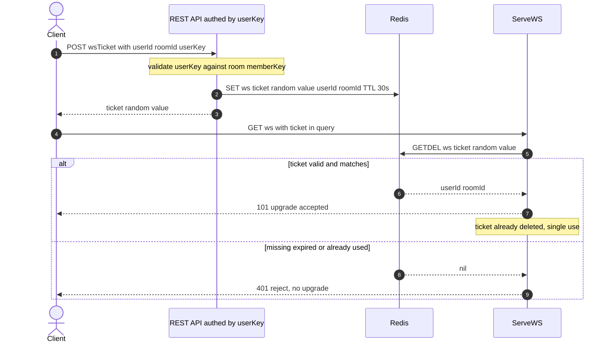

---

## 16. The event envelope and the double-encoded payload trade-off

Every message in or out is the same envelope (`event.go`):

```go
type Event struct {
    Type    string `json:"type"`
    Payload string `json:"payload"`   // <-- a STRING, not json.RawMessage
}
```

`Payload` is a **string**, not a nested object. So when a chat message carries structured data, it gets JSON-encoded, then stuffed into a string field, then the whole envelope is JSON-encoded again — **double encoding**. In `SendMessage`:

```go
res := ChatMessage{ UserID: c.UserID, Message: event.Payload }
payload, _ := json.Marshal(res)          // first encode -> string
roomEvent := Event{ Type: event.Type, Payload: string(payload) }  // string inside string
c.manager.broadcast <- RoomEvent{ RoomID: c.RoomID, Event: roomEvent }
```

On the wire you get something like `{"type":"message","payload":"{\"userId\":\"abc\",\"payload\":\"hi\"}"}` — note the escaped quotes. The frontend then `JSON.parse`s twice (once for the envelope, once for `payload`). You can see this in `page.tsx` where some handlers do `typeof data.payload === "string" ? JSON.parse(data.payload) : data.payload`.

**Trade-off:**

- **Pro:** the envelope is dead simple and uniform — every handler receives `{type, payload:string}` and the transport never needs to know the shape of each event type. New event types do not change the envelope.
- **Con:** double-encoding wastes bytes (escaping), costs an extra parse on both ends, loses type safety (`payload` is "some string, good luck"), and is a frequent source of bugs (forgetting to parse the inner layer, or double-parsing). The voice events compound this: SDP → JSON → string → envelope → JSON.

**Better:** make `Payload` a `json.RawMessage` (Go) so structured data is embedded directly as JSON without re-escaping, and the client parses once. You keep the uniform envelope *and* lose the double encoding. The voice code already uses `json.RawMessage` for `voiceSignalIn.Data`, so the pattern is right there — it just was not applied to the main `Event.Payload`.

### 16.1 RouteEvent: the handler registry

`RouteEvent` is a simple type → handler map (`manager.go` `setupEventHadlers`, `RouteEvent`):

```go
func (m *Manager) RouteEvent(event Event, c *Client) error {
    if handler, ok := m.handlers[event.Type]; ok {
        return handler(event, c, m)
    }
    return errors.New("there is no such event type ")
}
```

Registered handlers:

```go
m.handlers["send_message"] = SendMessage
m.handlers["message"]      = SendMessage   // alias
m.handlers["voice_join"]   = VoiceJoin
m.handlers["voice_leave"]  = VoiceLeave
m.handlers["voice_mute"]   = VoiceMute
m.handlers["voice_video"]  = VoiceVideo
m.handlers["voice_signal"] = VoiceSignal
```

This registry pattern is clean and extensible: add a type, add a handler, done. The signature `func(Event, *Client, *Manager) error` gives every handler the sender, the event, and the hub. The one wart: handlers run **on the reader goroutine** (section 9.2), so a slow handler slows that connection's reads.

---

## 17. The complete WebSocket event table

Direction is relative to the server. "Emitter" is the Go function (or frontend site) that produces the event. `payload` is always a JSON string field in the envelope.

### 17.1 Chat and room events

| Event `type` | Direction | Payload (inside the string) | Emitter |
|---|---|---|---|
| `message` | client → server | the raw message text | frontend `handleSendMessage` in `page.tsx` |
| `message` | server → client | JSON `{userId, payload}` (double-encoded) | `SendMessage` in `event.go`, via `broadcast` → `BroadcastToRoom` |
| `send_message` | client → server | same as `message` (alias) | registered to `SendMessage` in `setupEventHadlers` |
| `room_members` | server → client | JSON array of userIds currently connected in the room | `addClient` / `removeClient` in `manager.go` |
| `user_joined` | server → client | the userId that joined | `addClient` |
| `user_left` | server → client | the userId that left | `removeClient` |
| `room_users_updated` | server → client | JSON array of full user objects | HTTP handler `HandleJoinRoom` calling `BroadcastToRoom` directly (from the HTTP goroutine) |
| `REQUEST_TO_JOIN` | server → admin only | JSON `{userId, username}` | HTTP `HandleRequestToJoin` → `SendToAdmin` |
| `removed_room_member` | server → client | the removed userId | `RemoveUserFromRoom` in `manager.go` (defined but not called today; the frontend handles it) |

### 17.2 Voice / WebRTC signaling events

(See [04 · WebRTC Signaling](./04-webrtc-signaling.md) for the full flow; listed here for completeness.)

| Event `type` | Direction | Payload | Emitter |
|---|---|---|---|
| `voice_join` | client → server | `""` | frontend `useVoiceChat.join` |
| `voice_leave` | client → server | `""` | `useVoiceChat.leave` |
| `voice_mute` | client → server | `"true"` or `"false"` | `useVoiceChat.toggleMute` |
| `voice_video` | client → server | `"true"` or `"false"` | `useVoiceChat.toggleVideo` |
| `voice_signal` | client → server | JSON `{to, data}` where data is an SDP offer/answer or ICE candidate | `useVoiceChat` signaling |
| `voice_joined` | server → joiner | JSON array of `VoiceParticipant` already present (the joiner calls each) | `VoiceJoin` in `voice.go` |
| `voice_participants` | server → room | JSON array of `{userId, muted, video}` (sorted roster) | `VoiceJoin`, `VoiceLeave`, `setVoiceFlag`, `addClient`, `removeClient` |
| `voice_user_left` | server → room | the userId that left voice | `broadcastVoiceLeft` via `VoiceLeave` / `removeClient` |
| `voice_signal` | server → target | JSON `{from, data}` — **`from` set by the server** so clients cannot spoof | `VoiceSignal` in `voice.go` |
| `voice_error` | server → sender | error string, e.g. `"Voice channel is full"` | `VoiceJoin` |

Note the asymmetry: the client sends `voice_signal {to, data}`; the server strips `to`, stamps the authenticated `from`, and forwards `{from, data}`. That server-stamped `from` is a small but real anti-spoofing control — the one place the signaling path *does* enforce identity, in contrast to the unauthenticated upgrade (section 15).

---

## 18. Putting it together: the full connect sequence in this server

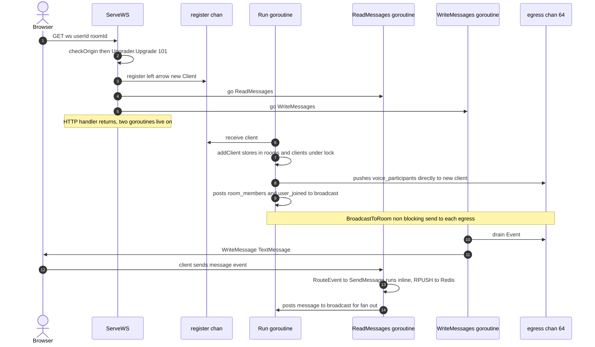

And the disconnect / teardown:

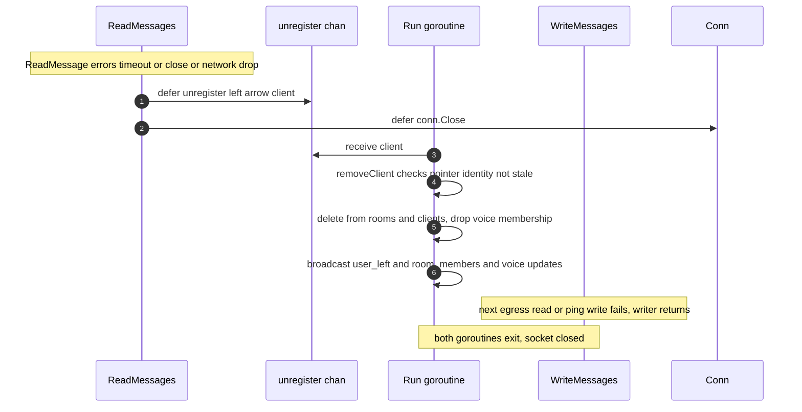

---

## 19. Summary and the senior takeaways

- WebSocket exists because HTTP cannot push. For a duplex workload (chat + signaling) it is the right primitive; SSE and long polling each lose on bidirectionality or latency.
- The handshake is HTTP/1.1 `Upgrade` → `101`; the `Sec-WebSocket-Accept` SHA-1+GUID dance proves protocol understanding, not security.
- Framing: FIN + opcode + variable length; **client→server frames are masked** to stop proxy cache poisoning, not for confidentiality — that is `wss`.
- This server's design is a textbook **hub + per-connection reader/writer pair + buffered egress**. The single-writer rule is why egress exists. Fan-out is non-blocking with **slow-consumer eviction**.
- Heartbeats (ping 9s < pongWait 10s) are the only defense against **1006** silent death; the read limit (32 KB, raised from 512 B) is tied to SDP size and code **1009**.
- The design is a **mixed** actor/mutex model, and that mix is the source of the real bugs: a **self-send hub deadlock**, an **unlock-less early return**, a **leaky eviction**, and an **unauthenticated upgrade** vulnerable to impersonation and (via a weak prefix origin check) **CSWSH**.
- The strongest, concrete improvements: **ticket-based WS auth**, **exact-match fail-closed origin allow-list**, **direct in-hub broadcast** (no self-send), **single owner for channel close**, **context timeouts on Redis**, and a **resumable reconnect** built on Redis Streams message IDs.

Continue to [03 · Goroutines and Concurrency](./03-goroutines-and-concurrency.md) for the goroutine accounting, the netpoller, and the C10K/C1M memory math, and to [05 · Scaling to Millions](./05-scaling-to-millions.md) for the distributed, multi-node version of this hub.
