# 03 — Goroutines, Threading, and Concurrency

> Audience: engineers preparing for senior/staff real-time-systems interviews.
> This file is the concurrency deep-dive for the TTL chat backend. It explains
> the Go runtime model, maps every goroutine and channel in this server, and
> then does an honest teardown of the concurrency hazards in the current code —
> with reproductions, root-cause analysis, and corrected Go.

Related docs:

- [01 — System Overview](./01-system-overview.md)
- [02 — WebSocket Architecture](./02-websocket-architecture.md)
- [04 — WebRTC Signaling](./04-webrtc-signaling.md)
- [05 — Scaling to Millions](./05-scaling-to-millions.md)
- [06 — Interview Guide](./06-interview-guide.md)

Code under discussion:

- `backend/internal/app/app.go` — `Run()` wires the server and starts the hub.
- `backend/internal/websocket/manager.go` — `Manager`, `ServeWS`, `Run`, `addClient`, `removeClient`, `BroadcastToRoom`, `SendToAdmin`, `RemoveUserFromRoom`.
- `backend/internal/websocket/client.go` — `Client`, `ReadMessages`, `WriteMessages`, `pongHandler`.
- `backend/internal/websocket/event.go` — `SendMessage`, `SaveRoomMessage`.
- `backend/internal/websocket/voice.go` — voice signaling handlers.

---

## 1. The Go runtime model in plain terms

If you take one idea away: **a goroutine is not an OS thread**. It is a cheap,
user-space unit of work that the Go runtime multiplexes onto a small pool of OS
threads. That single fact is what makes "one goroutine per connection" a sane
design in Go when it would be reckless in a thread-per-connection C server.

### 1.1 Goroutines vs OS threads

| Property | OS thread | Goroutine |
|---|---|---|
| Created by | kernel (`clone`/`CreateThread`) | Go runtime (`go` keyword) |
| Initial stack | ~1–8 MB fixed (guard pages) | ~2–8 KB, grows/shrinks on demand |
| Scheduling | preemptive, kernel scheduler | cooperative + preemptive, Go scheduler in user space |
| Context switch | ~1–2 µs, kernel trap, TLB effects | ~tens of ns, just a few register saves |
| How many feasible | thousands before memory/scheduler pain | millions |

The expensive thing about a thread is not the CPU to run it — it is the memory
for its stack and the kernel bookkeeping to schedule it. A million threads at
1 MB each is a terabyte of stack reservation. A million goroutines at 4 KB is
~4 GB, and most of that is lazily paged. This is the whole game.

### 1.2 The G-M-P scheduler

Go's scheduler has three entities:

- **G** — a goroutine (its stack, instruction pointer, and state).
- **M** — a "machine", i.e. an OS thread. Ms are what the kernel actually runs.
- **P** — a "processor", a scheduling context that owns a run queue of Gs. The
  number of Ps is `GOMAXPROCS` (defaults to the number of CPU cores).

The rule: **an M must hold a P to run Go code.** A G runs on an M, which is
bound to a P. Each P has a local run queue of runnable Gs plus there is a global
run queue. When a P's local queue empties, it **steals** half the Gs from
another P's queue (work-stealing) so cores stay busy.

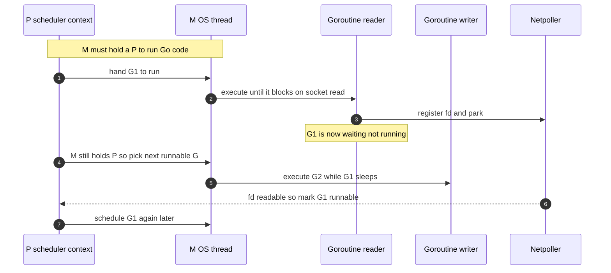

The key move is step 5–7: when `G1` blocks on a socket read, it does **not**
block the M. The runtime parks `G1`, hands its fd to the netpoller, and the M
picks up another runnable G. One OS thread keeps thousands of connections busy.

### 1.3 Growable stacks

A goroutine starts with a tiny contiguous stack (historically 2 KB, often
treated as 2–8 KB in practice once a real call chain exists). On function entry
the compiler inserts a cheap stack-bounds check; if the goroutine needs more, the
runtime allocates a bigger stack, copies the frames over, and fixes up pointers
("stack growth"). Stacks also shrink during GC when they are mostly unused.

Why this matters for us: a WebSocket reader goroutine that is parked waiting for
the next frame holds almost nothing — a few KB. That is the per-connection
memory floor, and it is why we can keep a huge number of idle connections.

### 1.4 The netpoller (epoll / kqueue)

Blocking I/O in Go looks synchronous but is asynchronous underneath. When
`conn.ReadMessage()` (gorilla) calls into `net.Conn.Read`, and the socket has no
data, the runtime does **not** make a blocking `read(2)` syscall that pins the
thread. Instead:

1. The fd is in non-blocking mode and registered with the OS readiness API
   (`epoll` on Linux, `kqueue` on BSD/macOS, IOCP on Windows).
2. The runtime **parks** the goroutine (state goes to waiting) and returns the M
   to run other Gs.
3. When the kernel reports the fd is readable, the **netpoller** (a runtime
   component polled by the scheduler and by a dedicated poller) marks the
   goroutine runnable again.
4. A P eventually schedules it, the `Read` returns the bytes, and from the
   goroutine's point of view it simply "woke up with data".

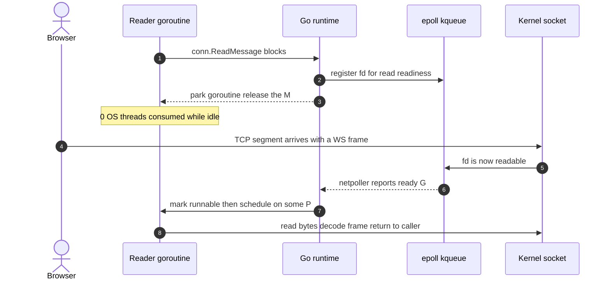

**This is the answer to the classic interview question "how do you handle a
million idle connections?"** Each connection costs a parked goroutine plus a
kernel socket; the netpoller watches all of them with one epoll instance and
wakes only the ones that have data.

### 1.5 Why goroutine-per-connection is viable — and its limits

Viable because:

- Idle goroutines are nearly free (small parked stacks, no OS thread held).
- The blocking programming model (`for { ReadMessage() }`) is simple to reason
  about yet runs on an event loop underneath.

Limits (the honest part):

- **Memory is still real.** Goroutine stacks, gorilla's per-connection read and
  write buffers, and our 64-slot `egress` channel all add up. See the
  back-of-the-envelope math in §9.
- **GC scan cost grows with live heap and goroutine count.** A million
  goroutines means a million stacks the GC may need to scan; keep per-connection
  heap allocations low.
- **A single process has one `epoll` and `GOMAXPROCS` Ps.** Fan-out to all
  clients is still O(number of clients) work on some goroutine; a hot broadcast
  path can bottleneck a core even if connections are cheap. That pushes you
  toward sharding — see [05 — Scaling to Millions](./05-scaling-to-millions.md).
- **File descriptors are a hard OS limit.** `ulimit -n` and ephemeral port /
  conntrack limits bite long before memory on a default box.

---

## 2. Goroutine inventory of this server

Here is every goroutine this backend creates, who starts it, and who ends it.
Cite these by name in an interview — specificity reads as seniority.

| Goroutine | Started by | Count | Ends when |
|---|---|---|---|
| `main` / `ListenAndServe` | `app.Run()` via `log.Fatal(http.ListenAndServe(...))` | 1 | process exit (it never returns normally) |
| HTTP request handler | `net/http` server, one per accepted request | 1 per in-flight HTTP request | handler returns (`/createRoom`, `/joinRoomMember`, `/ws` upgrade, etc.) |
| Hub `Run` | `go WSmanager.Run()` in `app.Run()` | 1 for the whole process | never (infinite `for { select }`), dies with the process |
| Per-connection **reader** `ReadMessages` | `go client.ReadMessages()` in `ServeWS` | 1 per WS connection | read error / client disconnect; `defer` sends `c` to `unregister` and closes the conn |
| Per-connection **writer** `WriteMessages` | `go client.WriteMessages()` in `ServeWS` | 1 per WS connection | `egress` closed, or a write/ping error returns; `defer` closes the conn |
| Transient eviction `go m.removeClient(client)` | `BroadcastToRoom` when a client's `egress` is full | 0..N short-lived | `removeClient` returns |

Important subtlety: in `ServeWS`, the HTTP request goroutine does **not** block
waiting for the connection to finish. It upgrades, pushes the client to
`m.register`, launches reader and writer, and **returns**. The old commented-out
code in `manager.go` used a `done` channel and `<-done` to keep the request
goroutine alive; the current code correctly detaches. So a live WS connection is
**2 goroutines** (reader + writer), not 3.

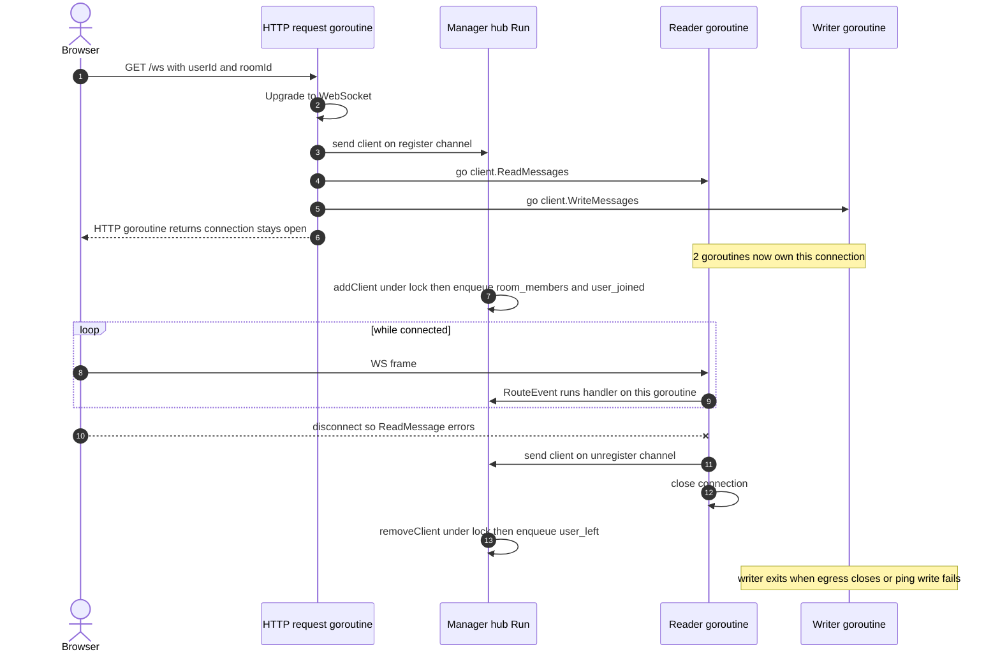

---

## 3. Channels: buffers, producers, consumers, failure modes

The `Manager` (see `NewManager` in `manager.go`) owns four channels. Each
`Client` owns one.

| Channel | Type | Buffer | Producers | Consumer | On full | On closed |
|---|---|---|---|---|---|---|
| `register` | `chan *Client` | 64 | `ServeWS` (HTTP goroutines) | hub `Run` | producer blocks until hub drains | never closed in this code |
| `unregister` | `chan *Client` | 64 | reader `defer` (`ReadMessages`) | hub `Run` | producer (reader) blocks | never closed |
| `broadcast` | `chan RoomEvent` | 128 | `addClient`, `removeClient`, `SendMessage`, voice handlers, HTTP handlers | hub `Run` → `BroadcastToRoom` | producer blocks (see hazard in §6.1) | never closed |
| `egress` (per client) | `chan Event` | 64 | `BroadcastToRoom`, `sendToClient`, `SendToAdmin` | that client's writer `WriteMessages` | sender does non-blocking send then evicts client | `RemoveUserFromRoom` closes it; writer sends CloseMessage and exits |

Design notes and gotchas:

- **`register` / `unregister` are small (64).** Fine, because the hub drains
  them quickly in normal operation. They matter during connection storms.
- **`broadcast` is 128 and is a shared bus for the whole process.** Every room's
  events flow through this one channel into one goroutine. That is a scaling
  ceiling (one goroutine serializes all fan-out) and the source of the self-send
  deadlock in §6.1.
- **`egress` is 64 per connection** and is the only writer-safe way to send on a
  gorilla connection, because **gorilla requires at most one concurrent writer
  per connection**. All sends funnel through `egress`; the single writer
  goroutine is the only thing that calls `WriteMessage`. This is the correct
  pattern. The subtlety is *who is allowed to close `egress`* — see §4 and §6.2.

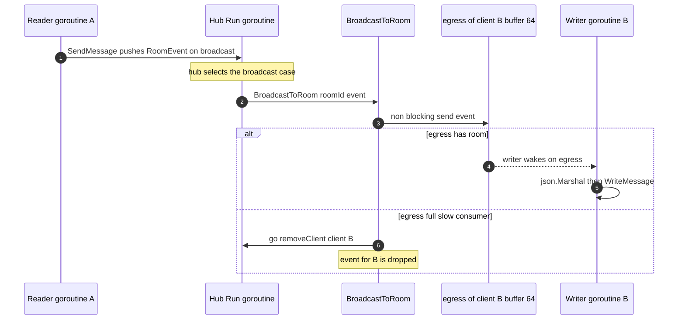

---

## 4. The mutex: what it guards and who takes it

`Manager` embeds `sync.RWMutex` (anonymous field, so `m.Lock()`,
`m.RLock()` are promoted). It protects the **shared maps**:

- `clients map[string]*Client` — global, keyed by `userId` (see hazard §6.6).
- `rooms map[string]map[string]*Client` — room → userId → client.
- `admins map[string]string` — room → admin userId (in memory only).
- `voice map[string]map[string]*voiceMember` — room → userId → voice session.

Who takes which lock:

| Caller | Lock | Why |
|---|---|---|
| `addClient` | `Lock` (write) | mutates `rooms`, `clients`, `voice` |
| `removeClient` | `Lock` (write) | deletes from `rooms`, `clients`, `voice` |
| `BroadcastToRoom` | `RLock` (read) | iterates a room's clients to fan out |
| `sendToClient` | `RLock` (read) | checks the client is still registered |
| `SendToAdmin` | `RLock` (read) | reads `admins` and `clients` |
| `SetRoomAdmin` | `Lock` (write) | sets `admins[roomID]` |
| `RemoveUserFromRoom` | `Lock` (write) | deletes client, closes `egress` |
| `VoiceJoin` / `VoiceLeave` / `setVoiceFlag` | `Lock` (write) | mutate `voice` |
| `VoiceSignal` | `RLock` (read) | reads `voice` to find the target client |

The `...Locked` helpers (`voiceParticipantsLocked`, `removeVoiceMemberLocked`)
assume the caller already holds the lock — a common and good convention. The
naming makes the contract explicit.

`RWMutex` lets many readers (broadcasts, signal relays) run concurrently while
writes (join/leave) are exclusive. That is the right call for a read-heavy
workload. The catch: readers can still **starve** writers under heavy read load,
and holding `RLock` while doing a non-blocking channel send (as
`BroadcastToRoom` does) is fine only because the send never blocks.

---

## 5. Two concurrency styles, mixed

This server mixes the two canonical Go concurrency models, and the mix is the
root of most hazards.

1. **Hub / actor model ("share memory by communicating").** One goroutine
   (`Run`) owns the state and everyone talks to it through channels
   (`register`, `unregister`, `broadcast`). No locks needed if the owner is the
   only one touching the maps.

2. **Shared memory + locks.** HTTP handlers and event handlers reach **directly**
   into the `Manager` and take `m.Lock()` / `m.RLock()` to mutate the same maps
   the hub also touches (`addClient`, `removeClient` run inside `Run` but
   `VoiceJoin`, `SendToAdmin`, `RemoveUserFromRoom`, `SetRoomAdmin` run on other
   goroutines).

Because both styles touch the same state, you need the mutex **and** the hub,
and you have to reason about both at once. That is strictly harder than
committing to one model.

Trade-offs:

- **Pure hub/actor:** easiest to reason about (single owner, no data races by
  construction), but the single hub goroutine serializes everything and can
  become a throughput bottleneck. You also must never send to your own input
  channel from inside the hub (that is exactly the §6.1 deadlock).
- **Pure locks:** maximal parallelism (any goroutine can act after taking the
  lock), but you must get lock ordering, unlock-on-all-paths, and
  send-on-closed-channel discipline exactly right — which this code does not
  (§6.2).

**Recommendation (expanded in §8): pick the hub as the single owner of the
maps.** Handlers send commands to the hub via channels and never lock. Fan-out
is done either directly inside the hub (cheap, non-blocking) or by a dedicated
fan-out goroutine so the hub never blocks on itself. The mutex then disappears
entirely, and with it the deadlock and send-on-closed hazards.

---

## 6. Known concurrency hazards (and fixes)

Each hazard below is real in the current code. For each: a reproduction
sequence, the root cause, and corrected Go.

### 6.1 Self-send deadlock in the hub

**Where:** `addClient` and `removeClient` run **inside** the `Run` goroutine
(the hub). Both push onto `m.broadcast` — the very channel that only `Run`
drains:

```go
// inside addClient, which runs inside Run via `case client := <-m.register`
m.broadcast <- RoomEvent{RoomID: c.RoomID, Event: Event{Type: "room_members", ...}}
m.broadcast <- RoomEvent{RoomID: c.RoomID, Event: Event{Type: "user_joined", ...}}
```

**Why it is a bug:** the hub is single-threaded. While it is executing
`addClient`, it is **not** in its `select` loop, so it is not draining
`broadcast`. The sends only succeed because `broadcast` has a 128 buffer. If a
burst of joins/leaves fills those 128 slots (many clients connecting at once, or
a slow fan-out), the next `m.broadcast <- ...` **blocks the hub on a channel
only the hub can drain**. Classic self-deadlock: the whole server stalls —
no more registers, unregisters, or broadcasts are processed.

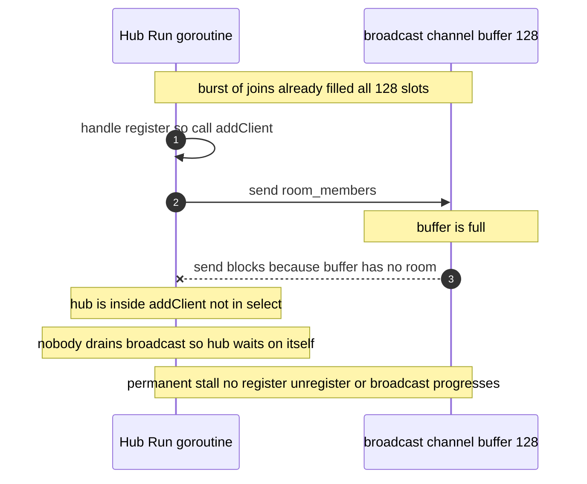

**Fix:** never send to your own input channel from inside the owner. Call the
fan-out logic directly inside the hub (it is just map iteration + non-blocking
sends to `egress`), or route fan-out through a separate goroutine.

```go
// Corrected: addClient computes events, then fans out DIRECTLY (no self-send).
// This runs inside Run, so BroadcastToRoom's RLock is uncontended-by-design,
// but even better: in a single-owner design there is no lock at all (see §8).
func (m *Manager) addClient(c *Client) {
	m.Lock()
	if m.rooms[c.RoomID] == nil {
		m.rooms[c.RoomID] = make(ClientList)
	}
	m.rooms[c.RoomID][c.UserID] = c
	m.clients[c.UserID] = c
	members := membersOf(m.rooms[c.RoomID])
	m.Unlock()

	// Direct fan-out: no send on m.broadcast, so the hub can never block on itself.
	m.BroadcastToRoom(c.RoomID, Event{Type: "room_members", Payload: mustJSON(members)})
	m.BroadcastToRoom(c.RoomID, Event{Type: "user_joined", Payload: c.UserID})
}
```

If you want to keep a bus for symmetry, give the bus its **own** draining
goroutine distinct from the registration hub, so no goroutine ever both produces
to and consumes from the same channel.

### 6.2 `RemoveUserFromRoom` returns while holding the lock — permanent deadlock

> Status: latent. `RemoveUserFromRoom` is defined but not called anywhere yet (`HandleRemoveUser` only updates Redis). It's still worth fixing before the admin-kick path is wired to it. §6.3 applies equally.

**Where:** `RemoveUserFromRoom` in `manager.go`:

```go
func (m *Manager) RemoveUserFromRoom(roomId, userId string) {
	m.Lock()
	clients, ok := m.rooms[roomId]
	if !ok {
		return // BUG: returns with the lock STILL HELD
	}
	close(clients[userId].egress)     // BUG: may panic if userId absent (nil deref)
	clients[userId].connection.Close()
	delete(clients, userId)
	delete(m.clients, userId)
	if len(clients) == 0 {
		delete(m.rooms, roomId)
	}
	m.Unlock()
	m.broadcast <- RoomEvent{...}     // also a self-send if ever called from the hub
}
```

**Why it is a bug:** if the room does not exist, the function `return`s **without
`Unlock`**. The `RWMutex` is now permanently write-locked. Every subsequent
`Lock`/`RLock` — every join, leave, broadcast, voice op — blocks forever. One
call to remove a user from a non-existent room bricks the whole server.

Two secondary bugs in the same function:
- `clients[userId].egress` dereferences a possibly-absent map entry (nil
  `*Client`) → nil-pointer panic.
- It `close(...)`s `egress`, but `BroadcastToRoom` and `sendToClient` may later
  send on that same channel from other goroutines → **send on closed channel
  panic** (see §6.3).

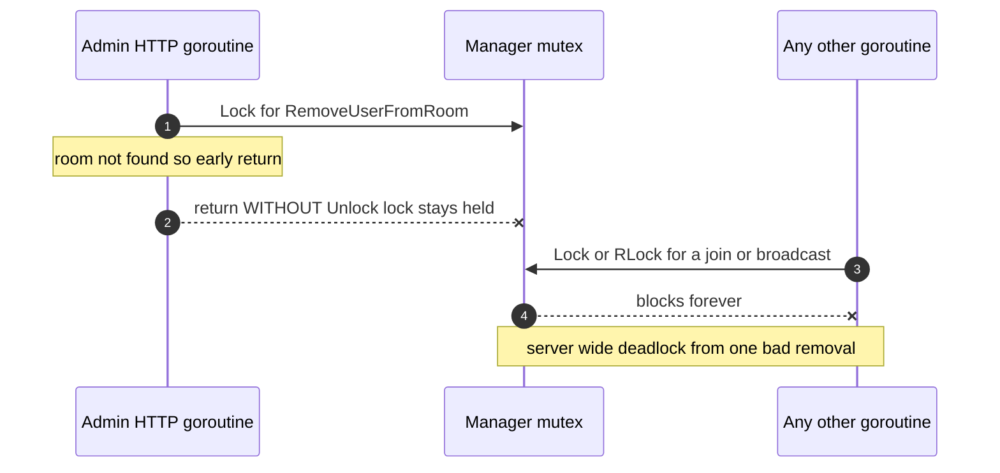

**Fix:** `defer m.Unlock()`, guard the map lookup, and let a single owner close
`egress` exactly once (via `sync.Once` / a `done` channel — §6.3 and §7).

```go
func (m *Manager) RemoveUserFromRoom(roomId, userId string) {
	m.Lock()
	defer m.Unlock() // unlock on EVERY path

	room, ok := m.rooms[roomId]
	if !ok {
		return // safe now: defer unlocks
	}
	c, ok := room[userId]
	if !ok {
		return
	}
	delete(room, userId)
	if m.clients[userId] == c {
		delete(m.clients, userId)
	}
	if len(room) == 0 {
		delete(m.rooms, roomId)
	}
	// Do NOT close egress here. Signal the writer to shut down idempotently
	// and let the writer own the close. (See §6.3 / §7.)
	c.shutdownOnce.Do(func() { close(c.done) })
}
```

Fan-out of `removed_room_member` should happen outside the lock and must not be
a self-send if this ever runs on the hub.

### 6.3 Send on closed channel — panic risk

**Where:** `RemoveUserFromRoom` does `close(clients[userId].egress)`. Meanwhile
`BroadcastToRoom` (holding `RLock`) and `sendToClient` do
`client.egress <- event`. In Go, **sending on a closed channel panics**, and the
panic is not recoverable per-send without a deferred `recover` on every sender.

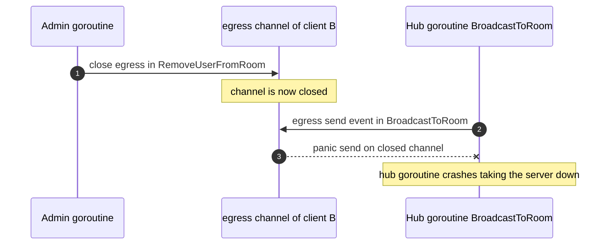

**Why it happens:** multiple goroutines can send on `egress`, but closing a
channel while other goroutines may still send is never safe. The Go idiom is
**the sender closes, and there must be exactly one sender, or coordination.**

**Fix:** do not close `egress` to signal shutdown. Keep a per-client `done`
channel, closed exactly once with `sync.Once`. Senders use `select` with a
`done` case so they stop sending once the client is going away; the **writer**
goroutine owns the connection teardown.

```go
type Client struct {
	// ...existing fields...
	egress       chan Event
	done         chan struct{}
	shutdownOnce sync.Once
}

func (c *Client) close() {
	c.shutdownOnce.Do(func() { close(c.done) }) // idempotent
}

// Non-blocking, close-safe send.
func (m *Manager) trySend(c *Client, e Event) {
	select {
	case c.egress <- e:
	case <-c.done:
		// client is shutting down; drop silently
	default:
		// buffer full and client alive -> treat as slow consumer
		c.close()
	}
}
```

The writer then selects on both `egress` and `done`:

```go
func (c *Client) WriteMessages() {
	ticker := time.NewTicker(pingInterval)
	defer func() { ticker.Stop(); c.connection.Close() }()
	for {
		select {
		case e := <-c.egress:
			if err := c.writeEvent(e); err != nil { return }
		case <-ticker.C:
			if err := c.ping(); err != nil { return }
		case <-c.done:
			_ = c.connection.WriteMessage(websocket.CloseMessage, nil)
			return
		}
	}
}
```

Nobody ever closes `egress`; it is simply garbage-collected when the `Client`
becomes unreachable. This removes the panic class entirely.

### 6.4 Slow-consumer eviction leaks the writer goroutine

**Where:** `BroadcastToRoom`:

```go
select {
case client.egress <- event:
default:
	go m.removeClient(client) // evict slow/dead client
}
```

**Why it is incomplete:** `removeClient` deletes the client from the maps and
(correctly) checks for stale connections — but it **does not close the
connection or signal the writer**. The writer goroutine keeps running, blocked
in its `select` on `egress` and the ping ticker, until the next ping write fails
(up to `pingInterval` ≈ 9s later) or the TCP connection errors. For a brief
window you have an "evicted" client whose two goroutines are still alive and
whose socket is still open. Under churn this is a slow goroutine/fd leak.

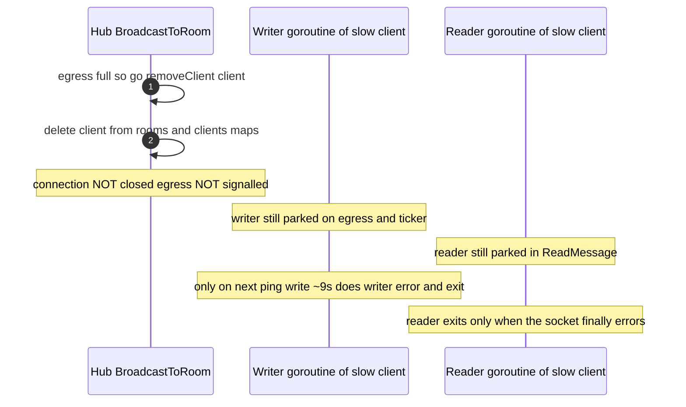

**Fix:** eviction must tear the connection down deterministically. With the
`done`/`sync.Once` pattern from §6.3, eviction is one call:

```go
default:
	// drop this event AND start deterministic teardown
	c.close()        // closes done -> writer sends Close and exits -> reader errors and exits
	go m.removeClient(c)
```

Closing `done` wakes the writer immediately; the writer closes the conn; the
reader's `ReadMessage` then errors and the reader exits. Both goroutines and the
fd are reclaimed in milliseconds, not seconds.

### 6.5 Redis I/O on the reader goroutine with no timeout

**Where:** `SendMessage` (in `event.go`) runs on the **reader goroutine**
(`RouteEvent` is called from `ReadMessages`). It calls `SaveRoomMessage`, which
does a synchronous Redis `RPUSH` with `context.Background()`:

```go
pipe := m.rdb.Client.Pipeline()
pipe.RPush(context.Background(), key, data) // no timeout, blocks this reader
_, err = pipe.Exec(context.Background())
```

**Why it matters:** running handlers on the reader goroutine is actually a good
property — different connections' handlers run in parallel, one per reader, so
there is no shared handler bottleneck. The problem is the **unbounded,
context-less Redis call**. If Redis is slow or the TCP link stalls, that reader
goroutine is stuck inside `Exec`. During that time:

- That connection reads nothing new (its `ReadMessage` loop is blocked in the
  handler), so its own messages back up.
- The read deadline (`pongWait` = 10s) is only re-armed by the pong handler,
  which also runs on this reader goroutine — so a long Redis stall can even
  interfere with liveness detection for that connection.

It does **not** stall other connections (each has its own reader), which is why
this is a per-connection latency bug, not a global one. Still, every network
call needs a deadline.

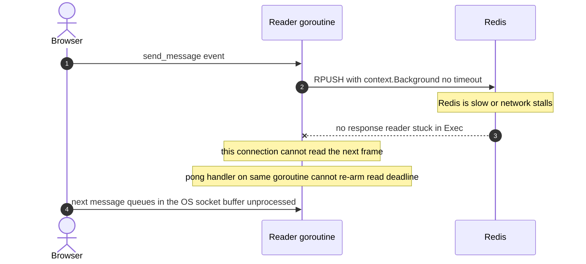

**Fix:** bound every Redis call with a context deadline, and consider doing the
persist asynchronously (fire-and-forget to a bounded worker) so the hot path is
broadcast, not disk.

```go
func SaveRoomMessage(m *Manager, roomID string, msg ChatMessage) error {
	ctx, cancel := context.WithTimeout(context.Background(), 500*time.Millisecond)
	defer cancel()

	data, err := json.Marshal(msg)
	if err != nil {
		return err
	}
	pipe := m.rdb.Client.Pipeline()
	pipe.RPush(ctx, "room:messages:"+roomID, data)
	pipe.Expire(ctx, "room:messages:"+roomID, roomTTL) // also fixes the TTL bug, see doc 01
	_, err = pipe.Exec(ctx)
	return err
}
```

Note the `Expire` in the same pipeline — this is also the fix for the "messages
never expire" bug described in [01 — System Overview](./01-system-overview.md):
the original `CreateChatRoom` does `RPUSH __init__; LPOP; EXPIRE`, but `LPOP`
empties the list so Redis deletes the key and `EXPIRE` returns 0; the first real
`RPUSH` then recreates the key with no TTL (`TTL` = -1).

### 6.6 Global `clients` map keyed by `userId` — cross-room collision

**Where:** `Manager.clients map[string]*Client` is keyed by `userId` only, not
by `(roomId, userId)`. `addClient` does `m.clients[c.UserID] = c`.

**Why it is a bug:** if the same `userId` is present in two different rooms (or
the id generator ever collides), the second connection **overwrites** the first
in `clients`. `SendToAdmin` and any `clients[...]` lookup then resolve to the
wrong connection. The `rooms` map is correctly nested by room, so broadcasts are
fine; it is the global `clients` map that is unsafe.

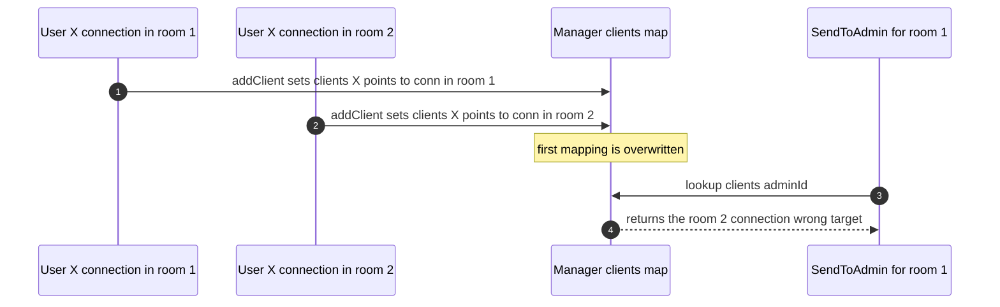

**Fix:** key by the pair, or drop the global map and look up through `rooms`.

```go
// Option A: composite key
clients map[clientKey]*Client
type clientKey struct{ RoomID, UserID string }

// Option B (simpler): remove `clients` entirely; look up via rooms.
func (m *Manager) clientInRoom(roomID, userID string) (*Client, bool) {
	room, ok := m.rooms[roomID]
	if !ok {
		return nil, false
	}
	c, ok := room[userID]
	return c, ok
}
```

Option B is cleaner because it removes a second source of truth that must be
kept in sync with `rooms`.

### 6.7 WS upgrade trusts query params (security + correctness)

Not strictly a concurrency bug, but it belongs in any honest teardown.
`ServeWS` reads `userId` and `roomId` from the query string and **never
validates the `userKey`** that the HTTP API uses for auth. Anyone who knows a
`roomId` and a `userId` can open a socket and impersonate that user, join voice,
and relay signals. Also, long-lived secrets in the query string get logged by
proxies and the server access log.

**Fix:** validate a credential during the upgrade. Prefer a **one-time ticket**:
the client calls an authenticated HTTP endpoint, gets a short-lived signed token
(a few seconds TTL), and passes that in the `?ticket=` param; `ServeWS` verifies
and burns it. This keeps long-lived secrets out of URLs. See
[02 — WebSocket Architecture](./02-websocket-architecture.md) and
[05 — Scaling to Millions](./05-scaling-to-millions.md).

---

## 7. Channel-close ownership, `sync.Once`, and context cancellation

Three disciplines that, applied together, eliminate most of §6.

### 7.1 Close ownership rule

> **The sender closes a channel, never the receiver, and there must be a single
> closer.** If multiple goroutines can send, you do not close to signal
> shutdown — you use a separate `done` channel.

`egress` has multiple senders (`BroadcastToRoom`, `sendToClient`,
`SendToAdmin`), so it must **never** be closed to signal shutdown. The current
`RemoveUserFromRoom` violates this. The fix in §6.3 uses a `done` channel owned
by the client.

### 7.2 `sync.Once` for idempotent close

Shutdown can be triggered from several places: read error (reader `defer`), slow
consumer eviction (`BroadcastToRoom`), admin kick (`RemoveUserFromRoom`), and
graceful shutdown (§7.4). All of them might fire for the same client. `close(ch)`
twice panics. Wrap it:

```go
func (c *Client) close() {
	c.shutdownOnce.Do(func() { close(c.done) })
}
```

Now any number of callers can request shutdown; exactly one close happens.

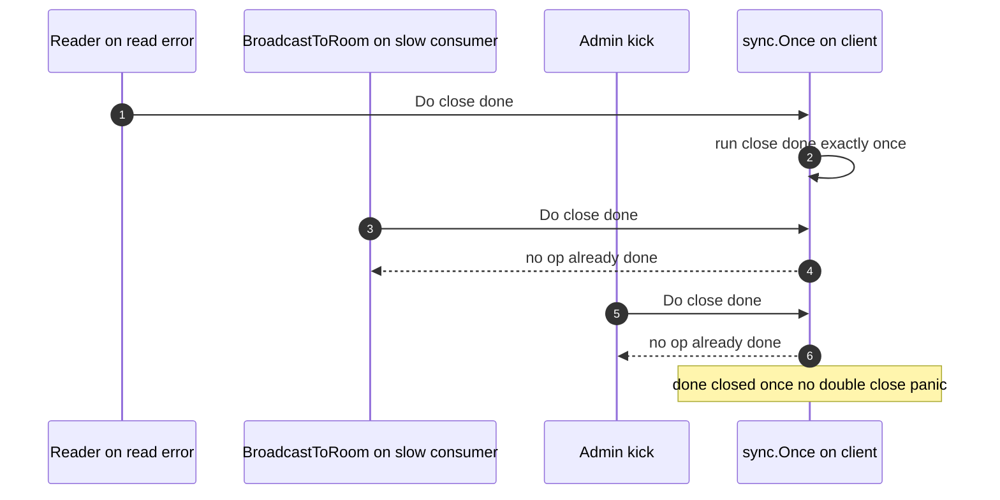

### 7.3 Context cancellation for lifecycles

Give each connection a `context.Context` derived from a server-root context.
Cancelling the root cancels every connection; cancelling a connection's context
cancels its Redis calls. This threads shutdown through I/O cleanly:

```go
ctx, cancel := context.WithCancel(serverCtx)
client.ctx, client.cancel = ctx, cancel
// Redis calls use client.ctx so they abort when the client goes away.
```

### 7.4 Graceful shutdown

On SIGINT/SIGTERM you want to: stop accepting new connections, tell existing WS
clients to close, drain in-flight work, then exit. `http.ListenAndServe` (used
in `app.Run()`) cannot do this — switch to an explicit `http.Server` and call
`Shutdown`.

```go
srv := &http.Server{Addr: ":" + port, Handler: corsHandler}

go func() {
	if err := srv.ListenAndServe(); err != nil && err != http.ErrServerClosed {
		log.Fatal(err)
	}
}()

stop := make(chan os.Signal, 1)
signal.Notify(stop, os.Interrupt, syscall.SIGTERM)
<-stop

ctx, cancel := context.WithTimeout(context.Background(), 15*time.Second)
defer cancel()

WSmanager.Shutdown()  // close every client's done channel (sync.Once each)
_ = srv.Shutdown(ctx) // stop accepting, wait for HTTP handlers to drain
```

Where `Manager.Shutdown` walks all clients and calls `c.close()`, each writer
sends a WebSocket CloseMessage so browsers see a clean `1000`/`1001` close rather
than a dropped socket.

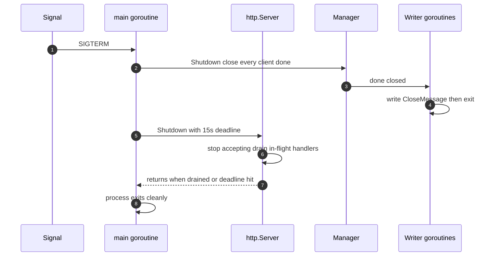

Why it matters in this deployment: on Render the free tier spins the instance
down after ~15 min idle. All in-memory state (`rooms`, `admins`, `voice`) is
lost. After a cold start the `admins` map is empty, so `SendToAdmin` for
`REQUEST_TO_JOIN` silently drops (admin "not connected"), and the frontend's
`ws.onclose` redirects to `/not-found` with no reconnect. Graceful shutdown does
not fix statelessness, but it is the first step toward moving that state to Redis
or a shared bus — see [05 — Scaling to Millions](./05-scaling-to-millions.md).

---

## 8. Reference design: single-owner Manager

Below is a compiled-quality rewrite that commits to the **hub-as-single-owner**
model. The hub goroutine owns all maps; nobody else locks them. Commands arrive
as typed messages on one channel. Fan-out is non-blocking and never a self-send
(a dedicated path, not the command channel). Each client has a `done` channel
and a `sync.Once` so teardown is idempotent and leak-free.

```go
package websocket

import (
	"context"
	"encoding/json"
	"sync"
	"time"

	"github.com/gorilla/websocket"
)

// ---- Client ----

type Client struct {
	ID       string
	UserID   string
	RoomID   string
	conn     *websocket.Conn
	egress   chan Event
	done     chan struct{}
	once     sync.Once
	JoinedAt time.Time
}

func (c *Client) close() { c.once.Do(func() { close(c.done) }) }

// ---- Commands to the hub (no shared-memory locking anywhere) ----

type command interface{ isCommand() }

type cmdRegister struct{ c *Client }
type cmdUnregister struct{ c *Client }
type cmdBroadcast struct {
	roomID string
	event  Event
}
type cmdToUser struct {
	roomID, userID string
	event          Event
}
type cmdShutdown struct{ ack chan struct{} }

func (cmdRegister) isCommand()   {}
func (cmdUnregister) isCommand() {}
func (cmdBroadcast) isCommand()  {}
func (cmdToUser) isCommand()     {}
func (cmdShutdown) isCommand()   {}

// ---- Manager: a single goroutine owns all state ----

type Manager struct {
	cmds   chan command // the ONLY way to mutate state
	rooms  map[string]map[string]*Client
	admins map[string]string
	voice  map[string]map[string]*voiceMember
	rdb    *RedisClient
}

func NewManager(rdb *RedisClient) *Manager {
	return &Manager{
		cmds:   make(chan command, 256),
		rooms:  map[string]map[string]*Client{},
		admins: map[string]string{},
		voice:  map[string]map[string]*voiceMember{},
		rdb:    rdb,
	}
}

// Run is the single owner of rooms/admins/voice. No mutex exists.
func (m *Manager) Run(ctx context.Context) {
	for {
		select {
		case <-ctx.Done():
			m.shutdownAll()
			return
		case c := <-m.cmds:
			m.handle(c)
		}
	}
}

func (m *Manager) handle(c command) {
	switch cmd := c.(type) {
	case cmdRegister:
		m.addClient(cmd.c)
	case cmdUnregister:
		m.removeClient(cmd.c)
	case cmdBroadcast:
		m.fanout(cmd.roomID, cmd.event) // direct, non-blocking, NOT a self-send
	case cmdToUser:
		if cl, ok := m.lookup(cmd.roomID, cmd.userID); ok {
			m.trySend(cl, cmd.event)
		}
	case cmdShutdown:
		m.shutdownAll()
		close(cmd.ack)
	}
}

func (m *Manager) addClient(c *Client) {
	if m.rooms[c.RoomID] == nil {
		m.rooms[c.RoomID] = map[string]*Client{}
	}
	m.rooms[c.RoomID][c.UserID] = c
	m.fanout(c.RoomID, Event{Type: "room_members", Payload: mustJSON(membersOf(m.rooms[c.RoomID]))})
	m.fanout(c.RoomID, Event{Type: "user_joined", Payload: c.UserID})
}

func (m *Manager) removeClient(c *Client) {
	room, ok := m.rooms[c.RoomID]
	if !ok {
		return
	}
	if cur, ok := room[c.UserID]; !ok || cur != c {
		return // stale connection: a newer one took over
	}
	delete(room, c.UserID)
	if len(room) == 0 {
		delete(m.rooms, c.RoomID)
	}
	c.close() // idempotent: wakes the writer, which closes the conn
	m.fanout(c.RoomID, Event{Type: "user_left", Payload: c.UserID})
}

// fanout runs inside the hub goroutine, so no lock is needed. It never blocks:
// a full egress means a slow consumer, which we tear down.
func (m *Manager) fanout(roomID string, e Event) {
	for _, cl := range m.rooms[roomID] {
		m.trySend(cl, e)
	}
}

func (m *Manager) trySend(c *Client, e Event) {
	select {
	case c.egress <- e:
	case <-c.done:
	default:
		// slow consumer: evict without blocking the hub
		c.close()
	}
}

func (m *Manager) lookup(roomID, userID string) (*Client, bool) {
	room, ok := m.rooms[roomID]
	if !ok {
		return nil, false
	}
	cl, ok := room[userID]
	return cl, ok
}

func (m *Manager) shutdownAll() {
	for _, room := range m.rooms {
		for _, c := range room {
			c.close()
		}
	}
}

// Public API used by HTTP/event handlers: send commands, never touch maps.
func (m *Manager) Register(c *Client)                 { m.cmds <- cmdRegister{c} }
func (m *Manager) Unregister(c *Client)               { m.cmds <- cmdUnregister{c} }
func (m *Manager) Broadcast(roomID string, e Event)   { m.cmds <- cmdBroadcast{roomID, e} }
func (m *Manager) ToUser(r, u string, e Event)        { m.cmds <- cmdToUser{r, u, e} }

func (m *Manager) Shutdown() {
	ack := make(chan struct{})
	m.cmds <- cmdShutdown{ack}
	<-ack
}

func membersOf(room map[string]*Client) []string {
	out := make([]string, 0, len(room))
	for id := range room {
		out = append(out, id)
	}
	return out
}

func mustJSON(v any) string { b, _ := json.Marshal(v); return string(b) }
```

What this buys you:

- **No mutex.** The hub is the only goroutine touching `rooms`/`admins`/`voice`,
  so data races are impossible by construction. `go test -race` has nothing to
  find in the state path.
- **No self-send deadlock.** `fanout` is a direct call inside the hub, not a send
  on `m.cmds`. The hub never waits on its own input.
- **No send-on-closed panic.** `egress` is never closed; `done` is closed once
  via `sync.Once`.
- **No slow-consumer leak.** `trySend`'s `default` evicts immediately by closing
  `done`, which wakes the writer to tear the connection down.
- **Clean shutdown.** `cmdShutdown` is serialized with every other command, so
  there is no race between "close everyone" and "a late register".

The trade-off, stated honestly: the single hub serializes all state mutations
and fan-out, so a very hot process bottlenecks on one core. That is fine up to a
point; past it you **shard** rooms across N hubs (hash `roomId` → hub index) so
each hub owns a disjoint slice of rooms and runs on its own goroutine/core. That
sharding is the bridge to the distributed design in
[05 — Scaling to Millions](./05-scaling-to-millions.md).

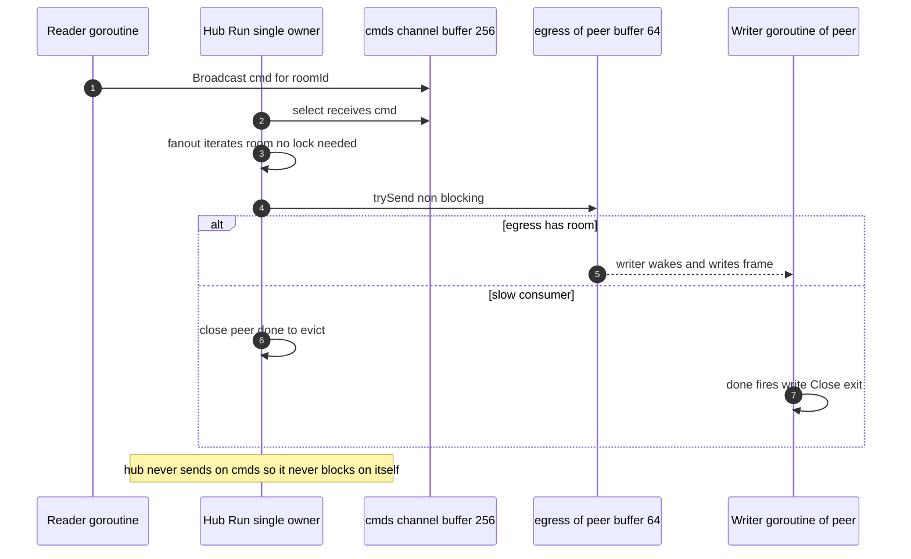

---

## 9. Memory per connection and the C1M math

Per live WebSocket connection in this server:

| Component | Rough size | Notes |
|---|---|---|
| Reader goroutine stack | ~2–8 KB | parked most of the time |
| Writer goroutine stack | ~2–8 KB | parked on `select` |
| gorilla read buffer | 1 KB | `ReadBufferSize: 1024` |
| gorilla write buffer | 1 KB | `WriteBufferSize: 1024` |
| `egress` channel | 64 slots × `Event` (two string headers + backing bytes) | capacity reserved lazily as it fills |
| `Client` struct + map entries | ~a few hundred bytes | plus `rooms`/`clients` map overhead |
| kernel socket buffers | ~8–64 KB (tunable) | **often the dominant cost**, lives in the kernel not the heap |

A defensible user-space estimate is **~16–24 KB per connection** (two goroutine
stacks + gorilla buffers + egress + struct), **excluding** kernel socket buffers
which are larger and tunable via `net.ipv4.tcp_rmem`/`tcp_wmem`.

Back-of-the-envelope (user-space only, ~20 KB/conn):

| Connections | User-space memory | Goroutines (2/conn + hub) |
|---|---|---|
| 10,000 | ~200 MB | ~20,001 |
| 100,000 | ~2 GB | ~200,001 |
| 1,000,000 | ~20 GB | ~2,000,001 |

Add kernel socket buffers and you can easily double or triple those numbers.
Observations an interviewer wants to hear:

- **1M connections in one Go process is physically possible** (people have done
  it) but requires tuning: raise `ulimit -n` well past 1M, shrink socket buffers,
  minimize per-connection heap, and watch GC. It is rarely the right choice.
- **The real ceiling is usually not goroutines, it is**: fan-out CPU on the hot
  broadcast path, GC pressure from per-message allocations, file descriptors, and
  the blast radius of one process dying. All of these argue for **horizontal
  sharding across many smaller processes/nodes** with a shared pub/sub bus.
- **gorilla's 1 KB buffers are a deliberate size trade-off**: smaller buffers =
  less memory per idle connection, but more `read`/`write` syscalls for large
  frames (like the 2–6 KB SDP offers that forced `maxMessageSize` up to 32 KB).

---

## 10. Verifying concurrency: race detector, leaks, profiling

- **Race detector.** `go test -race ./...` and, for a staging binary,
  `go build -race`. It instruments memory accesses to catch unsynchronized
  read/write pairs. In **this environment the race detector could not run**
  because it requires cgo and the toolchain here had cgo unavailable; run it in
  CI on a cgo-enabled builder. The single-owner design in §8 is specifically
  structured so the race detector has nothing to flag on the state path.
- **Goroutine leak detection.**
  - `uber-go/goleak` in tests: `defer goleak.VerifyNone(t)` fails a test if
    goroutines outlive it — perfect for catching the §6.4 writer leak.
  - `net/http/pprof`: hit `/debug/pprof/goroutine?debug=2` to dump every
    goroutine with its stack. A healthy server shows ~2 goroutines per live
    connection plus the hub; a leak shows writers/readers for connections that
    should be gone.
  - `runtime.NumGoroutine()` exported as a metric; alert if it diverges from
    `2 × activeConnections + constant`.
- **CPU/alloc profiles.** `go tool pprof` on `/debug/pprof/profile` (CPU) and
  `/debug/pprof/heap` (allocations) to find the fan-out hot path and
  per-message allocations (JSON marshal is a usual suspect — consider reusing
  buffers or `sync.Pool`).

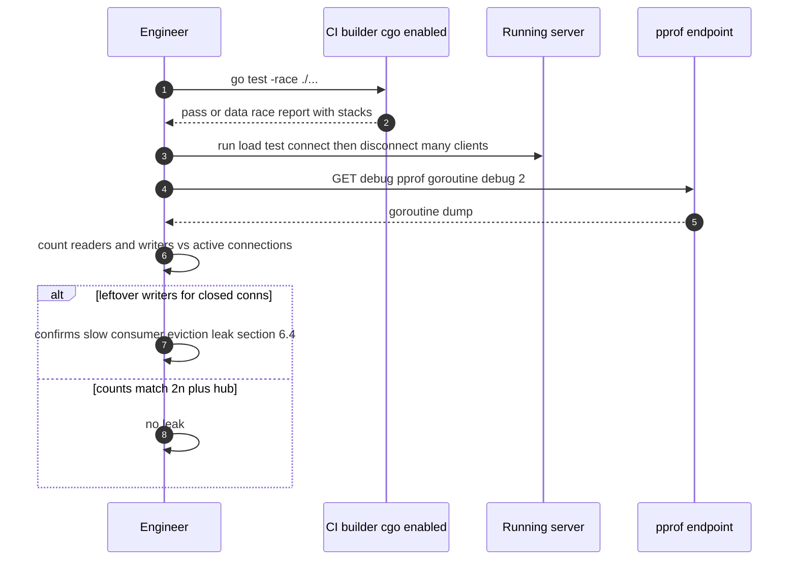

---

## 11. Summary checklist (what to say in an interview)

- Goroutines are cheap user-space tasks multiplexed over OS threads by the G-M-P
  scheduler; blocked socket reads park a goroutine and release the thread via the
  netpoller (epoll/kqueue). That is why goroutine-per-connection scales.
- This server runs **2 goroutines per connection** (reader + writer) plus **one
  hub** and **one HTTP goroutine per request**; the writer is the single safe
  writer gorilla requires.
- Four manager channels (`register`/`unregister` 64, `broadcast` 128) plus a
  64-slot per-client `egress`. The `broadcast` bus is a shared bottleneck and the
  site of a self-send deadlock.
- The server mixes hub/actor and mutex styles; the honest fix is to pick one —
  **single-owner hub, no mutex** (§8) — which eliminates the deadlock, the
  send-on-closed panic, and the slow-consumer leak at once.
- Known hazards: self-send deadlock (§6.1), missing `Unlock` in
  `RemoveUserFromRoom` (§6.2), send-on-closed `egress` (§6.3), slow-consumer
  writer leak (§6.4), context-less Redis on the reader (§6.5), global `clients`
  map collision (§6.6), unauthenticated WS upgrade (§6.7).
- Operate it with graceful shutdown (`http.Server.Shutdown` + draining clients
  via `done`/`sync.Once`), and verify with `go test -race`, `goleak`, and pprof
  goroutine profiles.
- 1M connections in one process is possible but the practical ceiling is fan-out
  CPU, GC, fds, and blast radius — shard rooms and move state to a shared bus
  (see [05 — Scaling to Millions](./05-scaling-to-millions.md)).
