# 04 — WebRTC Signaling and the Voice/Video Server

This document explains the WebRTC voice/video subsystem of the TTL chat app, from first
principles up to staff-level depth, and then maps every concept onto the actual code:

- Backend signaling: [`backend/internal/websocket/voice.go`](../backend/internal/websocket/voice.go) and its tests [`voice_test.go`](../backend/internal/websocket/voice_test.go)
- Frontend peer logic: [`frontend/hooks/useVoiceChat.ts`](../frontend/hooks/useVoiceChat.ts)
- Rendering: [`frontend/components/chat/video-grid.tsx`](../frontend/components/chat/video-grid.tsx) and [`voice-audio.tsx`](../frontend/components/chat/voice-audio.tsx)

Related docs:

- [01 — System Overview](./01-system-overview.md)
- [02 — WebSocket Architecture](./02-websocket-architecture.md)
- [03 — Goroutines and Concurrency](./03-goroutines-and-concurrency.md)
- [05 — Scaling to Millions](./05-scaling-to-millions.md)
- [06 — Interview Guide](./06-interview-guide.md)

The one sentence summary: **media is peer-to-peer, the server only relays signaling over
the existing chat WebSocket, and the whole thing is a full mesh capped at 8 people.**

---

## 1. What WebRTC is, and what it deliberately is not

WebRTC is a browser API plus a bundle of IETF protocols for sending **real-time audio,
video, and arbitrary data directly between two user agents**, usually peer-to-peer, with
mandatory encryption and built-in congestion control. It is what lets two browsers talk
without routing media through your server.

The single most important thing to understand for an interview: **WebRTC does not define
signaling.** The specification is explicit that how two peers discover each other, agree
to connect, and exchange their session descriptions is left entirely to the application.
There is no "connect to this user" call in the API. You get:

- `RTCPeerConnection` — the media transport
- `createOffer()` / `createAnswer()` — produce SDP blobs describing what you can send/receive
- `setLocalDescription()` / `setRemoteDescription()` — apply those blobs
- `onicecandidate` — emits network candidates you must ship to the other side somehow

Everything in bold ("somehow", "ship", "exchange") is **your** problem. That transport is
the *signaling channel*. In this project the signaling channel is the chat WebSocket
(`/ws`), and the relay logic is `VoiceSignal` in `voice.go`. The spec not covering
signaling is a feature: it lets you reuse whatever presence/auth transport you already
have, which is exactly what this app does.

Why that matters for security (we return to this in §15): the SDP you relay contains a
**DTLS fingerprint** that pins the media encryption keys. If an attacker can inject or
rewrite SDP on the signaling path, they can man-in-the-middle the media. So the signaling
channel must be authenticated and integrity-protected. WebRTC media is end-to-end
encrypted *relative to the SDP you exchanged* — it is only as trustworthy as your
signaling.

### What WebRTC is not

- Not a CDN or a broadcast system. Mesh P2P falls apart past a handful of peers (§8).
- Not "serverless." You almost always need STUN, usually need TURN, and always need signaling.
- Not a guaranteed direct connection. ~10–20% of real-world pairs cannot connect P2P and
  must relay through TURN.

---

## 2. The protocol stack

A single WebRTC connection is a stack of protocols, each solving one problem. Interviewers
love asking you to name them top to bottom and say why each exists.

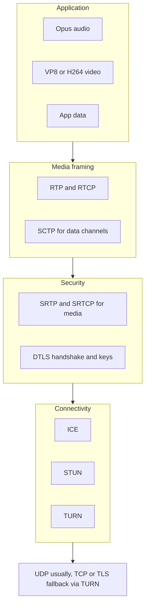
```mermaid
flowchart TB
  subgraph App[Application]
    A1[Opus audio]
    A2[VP8 or H264 video]
    A3[App data]
  end
  subgraph Media[Media framing]
    R1[RTP and RTCP]
    S1[SCTP for data channels]
  end
  subgraph Sec[Security]
    E1[SRTP and SRTCP for media]
    E2[DTLS handshake and keys]
  end
  subgraph Net[Connectivity]
    I1[ICE]
    I2[STUN]
    I3[TURN]
  end
  App --> Media --> Sec --> Net --> UDP
  UDP[UDP usually, TCP or TLS fallback via TURN]
```

Reading it bottom-up, which is the order the connection actually comes alive:

1. **ICE (Interactive Connectivity Establishment, RFC 8445)** — the framework that finds a
   working network path between two peers that are both likely behind NAT. ICE gathers
   *candidates* (possible addresses), then runs *connectivity checks* to find a pair that
   works.
2. **STUN (Session Traversal Utilities for NAT, RFC 8489)** — a tiny request/response
   protocol a peer uses to ask a public server "what public IP and port do you see me
   coming from?" The answer is a *server-reflexive* candidate. ICE also uses STUN binding
   requests as its connectivity-check pings.
3. **TURN (Traversal Using Relays around NAT, RFC 8656)** — a relay. When no direct path
   exists (symmetric NAT, strict firewall), both peers send media to a TURN server that
   forwards it. TURN is STUN's heavier cousin and costs real bandwidth money (§8).
4. **DTLS (Datagram TLS)** — once ICE finds a path, the peers run a DTLS handshake over it
   to agree on keys. The certificate fingerprints were pre-committed in the SDP, which is
   what binds the handshake to the signaling identity.
5. **SRTP / SRTCP** — DTLS does not carry the media. It performs *DTLS-SRTP* key export:
   the handshake produces keying material, and media then flows as SRTP (encrypted RTP)
   with SRTCP for its control. This is "DTLS-SRTP."
6. **RTP / RTCP (RFC 3550)** — the actual real-time transport. RTP carries media packets
   with sequence numbers and timestamps; RTCP carries receiver reports, sender reports,
   NACKs, PLIs (picture-loss indications), and the feedback that drives congestion control.
7. **SCTP over DTLS** — if you open a `RTCDataChannel`, it rides SCTP (for ordered/reliable
   or unordered/unreliable delivery) tunneled inside the same DTLS association. This app
   does **not** use data channels; media only.
8. **Codecs** — Opus for audio (48 kHz, excellent at low bitrate, built-in FEC and DTX),
   VP8/VP9 or H.264 for video. The codec and its parameters are negotiated in the SDP.

Everything above UDP is mandatory-to-implement encryption. There is no unencrypted WebRTC.

---

## 3. SDP and the offer/answer model

SDP (Session Description Protocol, RFC 8866) is an old, line-oriented text format
(`key=value`, one per line) that WebRTC reuses to describe a session. You never write it by
hand; `createOffer`/`createAnswer` generate it. But you must be able to read it.

The negotiation model is **offer/answer (RFC 3264)**: one side produces an *offer*
describing everything it is willing to send and receive, the other produces an *answer*
that accepts a compatible subset. Exactly one offer and one answer per negotiation round.

A trimmed offer looks like this:

```text
v=0
o=- 46117317 2 IN IP4 127.0.0.1
s=-
t=0 0
a=group:BUNDLE 0 1
m=audio 9 UDP/TLS/RTP/SAVPF 111
a=mid:0
a=ice-ufrag:F7gI
a=ice-pwd:x9cl0Cfj2V3bWv8qT4...
a=fingerprint:sha-256 AB:CD:EF:...
a=setup:actpass
a=sendrecv
a=rtpmap:111 opus/48000/2
m=video 9 UDP/TLS/RTP/SAVPF 96
a=mid:1
a=sendrecv
a=rtpmap:96 VP8/90000
```

What each piece means and why an interviewer cares:

- **`m=` lines (media sections)** — one per media stream. Here one audio, one video. The
  number of m-lines is fixed for the life of a negotiation; adding one requires
  renegotiation. This is the key fact behind this app's "two transceivers, never
  renegotiate" design (§11).
- **`a=mid:` (media identifier)** — a stable name for each m-line so offer and answer can
  line them up even if ordering differs. BUNDLE groups them so all media shares one
  ICE/DTLS transport (one port, one handshake) instead of one per track.
- **`a=rtpmap:` codecs** — the payload types and codec parameters each side supports. The
  answer picks the intersection.
- **`a=ice-ufrag` / `a=ice-pwd`** — the ICE username fragment and password. Connectivity
  checks are STUN requests authenticated with these, so a stray packet can't hijack the
  session. New ufrag/pwd = ICE restart (§14).
- **`a=fingerprint:sha-256 ...`** — the hash of the peer's DTLS certificate. **This is the
  security anchor.** When the DTLS handshake happens, each side checks the peer's actual
  cert against this fingerprint. If signaling wasn't tampered with, you know you're
  encrypting to the right peer. If signaling *was* tampered with, the attacker can swap the
  fingerprint and MITM you. Hence: signaling must be authenticated.
- **`a=setup:actpass`** — DTLS role negotiation. The offerer says "I'll be active or
  passive," the answerer picks; whoever is `active` sends the DTLS ClientHello.
- **`a=sendrecv` / `sendonly` / `recvonly` / `inactive`** — the direction of each m-line.
  This app uses `sendrecv` on both transceivers always (§11).

---

## 4. The JSEP state machine

JSEP (JavaScript Session Establishment Protocol, RFC 8829) is the contract between your JS
and the browser's media engine. The piece you must know is `RTCPeerConnection.signalingState`
and its legal transitions. Doing offer/answer in the wrong order throws.

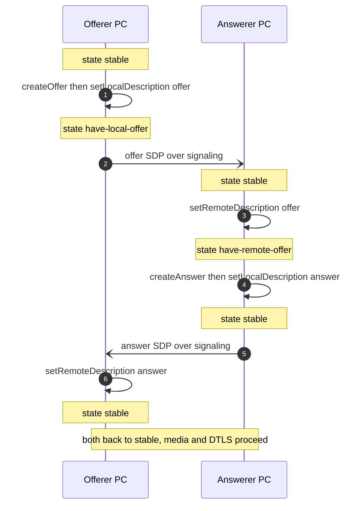
```mermaid
sequenceDiagram
  autonumber
  participant O as Offerer PC
  participant A as Answerer PC
  Note over O: state stable
  O->>O: createOffer then setLocalDescription offer
  Note over O: state have-local-offer
  O-)A: offer SDP over signaling
  Note over A: state stable
  A->>A: setRemoteDescription offer
  Note over A: state have-remote-offer
  A->>A: createAnswer then setLocalDescription answer
  Note over A: state stable
  A-)O: answer SDP over signaling
  O->>O: setRemoteDescription answer
  Note over O: state stable
  Note over O,A: both back to stable, media and DTLS proceed
```

Legal states: `stable`, `have-local-offer`, `have-remote-offer`, `have-local-pranswer`,
`have-remote-pranswer`, `closed`. The golden rule: **you may only `setLocalDescription(offer)`
from `stable`, and only `setRemoteDescription(answer)` from `have-local-offer`.**

The frontend guards exactly this. In `handleSignal` (`useVoiceChat.ts`), the answer branch
checks `if (peer.pc.signalingState !== "have-local-offer") return` before applying a remote
answer — so a late or duplicate answer can't corrupt the state machine. That one line is a
senior-level defensive touch; call it out in interviews.

The other hidden state machines are `iceConnectionState`
(`new → checking → connected → completed → disconnected → failed → closed`) and
`connectionState` (the aggregate). The frontend listens on `onconnectionstatechange` and
logs when it hits `failed`, which is the "you probably need TURN" signal (§12).

---

## 5. NAT, and why STUN sometimes isn't enough

Almost no browser has a public IP. It sits behind a NAT that rewrites its private
`192.168.x.x:port` to some public `ip:port` on the way out. For P2P to work, each peer must
learn its own public mapping and the two must be able to send packets to each other's
mappings. NAT behavior decides whether that's even possible.

Classic NAT taxonomy (RFC 3489 era, still the useful mental model):

| NAT type | Mapping behavior | Direct P2P with STUN? |
|---|---|---|
| Full-cone | One public mapping, anyone can send back to it | Yes, easy |
| Restricted-cone | Same mapping, but only from IPs you've sent to | Yes |
| Port-restricted-cone | Same mapping, only from IP+port you've sent to | Yes, with hole punching |
| Symmetric | **New mapping per destination** | No — STUN mapping is useless to the peer |

Why STUN works for cone NATs: with a cone NAT, the public mapping you learn from the STUN
server is the *same* mapping your peer will see, so you can hand it over and the peer can
reach you. Hole punching (both sides send simultaneously) opens the pinhole.

Why STUN fails for symmetric NAT: a symmetric NAT allocates a **different** public port for
each distinct destination. The mapping you learned by talking to the STUN server is not the
mapping that will exist when you talk to your peer. The address you advertised is dead on
arrival. Two symmetric NATs facing each other is the classic "requires TURN" case —
roughly the 10–20% of connections that must relay.

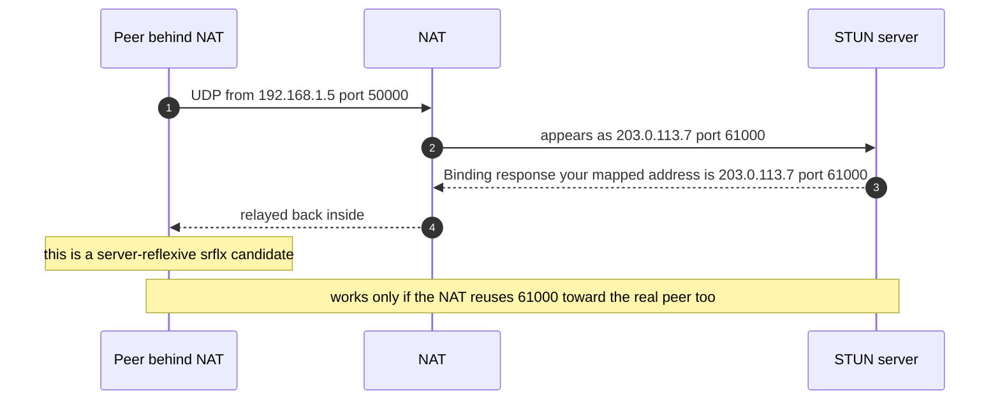
```mermaid
sequenceDiagram
  autonumber
  participant P as Peer behind NAT
  participant N as NAT
  participant S as STUN server
  P->>N: UDP from 192.168.1.5 port 50000
  N->>S: appears as 203.0.113.7 port 61000
  S-->>N: Binding response your mapped address is 203.0.113.7 port 61000
  N-->>P: relayed back inside
  Note over P: this is a server-reflexive srflx candidate
  Note over P,S: works only if the NAT reuses 61000 toward the real peer too
```

---

## 6. ICE candidates, gathering, checks, nomination

An ICE *candidate* is one possible transport address for a peer. Four types:

- **host** — a local interface address (`192.168…`, link-local, VPN). Works if peers are on
  the same LAN or one has a public IP.
- **srflx (server-reflexive)** — the public mapping discovered via STUN. The workhorse for
  cone NATs.
- **relay** — an address on a TURN server. Always works if TURN works, at the cost of
  relaying all media.
- **prflx (peer-reflexive)** — a mapping *discovered during connectivity checks*, not from
  STUN. Shows up when the real path differs from what gathering predicted.

ICE forms **candidate pairs** (every local candidate × every remote candidate), prioritizes
them (host > srflx > relay, roughly, by a published formula), and runs **connectivity
checks**: STUN binding requests authenticated with the negotiated ufrag/pwd, in both
directions. A pair where both directions succeed is *valid*. One valid pair is *nominated*
and promoted to the selected pair that media flows on. "Full ICE" uses regular nomination;
most browsers use aggressive nomination to go faster.

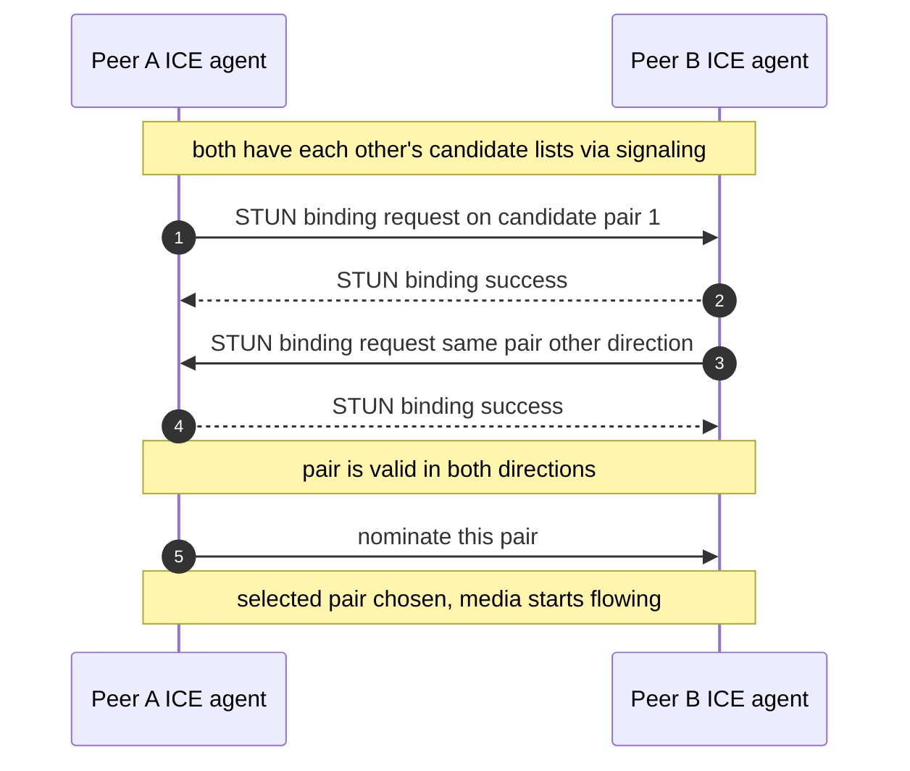
```mermaid
sequenceDiagram
  autonumber
  participant A as Peer A ICE agent
  participant B as Peer B ICE agent
  Note over A,B: both have each other's candidate lists via signaling
  A->>B: STUN binding request on candidate pair 1
  B-->>A: STUN binding success
  B->>A: STUN binding request same pair other direction
  A-->>B: STUN binding success
  Note over A,B: pair is valid in both directions
  A->>B: nominate this pair
  Note over A,B: selected pair chosen, media starts flowing
```

---

## 7. Trickle ICE

Classic ICE gathered *all* candidates, then put them in the SDP, then sent one big offer.
Gathering can take seconds (STUN round-trips, TURN allocation), so the connection stalled.

**Trickle ICE (RFC 8838)** sends the offer/answer immediately with whatever candidates you
have (often none), then streams each new candidate over signaling *as it is discovered* via
`onicecandidate`. Both sides add candidates incrementally and start connectivity checks
early. This is strictly faster and is what every modern app does.

This app trickles. In `useVoiceChat.ts`, `pc.onicecandidate` fires per candidate and calls
`sendSignal(peerId, { type: "candidate", candidate })`, and the server relays it like any
other signal.

**The ordering hazard trickle introduces:** a candidate can arrive *before* you've called
`setRemoteDescription`. `addIceCandidate` throws if there's no remote description yet. The
frontend handles this with a per-peer `pendingCandidates` buffer:

```ts
if (!peer.pc.remoteDescription) {
  peer.pendingCandidates.push(data.candidate)
} else {
  await peer.pc.addIceCandidate(data.candidate)
}
```

and `flushCandidates(peer)` drains the buffer right after each `setRemoteDescription`. This
is a textbook trickle-ICE race and the fix is exactly right — a strong detail to cite.

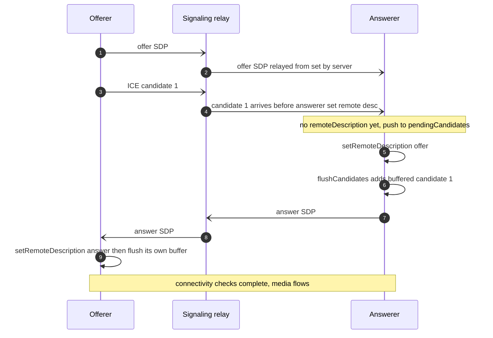
```mermaid
sequenceDiagram
  autonumber
  participant Ofr as Offerer
  participant Srv as Signaling relay
  participant Ans as Answerer
  Ofr-)Srv: offer SDP
  Srv-)Ans: offer SDP relayed from set by server
  Ofr-)Srv: ICE candidate 1
  Srv-)Ans: candidate 1 arrives before answerer set remote desc
  Note over Ans: no remoteDescription yet, push to pendingCandidates
  Ans->>Ans: setRemoteDescription offer
  Ans->>Ans: flushCandidates adds buffered candidate 1
  Ans-)Srv: answer SDP
  Srv-)Ofr: answer SDP
  Ofr->>Ofr: setRemoteDescription answer then flush its own buffer
  Note over Ofr,Ans: connectivity checks complete, media flows
```

---

## 8. TURN relays and what they cost

When ICE finds no working direct pair, media must go through a TURN relay. TURN is where
"peer-to-peer" quietly stops being peer-to-peer: both peers allocate a relayed address on
the TURN server and send media *to the server*, which forwards it to the other peer.

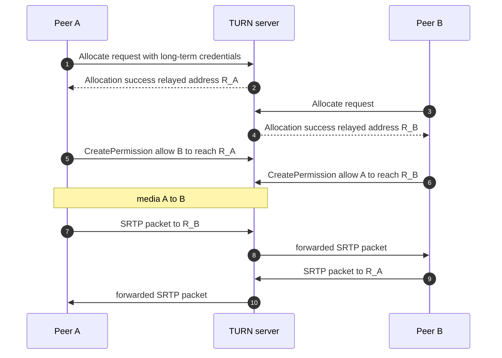
```mermaid
sequenceDiagram
  autonumber
  participant A as Peer A
  participant T as TURN server
  participant B as Peer B
  A->>T: Allocate request with long-term credentials
  T-->>A: Allocation success relayed address R_A
  B->>T: Allocate request
  T-->>B: Allocation success relayed address R_B
  A->>T: CreatePermission allow B to reach R_A
  B->>T: CreatePermission allow A to reach R_B
  Note over A,T: media A to B
  A->>T: SRTP packet to R_B
  T->>B: forwarded SRTP packet
  B->>T: SRTP packet to R_A
  T->>A: forwarded SRTP packet
```

Why it costs money and why you minimize it:

- **Bandwidth.** Every relayed byte is ingress *and* egress on the TURN host. A relayed 1:1
  video call at 500 kbps is ~1 Mbps through the server, both ways, per direction. At scale
  this dominates your infra bill.
- **Latency.** You add a hop through a third box, often not on the shortest path.
- **It is unavoidable for ~10–20% of pairs.** You cannot "turn off" TURN; you can only make
  it ephemeral and cheap. A STUN-only deployment silently fails for symmetric-NAT users.

Deployment note specific to this project: the plan is backend on **Render**, which serves
only HTTP(S) and cannot host a TURN server (TURN needs UDP and raw ports). So TURN, if used,
must be a separate box — `coturn` on a VM, or a managed TURN provider (Twilio, Cloudflare,
metered). This is called out again in [05 — Scaling to Millions](./05-scaling-to-millions.md).

In code, TURN is optional and comes from env in `buildIceServers()` (`useVoiceChat.ts`):

```ts
const servers = [{ urls: "stun:stun.l.google.com:19302" }]
if (turnUrl) servers.push({ urls: turnUrl, username, credential })
```

The hardcoded Google STUN server is fine for development but you should not depend on it in
production (no SLA, rate-limited). The way these TURN credentials are shipped is a real
security problem — see §15.

---

## 9. DTLS fingerprint: the binding between media and signaling

Return to the fingerprint line from §3, because this is the concept that ties the whole
security story together and interviewers probe it.

The media encryption keys are **not** in the SDP. What's in the SDP is
`a=fingerprint:sha-256 <hash of my DTLS cert>`. The sequence:

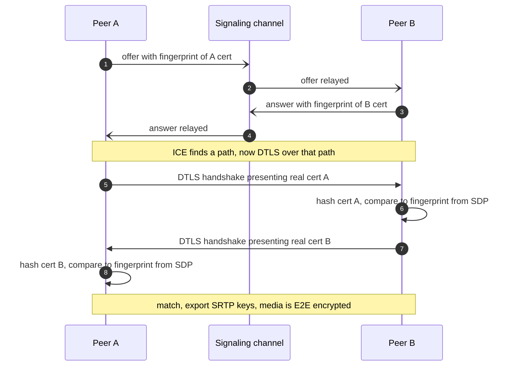
```mermaid
sequenceDiagram
  autonumber
  participant A as Peer A
  participant Sig as Signaling channel
  participant B as Peer B
  A-)Sig: offer with fingerprint of A cert
  Sig-)B: offer relayed
  B-)Sig: answer with fingerprint of B cert
  Sig-)A: answer relayed
  Note over A,B: ICE finds a path, now DTLS over that path
  A->>B: DTLS handshake presenting real cert A
  B->>B: hash cert A, compare to fingerprint from SDP
  B->>A: DTLS handshake presenting real cert B
  A->>A: hash cert B, compare to fingerprint from SDP
  Note over A,B: match, export SRTP keys, media is E2E encrypted
```

The punchline: **the media stream is end-to-end encrypted, but only authenticated as
strongly as the signaling channel.** If an attacker can rewrite the SDP in flight, they
substitute their own fingerprint, terminate DTLS themselves, and relay — a classic MITM.
This is exactly why §15 insists the signaling WebSocket must be authenticated, and why the
server-set `from` field in `VoiceSignal` matters (§10). "WebRTC is secure" is only true
given a trusted signaling path.

---

## 10. The signaling protocol in this app

The server speaks a tiny voice protocol layered on the chat WebSocket envelope
`{"type": string, "payload": string}`. Note `payload` is always a **string**; structured
payloads are JSON-encoded into it (double-encoded on the wire). The voice event constants
live at the top of `voice.go`.

| Direction | Event | Payload | Meaning |
|---|---|---|---|
| client to server | `voice_join` | `""` | Join this room's voice channel |
| client to server | `voice_leave` | `""` | Leave the voice channel |
| client to server | `voice_mute` | `"true"` / `"false"` | Update own mute flag |
| client to server | `voice_video` | `"true"` / `"false"` | Update own camera flag |
| client to server | `voice_signal` | object with `to` and `data` | Relay SDP or ICE to one peer |
| server to client | `voice_joined` | array of participants | To the joiner: peers to call |
| server to client | `voice_participants` | array of participants | Room roster, sorted |
| server to client | `voice_user_left` | `userId` | Close the peer connection to this user |
| server to client | `voice_signal` | object with `from` and `data` | Relayed SDP or ICE, `from` set by server |
| server to client | `voice_error` | string | e.g. `Voice channel is full` |

The server is **signaling-only and stateless about media**. It tracks a per-room voice
roster in memory (`m.voice[roomID]` is a `map[userID]*voiceMember`) and never sees a media
packet. The roster is memory-only by design — it is cheap, ephemeral, and lost on restart
(a real limitation discussed in [03](./03-goroutines-and-concurrency.md) and
[05](./05-scaling-to-millions.md)).

### Server-side authorization and anti-spoofing

Two rules in `VoiceSignal` (and in the voice membership helpers) do all the security work:

1. **Relay only between two members of the same room's voice channel.** The handler looks
   up both `sender` and `target` in `m.voice[c.RoomID]`. If either is missing, it returns an
   error and relays nothing. The test `TestVoiceSignalRejectedForNonParticipants` proves a
   user not in voice, and a user in a *different room's* voice, both fail to signal Alice.
2. **The `from` field is set by the server, not the client.** The inbound payload
   (`voiceSignalIn`) only has `to` and `data`. The outbound payload (`voiceSignalOut`) has
   `from: c.UserID` filled from the authenticated connection. A client literally cannot
   claim to be someone else; the field it would spoof doesn't exist on the way in. The test
   asserts `relayed.From == "bob"`.

There is also a connection-binding check: `sender.client == c`. A `voiceMember` stores the
exact `*Client` connection that joined. So if a stale connection for the same `userId` is
still floating around, it can't drive signaling for the live session. This is the same
"newest connection wins" idea used throughout the hub.

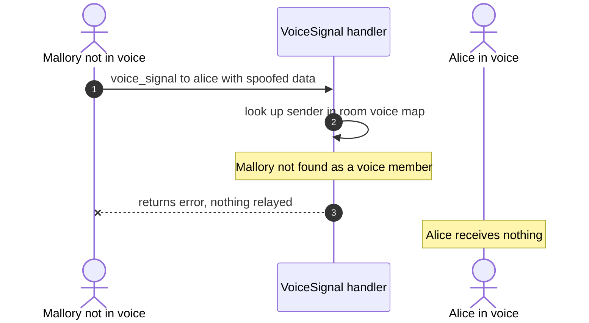
```mermaid
sequenceDiagram
  autonumber
  actor Mal as Mallory not in voice
  participant Srv as VoiceSignal handler
  actor Ali as Alice in voice
  Mal->>Srv: voice_signal to alice with spoofed data
  Srv->>Srv: look up sender in room voice map
  Note over Srv: Mallory not found as a voice member
  Srv--xMal: returns error, nothing relayed
  Note over Ali: Alice receives nothing
```

---

## 11. Full mesh topology and its cost

Every participant holds a direct `RTCPeerConnection` to every other participant. The server
relays signaling but zero media. This is the simplest possible topology and the reason the
room cap is **8** (`maxVoiceParticipants` in `voice.go`).

The cost math is why mesh does not scale, and you must be able to derive it:

- **Connections in the room:** `n(n-1)/2` (every unordered pair).
- **Per-peer uplink:** each peer sends its stream to `n-1` others, so uplink is
  `(n-1) × bitrate`. This is the real killer — a browser's uplink is limited and it is
  encoding/sending the same frame `n-1` times.
- **Per-peer downlink:** `(n-1) × bitrate` incoming.

Using this app's caps — 500 kbps video + ~32 kbps Opus audio ≈ **532 kbps per stream**:

| n | Connections `n(n-1)/2` | Per-peer uplink | Per-peer downlink | Total room egress across all peers |
|---|---|---|---|---|
| 2 | 1 | 532 kbps | 532 kbps | ~1.06 Mbps |
| 3 | 3 | 1.06 Mbps | 1.06 Mbps | ~3.19 Mbps |
| 4 | 6 | 1.60 Mbps | 1.60 Mbps | ~6.38 Mbps |
| 5 | 10 | 2.13 Mbps | 2.13 Mbps | ~10.6 Mbps |
| 6 | 15 | 2.66 Mbps | 2.66 Mbps | ~15.9 Mbps |
| 7 | 21 | 3.19 Mbps | 3.19 Mbps | ~22.3 Mbps |
| 8 | 28 | 3.72 Mbps | 3.72 Mbps | ~29.8 Mbps |

At n=8 every participant is uploading ~3.7 Mbps and encoding 7 video streams — already
punishing for a laptop on home broadband. That is why 8 is a sane ceiling and why past it
you move to an SFU (§13). The upside of mesh: **zero media infrastructure, lowest possible
latency (direct), and perfect privacy (server never sees media).** For small ephemeral
rooms that trade is exactly right for this product.

### Full join flow with three peers

The ordering here is the heart of the design. Alice is already in voice; Bob joins, then
Carol. The server tells each **joiner** who to call, and the joiner is the one who creates
offers. Existing members only ever answer.

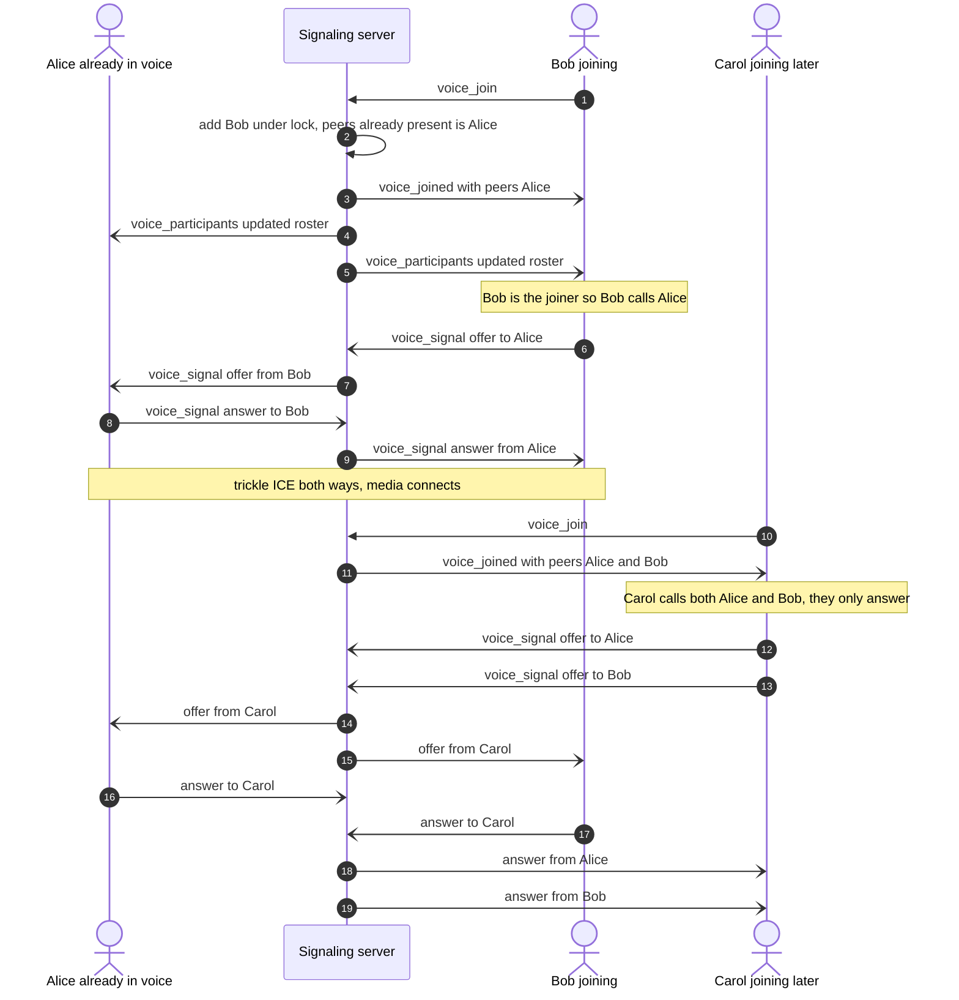
```mermaid
sequenceDiagram
  autonumber
  actor Ali as Alice already in voice
  participant Srv as Signaling server
  actor Bob as Bob joining
  actor Car as Carol joining later
  Bob->>Srv: voice_join
  Srv->>Srv: add Bob under lock, peers already present is Alice
  Srv-)Bob: voice_joined with peers Alice
  Srv-)Ali: voice_participants updated roster
  Srv-)Bob: voice_participants updated roster
  Note over Bob: Bob is the joiner so Bob calls Alice
  Bob-)Srv: voice_signal offer to Alice
  Srv-)Ali: voice_signal offer from Bob
  Ali-)Srv: voice_signal answer to Bob
  Srv-)Bob: voice_signal answer from Alice
  Note over Ali,Bob: trickle ICE both ways, media connects
  Car->>Srv: voice_join
  Srv-)Car: voice_joined with peers Alice and Bob
  Note over Car: Carol calls both Alice and Bob, they only answer
  Car-)Srv: voice_signal offer to Alice
  Car-)Srv: voice_signal offer to Bob
  Srv-)Ali: offer from Carol
  Srv-)Bob: offer from Carol
  Ali-)Srv: answer to Carol
  Bob-)Srv: answer to Carol
  Srv-)Car: answer from Alice
  Srv-)Car: answer from Bob
```

---

## 12. Glare, joiner-only offers, and perfect negotiation

**Glare** is when both peers send an offer at the same time. Each is now in
`have-local-offer` and receives a remote offer it can't apply (you can't
`setRemoteDescription(offer)` from `have-local-offer`). Without handling, both sides error
and the connection never forms.

### How this app avoids glare entirely

It sidesteps the problem by construction: **only the joiner creates offers.** When you join,
the server decides — *under the manager lock* — the exact set of peers already present and
sends them to you in `voice_joined`. You offer to each of them; they only ever answer. Two
users joining "simultaneously" are still serialized by the lock in `VoiceJoin`, so each sees
a consistent snapshot and there is never a pair where both decide to offer the other.

The comment in `VoiceJoin` says exactly this: *"Because this is decided under the lock, two
simultaneous joiners never both offer to each other (no glare)."* This is a legitimate,
elegant design choice — the signaling topology makes an entire class of bug impossible
rather than handling it after the fact.

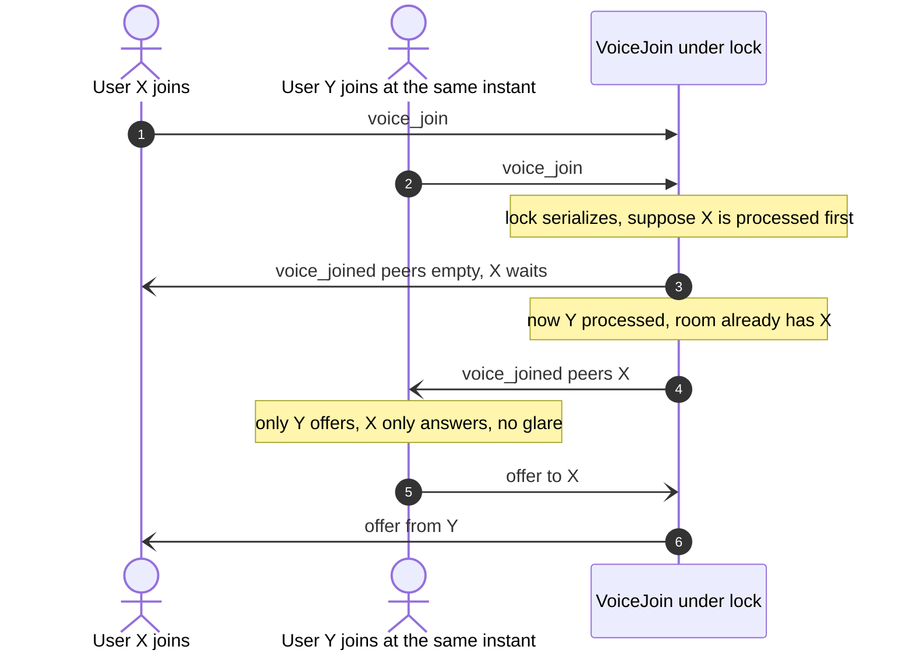
```mermaid
sequenceDiagram
  autonumber
  actor X as User X joins
  actor Y as User Y joins at the same instant
  participant Srv as VoiceJoin under lock
  X->>Srv: voice_join
  Y->>Srv: voice_join
  Note over Srv: lock serializes, suppose X is processed first
  Srv-)X: voice_joined peers empty, X waits
  Note over Srv: now Y processed, room already has X
  Srv-)Y: voice_joined peers X
  Note over Y: only Y offers, X only answers, no glare
  Y-)Srv: offer to X
  Srv-)X: offer from Y
```

### Perfect negotiation (the general solution)

If you *can't* guarantee joiner-only offers — e.g. either side may add tracks and trigger
`onnegotiationneeded` at any time — the standard pattern is **perfect negotiation (polite vs
impolite peers)**:

- Assign each peer a role: one **polite**, one **impolite** (e.g. by comparing user IDs).
- On a glare collision (an incoming offer arrives while you have a local offer):
  - the **polite** peer **rolls back** its own offer (`setLocalDescription({type:"rollback"})`),
    accepts the incoming offer, and answers.
  - the **impolite** peer **ignores** the incoming offer and keeps its own.
- ICE candidates arriving during the collision are buffered and applied after rollback.

This yields deterministic convergence no matter who offered first. This app doesn't need it
because of its join discipline, but you should be able to describe it on demand — it's a
very common WebRTC interview question. The trade-off: perfect negotiation is more general
(supports arbitrary renegotiation from either side) but adds rollback complexity and a
role-assignment rule; joiner-only is simpler but only works when one side clearly initiates.

---

## 13. The fixed two-transceiver design and camera toggle without renegotiation

This is the cleverest part of the implementation and a great "show me you understand SDP"
story.

**The problem it avoids:** adding or removing a media track changes the number of m-lines,
which fires `onnegotiationneeded` and forces a *renegotiation* (a fresh offer/answer round).
Mid-call renegotiation is exactly where glare, state-machine bugs, and flicker live. If
turning your camera on triggered renegotiation across a mesh, you'd have `n-1` simultaneous
renegotiations and plenty of ways to deadlock.

**The design:** every peer connection *always* negotiates exactly **one audio and one video
transceiver**, both `sendrecv`, from the very first offer — whether or not the camera is on.

- The **offerer** (`callPeer`) explicitly adds two transceivers:
  ```ts
  pc.addTransceiver(audioTrackRef.current ?? "audio", { direction: "sendrecv" })
  const videoTx = pc.addTransceiver(videoTrackRef.current ?? "video", { direction: "sendrecv" })
  ```
  Note `?? "audio"` / `?? "video"`: if there's no live track yet, it still creates the
  transceiver by kind, so the m-line exists regardless.
- The **answerer** (`handleSignal`, offer branch) doesn't add transceivers; it walks the
  transceivers the offer created and attaches its local tracks with `replaceTrack`:
  ```ts
  for (const tx of pc.getTransceivers()) {
    tx.direction = "sendrecv"
    if (tx.receiver.track.kind === "audio") await tx.sender.replaceTrack(audioTrackRef.current)
    else if (tx.receiver.track.kind === "video") { await tx.sender.replaceTrack(videoTrackRef.current); peer.videoSender = tx.sender }
  }
  ```

Now **turning the camera on or off is just `videoSender.replaceTrack(track | null)`** on
every peer (`setOutgoingVideo`). `replaceTrack` swaps the media source on an *existing*
sender without touching the SDP, so `onnegotiationneeded` never fires and signaling stays
`stable`. Camera off = `replaceTrack(null)`; the m-line is still there, just sending nothing.

### Verified in headless Firefox

This was not assumed — it was confirmed in a headless Firefox run:

- Two peers connected both ways (ICE `connected`, DTLS up).
- Camera off at start: video bytes sent = **0**.
- Camera toggled on: video bytes **0 → 61559** on the receiver.
- `onnegotiationneeded` **never fired**; `signalingState` stayed `stable → stable`
  throughout.
- Camera toggled off: byte counter stopped increasing.

So the "no renegotiation" claim is empirically true, not just theoretically expected.

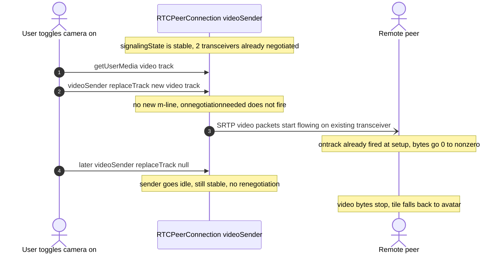
```mermaid
sequenceDiagram
  autonumber
  actor U as User toggles camera on
  participant PC as RTCPeerConnection videoSender
  actor P as Remote peer
  Note over PC: signalingState is stable, 2 transceivers already negotiated
  U->>PC: getUserMedia video track
  U->>PC: videoSender replaceTrack new video track
  Note over PC: no new m-line, onnegotiationneeded does not fire
  PC-)P: SRTP video packets start flowing on existing transceiver
  Note over P: ontrack already fired at setup, bytes go 0 to nonzero
  U->>PC: later videoSender replaceTrack null
  Note over PC: sender goes idle, still stable, no renegotiation
  Note over P: video bytes stop, tile falls back to avatar
```

---

## 14. Mute, bitrate capping, congestion control, and media quality

### Mute without renegotiation

Mute is `audioTrackRef.current.enabled = false` in `toggleMute`. A disabled track still
exists on the sender — it just emits silence frames — so there is **no renegotiation** and
no connection churn. The server is told via `voice_mute` purely so other clients can show a
mic-off icon; it has no effect on the media path.

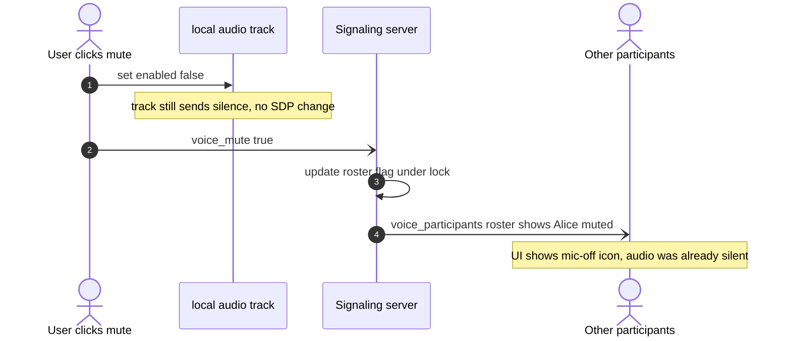
```mermaid
sequenceDiagram
  autonumber
  actor U as User clicks mute
  participant Track as local audio track
  participant Srv as Signaling server
  actor P as Other participants
  U->>Track: set enabled false
  Note over Track: track still sends silence, no SDP change
  U-)Srv: voice_mute true
  Srv->>Srv: update roster flag under lock
  Srv-)P: voice_participants roster shows Alice muted
  Note over P: UI shows mic-off icon, audio was already silent
```

Why not stop the track entirely? Stopping it would end the m-line's media and could prompt
renegotiation and re-prompt the mic permission. `enabled=false` is the cheap, reversible,
no-renegotiation mute. This is the standard pattern.

### Bitrate capping

Video is capped at **500 kbps per peer** via the sender's encoding parameters, not via SDP:

```ts
const params = sender.getParameters()
params.encodings[0].maxBitrate = VIDEO_MAX_BITRATE // 500_000
await sender.setParameters(params)
```

`limitVideoBitrate` runs best-effort after the offer/answer (it can fail before negotiation
completes, hence the try/catch). Capping matters doubly in a mesh: your uplink is
`(n-1) × bitrate`, so an uncapped 2.5 Mbps camera at n=8 would try to push ~17 Mbps uplink
and collapse. The capture constraints also keep it modest: 640×360 ideal, ≤30 fps, and
`contentHint = "motion"` tells the encoder to favor smooth motion over sharp stills.

### Congestion control (GCC / TWCC)

The 500 kbps cap is a ceiling, not a fixed rate. Underneath, WebRTC runs its own congestion
control and will send *below* the cap when the network is bad:

- **GCC (Google Congestion Control)** estimates available bandwidth from two signals: delay
  gradient (packets arriving later than expected means a queue is building) and loss. It
  continuously adjusts the send bitrate.
- **TWCC (Transport-Wide Congestion Control)** is the feedback mechanism: the receiver tags
  every packet transport-wide and reports arrival times back via RTCP, so the sender has a
  precise, per-packet view of delay and loss to feed GCC.

The encoder then adapts: it drops bitrate, resolution, or frame rate to fit the estimate.
You set the ceiling and the floor-ish constraints; WebRTC does the real-time adaptation.
This is why a WebRTC call degrades gracefully (blurry but connected) instead of freezing —
a key contrast with naive streaming.

### Simulcast and SVC (why they don't appear here, and when they would)

In a mesh these don't apply, but you should know them because they're the first thing an
SFU adds:

- **Simulcast** — a sender encodes the *same* video at several resolutions/bitrates
  simultaneously (e.g. 180p, 360p, 720p) and sends all layers to an SFU. The SFU forwards
  the appropriate layer to each receiver based on that receiver's bandwidth and whether
  it's the active speaker. Needs an SFU to pick layers; pointless in pure P2P mesh.
- **SVC (Scalable Video Coding)** — one encoded stream with embedded layers (temporal /
  spatial), so the SFU can drop layers by discarding packets without re-encoding. More
  efficient than simulcast, more codec-dependent (VP9/AV1).

Both exist to let one sender serve many heterogeneous receivers cheaply — exactly the
problem a mesh doesn't have (only one receiver per connection) and an SFU does.

---

## 15. Rendering: audio sinks, muted tiles, mirrored preview, autoplay

The media plumbing on screen has a few non-obvious rules, all driven by browser behavior.

**Build a MediaStream per peer in JS.** Tracks that arrive via `addTransceiver`/`replaceTrack`
carry no stream, so `ontrack` builds one by hand (`useVoiceChat.ts`):

```ts
peer.remoteTracks = [...peer.remoteTracks.filter(t => t.kind !== e.track.kind), e.track]
setRemoteStreams(prev => ({ ...prev, [peerId]: new MediaStream(peer.remoteTracks) }))
```

Creating a **fresh** `MediaStream` object each time forces React/the media element to
re-bind to the new track set — important when video is added after audio.

**Audio and video are rendered by different components to avoid double audio / echo:**

- `VoiceAudio` (`voice-audio.tsx`) renders a **hidden** `<audio autoPlay>` sink per remote
  peer. This is the only place remote audio is played.
- `VideoGrid` (`video-grid.tsx`) renders `<video ... muted>` tiles. **The video elements are
  always muted** — remote audio comes solely through `VoiceAudio`, and your own local
  preview must never play back your own mic (that's an echo/feedback loop). The code comment
  states this exactly.

**Mirror the local preview.** The local tile gets `-scale-x-100` (`isLocal` → mirrored),
matching the "selfie" convention; remote tiles are not mirrored.

**Avatar fallback.** A tile shows video only when `videoOn && stream !== null`; otherwise it
renders initials. This is why `voice_video` roster flags matter — a peer with the camera off
shows an avatar, not a black rectangle.

**Autoplay policy.** Browsers block autoplaying audio without a user gesture. Here, *joining
voice is itself a click*, so playback is normally allowed; the code still wraps `play()` in
`.catch()` and logs if the browser blocks it, rather than throwing. This is the correct
defensive posture around the autoplay policy.

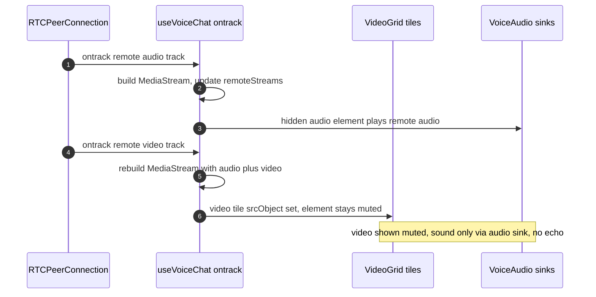
```mermaid
sequenceDiagram
  autonumber
  participant PC as RTCPeerConnection
  participant Hook as useVoiceChat ontrack
  participant Grid as VideoGrid tiles
  participant Aud as VoiceAudio sinks
  PC->>Hook: ontrack remote audio track
  Hook->>Hook: build MediaStream, update remoteStreams
  Hook->>Aud: hidden audio element plays remote audio
  PC->>Hook: ontrack remote video track
  Hook->>Hook: rebuild MediaStream with audio plus video
  Hook->>Grid: video tile srcObject set, element stays muted
  Note over Grid,Aud: video shown muted, sound only via audio sink, no echo
```

---

## 16. Failure handling

Real deployments fail in predictable ways. The hook handles each explicitly.

- **Permission denied / no device / device busy.** `getUserMedia` rejects with a
  `DOMException`; `mediaErrorMessage` maps `NotAllowedError`, `NotFoundError`,
  `NotReadableError` to human messages. Crucially, if the **camera** fails during join, the
  user still joins with **audio only** (the camera error is reported but not fatal) — mic
  failure aborts the join.
- **Camera unplugged / revoked mid-call.** The capture track's `onended` fires. The handler
  swaps the outgoing track to null (`setOutgoingVideo(null)`), stops the camera locally, and
  sends `voice_video false` so peers drop the tile — all without renegotiation.
- **Connection failed.** `onconnectionstatechange` logs when state hits `failed`, with the
  note "a TURN server may be required." A pure STUN deployment hitting symmetric NAT lands
  here; the fix is to configure TURN (§8).
- **Secure context required.** `getUserMedia` only exists on HTTPS or `localhost`. The hook
  checks `navigator.mediaDevices?.getUserMedia` and throws a clear "requires HTTPS" error
  otherwise.
- **Room full.** The server returns `voice_error "Voice channel is full"` when a 9th user
  tries to join (`maxVoiceParticipants`). The client calls `cleanup()` and surfaces the
  message. Proven by `TestVoiceRejectsWhenFull`.

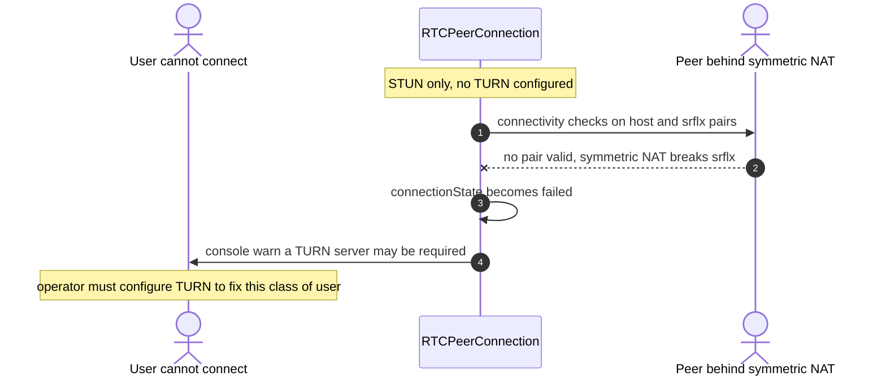
```mermaid
sequenceDiagram
  autonumber
  actor U as User cannot connect
  participant PC as RTCPeerConnection
  actor P as Peer behind symmetric NAT
  Note over PC: STUN only, no TURN configured
  PC->>P: connectivity checks on host and srflx pairs
  P--xPC: no pair valid, symmetric NAT breaks srflx
  PC->>PC: connectionState becomes failed
  PC->>U: console warn a TURN server may be required
  Note over U: operator must configure TURN to fix this class of user
```

---

## 17. Lifecycle: join, leave, disconnect, and stale sessions on reload

Voice membership is bound to a specific connection, which makes reconnects clean.

**Normal leave.** `leave()` sends `voice_leave` and calls `cleanup()` (stops tracks, closes
all peer connections). The server removes the member *only if the session belongs to this
connection* (`removeVoiceMemberLocked(roomID, userID, c)`), then broadcasts `voice_user_left`
and the updated roster. Peers close the matching `RTCPeerConnection`.

**Disconnect (tab close, network drop).** No `voice_leave` is sent, but the WebSocket read
loop errors and the hub's unregister path removes the voice membership and broadcasts
`voice_user_left` anyway. `TestVoiceSignalingFlow` verifies that `bob.Close()` makes Alice
receive `voice_user_left bob`.

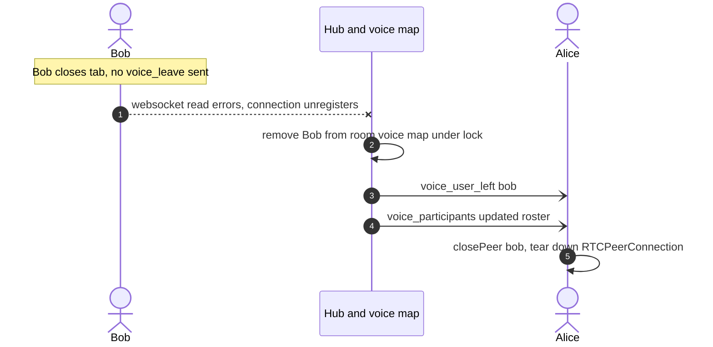
```mermaid
sequenceDiagram
  autonumber
  actor Bob as Bob
  participant Srv as Hub and voice map
  actor Ali as Alice
  Note over Bob: Bob closes tab, no voice_leave sent
  Bob--xSrv: websocket read errors, connection unregisters
  Srv->>Srv: remove Bob from room voice map under lock
  Srv-)Ali: voice_user_left bob
  Srv-)Ali: voice_participants updated roster
  Ali->>Ali: closePeer bob, tear down RTCPeerConnection
```

**Stale session on reload.** This is the subtle one. When Bob reloads, the old WebSocket may
linger briefly while the new one connects with the *same* `userId`. Two mechanisms keep this
clean:

1. On the server, the new connection's `addClient` drops any stale voice session for that
   `userId` from the older connection (the `voiceMember.client == c` binding means only the
   current connection "owns" the membership).
2. The server also broadcasts `voice_user_left <reloaded userId>`. On the frontend
   (`handleVoiceEvent`), a client receiving `voice_user_left` for **its own** `userId` treats
   it as "the server dropped our session (we reconnected elsewhere)" and runs `cleanup()`,
   while other peers just `closePeer` the old connection and will get a fresh offer when the
   reloaded Bob rejoins.

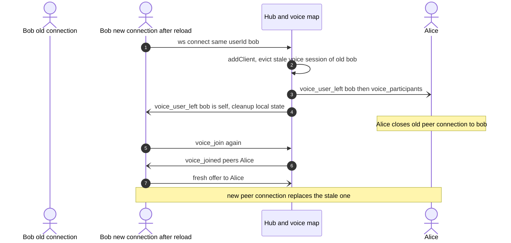
```mermaid
sequenceDiagram
  autonumber
  actor Old as Bob old connection
  actor New as Bob new connection after reload
  participant Srv as Hub and voice map
  actor Ali as Alice
  New->>Srv: ws connect same userId bob
  Srv->>Srv: addClient, evict stale voice session of old bob
  Srv-)Ali: voice_user_left bob then voice_participants
  Srv-)New: voice_user_left bob is self, cleanup local state
  Note over Ali: Alice closes old peer connection to bob
  New->>Srv: voice_join again
  Srv-)New: voice_joined peers Alice
  New-)Srv: fresh offer to Alice
  Note over Ali,New: new peer connection replaces the stale one
```

The `createPeer` call also defensively `closePeer`s any existing connection to the same peer
id before making a new one, so a re-offer never leaks a dangling `RTCPeerConnection`.

---

## 18. Mesh vs SFU vs MCU

The question "how would you scale this past 8 people?" is really "which topology?" Three
canonical answers, each a different point on the cost/latency/quality curve.

| | Mesh (this app) | SFU (Selective Forwarding Unit) | MCU (Multipoint Control Unit) |
|---|---|---|---|
| Media path | Peer to peer, direct | Each peer sends once to server, server forwards | Server decodes, mixes, re-encodes one stream |
| Server media role | None, signaling only | Routes/forwards packets, no decode | Full decode + composite + encode |
| Client uplink | `(n-1)` copies | **1** copy | 1 copy |
| Client downlink | `(n-1)` streams | `(n-1)` streams (or fewer with simulcast) | **1** mixed stream |
| Server CPU | Zero media | Low (packet routing) | **Very high** (transcoding) |
| Server bandwidth | Zero media | High (fan-out) | High |
| Latency | Lowest (direct) | Low (one hop) | Highest (decode+encode) |
| E2E encryption | Yes, true E2E | Hop-by-hop (server sees packets, usually not plaintext unless Insertable Streams) | No, server sees media in clear |
| Good for | 2 to ~6-8 peers | ~8 to hundreds | Legacy, lowest-end clients, recording |
| Cost driver | Client bandwidth | Server bandwidth | Server CPU |

**When to switch from mesh to SFU:** when per-client uplink becomes the bottleneck, which in
practice is around 4–8 participants for video. The moment you want 10, 50, or 500 people in
a call, the SFU is the answer — each client uploads exactly once, and the server fans out.
This is the dominant architecture for modern group calling (Zoom-like, Meet, Jitsi,
LiveKit, mediasoup, Janus). See [05 — Scaling to Millions](./05-scaling-to-millions.md) for
how that fits the rest of this system.

**When MCU:** rarely today. It made sense when clients were too weak to decode `n-1` streams
or when you must emit a single composited stream (e.g. RTMP to a broadcast, or a SIP/PSTN
gateway). The transcoding cost is brutal and it destroys E2E encryption.

### Media flow per topology

Mesh — n(n-1)/2 direct paths, server untouched by media:

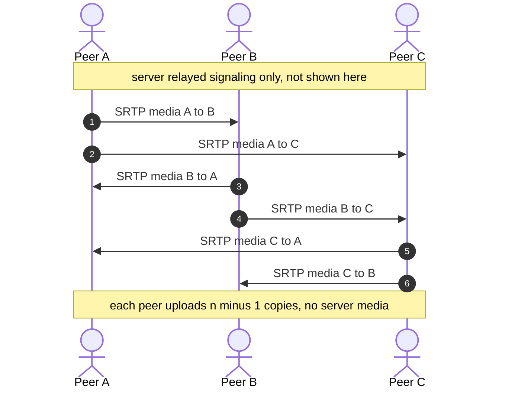
```mermaid
sequenceDiagram
  autonumber
  actor A as Peer A
  actor B as Peer B
  actor C as Peer C
  Note over A,C: server relayed signaling only, not shown here
  A->>B: SRTP media A to B
  A->>C: SRTP media A to C
  B->>A: SRTP media B to A
  B->>C: SRTP media B to C
  C->>A: SRTP media C to A
  C->>B: SRTP media C to B
  Note over A,C: each peer uploads n minus 1 copies, no server media
```

SFU — each peer uploads once, server forwards selectively:

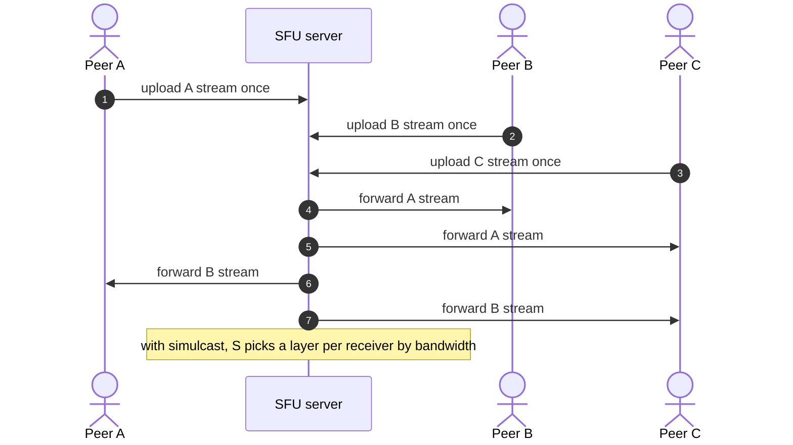
```mermaid
sequenceDiagram
  autonumber
  actor A as Peer A
  participant S as SFU server
  actor B as Peer B
  actor C as Peer C
  A->>S: upload A stream once
  B->>S: upload B stream once
  C->>S: upload C stream once
  S->>B: forward A stream
  S->>C: forward A stream
  S->>A: forward B stream
  S->>C: forward B stream
  Note over S: with simulcast, S picks a layer per receiver by bandwidth
```

MCU — server decodes, mixes, sends one stream back:

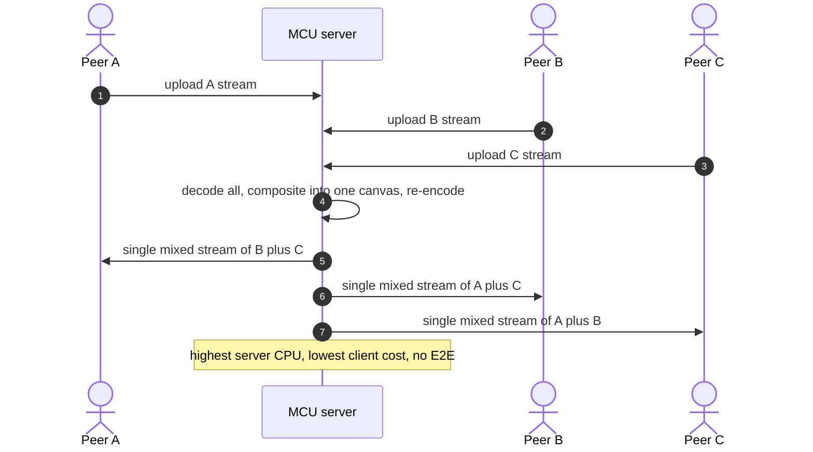
```mermaid
sequenceDiagram
  autonumber
  actor A as Peer A
  participant M as MCU server
  actor B as Peer B
  actor C as Peer C
  A->>M: upload A stream
  B->>M: upload B stream
  C->>M: upload C stream
  M->>M: decode all, composite into one canvas, re-encode
  M->>A: single mixed stream of B plus C
  M->>B: single mixed stream of A plus C
  M->>C: single mixed stream of A plus B
  Note over M: highest server CPU, lowest client cost, no E2E
```

---

## 19. ICE restart

Networks change under a live call: Wi-Fi to cellular handoff, VPN flap, NAT rebinding after
a timeout. The selected candidate pair dies and `iceConnectionState` goes `disconnected`
then `failed`. You do **not** want to tear down the whole call (new DTLS, new keys, media
gap) if you can avoid it.

**ICE restart** re-runs only the ICE phase with a fresh `ice-ufrag`/`ice-pwd`, keeping the
DTLS/SRTP session and media tracks intact. You call `createOffer({ iceRestart: true })` (or
`restartIce()`), send the new offer/answer, gather new candidates, and ICE finds a new path.
The media session survives the network change.

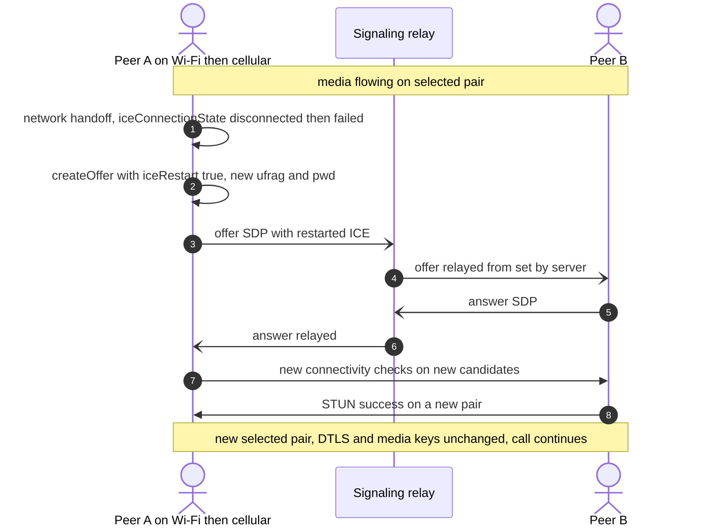
```mermaid
sequenceDiagram
  autonumber
  actor A as Peer A on Wi-Fi then cellular
  participant Sig as Signaling relay
  actor B as Peer B
  Note over A,B: media flowing on selected pair
  A->>A: network handoff, iceConnectionState disconnected then failed
  A->>A: createOffer with iceRestart true, new ufrag and pwd
  A-)Sig: offer SDP with restarted ICE
  Sig-)B: offer relayed from set by server
  B-)Sig: answer SDP
  Sig-)A: answer relayed
  A->>B: new connectivity checks on new candidates
  B->>A: STUN success on a new pair
  Note over A,B: new selected pair, DTLS and media keys unchanged, call continues
```

Note this app does **not** currently implement ICE restart — a connection failure just gets
logged, and recovery relies on the user rejoining (which rebuilds the peer connection from
scratch). Adding `restartIce()` on the `disconnected`/`failed` transition would be a clean,
low-risk resilience improvement, and is worth proposing in an interview as "the next thing
I'd add."

---

## 20. Security: TURN credentials and the ephemeral REST API

### The problem in this codebase

TURN credentials are read from `NEXT_PUBLIC_*` env vars in `buildIceServers()`:

```ts
process.env.NEXT_PUBLIC_TURN_USERNAME
process.env.NEXT_PUBLIC_TURN_CREDENTIAL
```

Anything prefixed `NEXT_PUBLIC_` in Next.js is **inlined into the client bundle** and shipped
to every browser. So these are static, long-lived TURN credentials visible to anyone who
opens devtools. An attacker can lift them and use your TURN server as a free, open relay
(for their own traffic, port scanning, abuse) — you pay the bandwidth bill. This is a
genuine, common misconfiguration.

### The fix: TURN REST API (ephemeral, time-limited HMAC credentials)

The standard solution (`draft-uberti-behave-turn-rest`) issues **short-lived** credentials
the client can't reuse for long and that no one can forge:

- The TURN server (`coturn`) is configured with `use-auth-secret` and a shared **secret
  known only to the backend and the TURN server** — never shipped to the browser.
- When a client is about to join voice, it asks the **backend** for credentials. The backend
  computes:
  - `username = <unix expiry timestamp>:<optional user id>` (e.g. valid for 2 minutes)
  - `credential = base64(HMAC_SHA1(secret, username))`
- The backend returns `{ username, credential, urls }`. The client plugs them into
  `iceServers`. `coturn` recomputes the same HMAC from the embedded expiry and the shared
  secret, so it validates without any database and automatically rejects expired usernames.

Now the browser never holds the real secret, credentials expire in minutes, and a leaked
credential is worthless almost immediately.

```mermaid
sequenceDiagram
  autonumber
  actor C as Client about to join voice
  participant BE as Backend holds shared secret
  participant TURN as coturn use-auth-secret
  C->>BE: request TURN credentials, authenticated session
  BE->>BE: username is expiry timestamp, credential is HMAC of username with secret
  BE-->>C: username, credential, turn urls, short TTL
  C->>C: build iceServers with these ephemeral creds
  C->>TURN: Allocate with username and credential
  TURN->>TURN: recompute HMAC from username and shared secret, check expiry
  alt valid and not expired
    TURN-->>C: Allocation success relayed address
  else expired or bad HMAC
    TURN--xC: 401 unauthorized
  end
  Note over C,TURN: secret never leaves the backend, creds die in minutes
```

### Related signaling-channel hardening

Because the DTLS fingerprint binds media security to signaling (§9), the signaling path must
itself be trustworthy. Two issues documented elsewhere compound here:

- **`/ws` is unauthenticated** — it trusts `userId`/`roomId` query params with no `userKey`
  check (see [02](./02-websocket-architecture.md) and [03](./03-goroutines-and-concurrency.md)).
  Anyone who knows the ids can connect as that user and inject voice signaling. The server's
  `from`-is-set-by-server rule limits *impersonation within* a connection, but it can't help
  if the connection itself was never authenticated. Fix: validate `userKey` or a one-time
  signed ticket during the upgrade.
- **`checkOrigin` uses a prefix match** on `FRONTEND_FULL_URL`, so
  `https://app.vercel.app.evil.com` passes. Fix: exact-match allow-list. Also discussed in
  [02](./02-websocket-architecture.md) and [05](./05-scaling-to-millions.md).

Neither breaks the clever parts of the voice design, but both weaken the trust assumption
that WebRTC's end-to-end encryption quietly relies on.

---

## 21. Summary and interview soundbites

- **WebRTC has no signaling in the spec** — this app reuses the chat WebSocket as the
  signaling channel; `VoiceSignal` in `voice.go` is the whole relay.
- **Media is pure P2P full mesh**; the server never sees a media packet, only relays SDP/ICE
  and tracks an in-memory roster.
- **Mesh cost is `n(n-1)/2` connections and `(n-1) × bitrate` uplink per peer** — the reason
  for the 8-person cap and the point where you'd switch to an SFU.
- **Glare is designed out**: only the joiner offers, decided under the manager lock. Perfect
  negotiation (polite/impolite) is the general fallback when you can't guarantee that.
- **Two fixed transceivers + `replaceTrack`** means camera on/off and mute never renegotiate
  — verified in headless Firefox (bytes `0 → 61559`, `onnegotiationneeded` never fired,
  signaling stayed `stable`).
- **Trickle ICE** with a `pendingCandidates` buffer handles the candidate-before-remote-desc
  race correctly.
- **The DTLS fingerprint in SDP** binds media encryption to the signaling channel — so the
  signaling channel must be authenticated. It currently isn't (`/ws` trusts query params),
  which is the headline hardening item.
- **TURN credentials leak via `NEXT_PUBLIC_` env**; fix with the TURN REST API (time-limited
  HMAC credentials issued by the backend).
- **Known next steps**: ICE restart on `failed`, authenticated upgrade, exact-match origin
  check, and (for larger rooms) an SFU.

Continue to [05 — Scaling to Millions](./05-scaling-to-millions.md) for how voice, the
WebSocket hub, and Redis evolve into a distributed system, and
[06 — Interview Guide](./06-interview-guide.md) for drilled Q&A on everything above.
