# 05 — Scaling to Millions

How do we take a single Go process that holds every room in a `map` and turn it
into a system that serves ~1,000,000 concurrent WebSocket connections across
~100,000 rooms, plus WebRTC voice/video, across multiple regions, with
zero-downtime deploys?

This file is the "staff interview" chapter. It starts from the exact code in
this repo, shows where it breaks and *why*, does the back-of-the-envelope math
so you can defend your numbers, and then builds the target architecture
piece by piece with the trade-offs spelled out.

Related reading:

- [01 — System Overview](./01-system-overview.md)
- [02 — WebSocket Architecture](./02-websocket-architecture.md)
- [03 — Goroutines and Concurrency](./03-goroutines-and-concurrency.md)
- [04 — WebRTC Signaling](./04-webrtc-signaling.md)
- [06 — Interview Guide](./06-interview-guide.md)

> **All numbers in this file are estimates.** They are order-of-magnitude
> figures to reason about capacity, not benchmarks from this codebase. Real
> numbers depend on message size, fan-out, CPU, NIC, kernel, and cloud
> provider. Always load-test before you commit to a capacity plan.

---

## 1. Where the current design breaks

Everything here lives in **one Go process**. Let's name the exact pieces from
the code and then explain the ceiling each one hits.

### 1.1 In-memory maps are the whole database for live state

From `backend/internal/websocket/manager.go`, the `Manager` struct holds:

```go
type Manager struct {
    clients    ClientList            // userId -> *Client  (GLOBAL, not per-room)
    rooms      map[string]ClientList // roomId -> (userId -> *Client)
    admins     map[string]string     // roomId -> adminUserId
    register   chan *Client
    unregister chan *Client
    broadcast  chan RoomEvent
    sync.RWMutex
    handlers map[string]EventHandler
    voice    map[string]map[string]*voiceMember // roomId -> userId -> session
    rdb      *db.RedisClient
}
```

Four maps (`clients`, `rooms`, `admins`, `voice`) are the live source of truth
for *who is connected right now*. None of it is replicated. None of it survives
a restart. The consequences:

- **A second process shares nothing.** If you run two instances behind a load
  balancer, a client connected to instance A and a client connected to
  instance B are in two different `rooms` maps. `BroadcastToRoom` on A never
  reaches the client on B. The room is silently split-brained. This is the
  single biggest blocker to horizontal scaling.
- **Restart wipes presence.** On Render free tier the instance spins down after
  ~15 minutes idle. When it wakes, `rooms`, `voice`, and `admins` are empty
  maps. The Redis data (`room:<id>`, `room:members:<id>`) is still there, but
  the live connection graph is gone. In particular `admins` is empty, so
  `SendToAdmin` logs `"No admin for room"` and the `REQUEST_TO_JOIN` event never
  reaches the admin — new joins silently break until the admin reconnects (which
  re-runs `SetRoomAdmin` only on `/createRoom`, not on reconnect). See
  [02 — WebSocket Architecture](./02-websocket-architecture.md) and
  [03 — Goroutines and Concurrency](./03-goroutines-and-concurrency.md) for the
  in-memory-state discussion.

### 1.2 The single hub goroutine is a serialization point

`Run()` is started exactly once in `app.go` (`go WSmanager.Run()`). It is a
single `for { select { ... } }` loop over `register`, `unregister`, and
`broadcast`. Every join, every leave, and every room broadcast funnels through
*one goroutine*.

That is fine at small scale and it is a classic "share memory by communicating"
hub. But at a million connections it becomes a bottleneck in two ways:

1. **Throughput ceiling.** One goroutine processes `broadcast` events serially.
   If each event's fan-out touches a 50-person room, and you have thousands of
   rooms each doing a few messages/sec, the hub becomes the busiest goroutine
   in the process and cannot use more than one core for that work.
2. **Self-send deadlock risk (known issue).** `addClient` and `removeClient`
   run *inside* `Run()` (they are called from the `select`), yet they push onto
   `m.broadcast` — the very channel `Run()` is the only drainer of. This works
   only while the 128-slot buffer has room. Under a burst of joins/leaves (a
   reconnect storm, exactly what happens after a deploy), the hub can fill its
   own input channel and block on itself. The whole server stalls. The fix is
   to call `BroadcastToRoom` directly inside the hub, or run a separate fan-out
   goroutine, or never send to your own input channel. This is covered in depth
   in [03 — Goroutines and Concurrency](./03-goroutines-and-concurrency.md); for
   scaling, the point is: **the hub must not be able to block on itself**, or no
   amount of hardware saves you.

### 1.3 Mixed concurrency model

The code uses *both* the hub channels *and* a `sync.RWMutex` embedded in the
`Manager`. HTTP handlers call `BroadcastToRoom`, `SendToAdmin`, and
`SetRoomAdmin` directly from their own goroutines and take the mutex. Voice
handlers (`VoiceJoin`, `VoiceSignal`, …) run on the per-connection *reader*
goroutine and also take the mutex.

So state is protected by a lock, but control flow pretends to be an actor. That
is two models fighting. At scale you want **one owner** of each piece of state:
either a sharded actor (one goroutine owns one shard, no lock) or a plain
lock-protected structure with no "hub" at all. Picking one removes a whole class
of bugs (`RemoveUserFromRoom` returning while holding the lock, close-on-closed-
channel panics, etc. — see [03](./03-goroutines-and-concurrency.md)).

### 1.4 Single Redis

Redis holds `room:<id>`, `room:members:<id>`, `room:messages:<id>`,
`room:memberKey:<id>:<uid>`, and so on (see `internal/service/ChatService.go`).
A single Redis node is a single point of failure and a single throughput
ceiling. One modern Redis node does maybe ~100k–200k simple ops/sec before you
feel it; a `room:messages` `RPUSH` plus the `EXPIRE` you *should* be doing is a
couple ops per message. More importantly it is one failure domain: if it is
down, every room is down.

> **Carry-over bug for the roadmap:** `CreateChatRoom` does
> `RPUSH __init__ ; LPOP ; EXPIRE` on `room:messages`. The `LPOP` empties the
> list, Redis deletes the now-empty key, `EXPIRE` returns 0, and the first real
> message creates a fresh list with **TTL -1** — messages never expire. Verified
> with `redis-cli`. This is Phase 0 work; see the roadmap in §12.

### 1.5 Mesh WebRTC caps the room at ~8

`voice.go` sets `const maxVoiceParticipants = 8`. The topology is full mesh:
every participant has a direct `RTCPeerConnection` to every other participant.
That is `n(n-1)/2` connections and each peer *uploads n-1 copies* of its own
media. See [04 — WebRTC Signaling](./04-webrtc-signaling.md) for the full
treatment. For scaling the headline is: **mesh does not scale past a handful of
publishers**, so large calls need an SFU (§11).

### 1.6 WebSocket auth is query-string trust

`ServeWS` reads `userId` and `roomId` from the query string and does **no**
`userKey` check. Anyone who knows the ids can connect and impersonate. At one
user this is a bug; at a million users exposed to the internet it is a
DDoS/abuse vector. The fix (ticket-based auth) is in §10.

---

## 2. Capacity planning (back-of-the-envelope)

Before designing anything, decide what one node can actually hold. Interviewers
love this because it forces you to reason about the OS, not just the app.

### 2.1 Connections per node

A WebSocket is a long-lived TCP connection. The limits you hit, in order:

| Limit | Where | Default | What to set | Why |
|---|---|---|---|---|
| File descriptors | per-process `ulimit -n` | often 1024 | 1,000,000+ | every socket is an fd |
| System-wide fds | `fs.file-max` | varies | a few million | kernel cap |
| Listen backlog | `net.core.somaxconn` | 128–4096 | 65535 | accept() queue during connect storms |
| SYN backlog | `net.ipv4.tcp_max_syn_backlog` | small | 65535 | half-open connections during storms |
| TIME_WAIT reuse | `net.ipv4.tcp_tw_reuse` | 0 | 1 | reuse sockets after close, outbound |
| Ephemeral ports | `net.ipv4.ip_local_port_range` | ~28k | 1024–65535 | matters for *outbound* (gateway→Redis/backbone), see below |
| conntrack table | `nf_conntrack_max` | 65536 | millions or disable | NAT/firewall tracking blows up |

**Ephemeral port myth.** People say "a server can only hold ~65k connections
because of ports." That is wrong for *inbound* connections. A TCP connection is
identified by the 4-tuple `(src_ip, src_port, dst_ip, dst_port)`. The server's
`dst_port` is fixed (443). Each distinct *client* `(src_ip, src_port)` is a new
tuple, so one server port accepts millions of inbound connections. The 65k port
limit only bites on the *outbound* side — e.g. a gateway opening connections to
Redis or the pub/sub backbone *to a single destination IP:port* is capped at ~64k
ephemeral ports. Fix with connection pooling and/or multiple backbone endpoints.

**Memory per connection.** This is usually what actually caps you, not fds. For
this codebase, per WebSocket connection:

- 2 goroutines (reader + writer). Go goroutine stacks start ~2–8 KB and grow.
  Call it ~8–16 KB for the pair at rest.
- gorilla buffers: `ReadBufferSize: 1024` + `WriteBufferSize: 1024` = ~2 KB.
- `egress chan Event` buffered to 64. If events are small (say a few hundred
  bytes), a full buffer is ~tens of KB, but typically near-empty, so budget a
  few KB amortized.
- Kernel socket buffers: `tcp_rmem`/`tcp_wmem` — the big one. Defaults can be
  tens to hundreds of KB *per socket* and the kernel autotunes up under load.
  You often **lower** the minimum (`net.ipv4.tcp_rmem = 4096 ...`) for idle
  chat sockets to fit more connections.

Rough per-connection budget (estimate): **~20–60 KB** app+runtime, plus
**~10–100 KB** kernel socket buffers depending on tuning. Say **~50–150 KB**
all-in.

- At 100 KB/conn, **1,000,000 connections ≈ 100 GB RAM.** That does not fit one
  box, which is *why* you need a gateway tier of many nodes.
- A practical, well-tuned single Go node holds roughly **100k–500k idle
  WebSocket connections** (estimate; the C10M crowd pushes higher with heavy
  tuning and tiny buffers). Plan for the low end so headroom absorbs spikes.

So for 1M connections you want on the order of **5–20 gateway nodes** depending
on tuning and per-connection message rate.

### 2.2 The C10K / C1M problem and the Go netpoller

Why can Go hold hundreds of thousands of connections with a goroutine-per-read
model when the old wisdom was "thread per connection dies at 10k"? Because Go
goroutines are not OS threads. Each blocking `conn.ReadMessage()` does **not**
block an OS thread. Under the hood the runtime uses an **epoll** (Linux)
netpoller: when a goroutine would block on I/O, the runtime parks it, registers
the fd with epoll, and lets the OS thread run other goroutines. When data
arrives, the netpoller wakes the goroutine. So you pay goroutine-stack memory,
not thread memory, and the scheduler multiplexes everything over a small pool of
OS threads (`GOMAXPROCS`). That is the whole trick that makes
goroutine-per-connection viable. See [03](./03-goroutines-and-concurrency.md).

### 2.3 Fan-out cost: messages/sec is not what matters, *deliveries*/sec is

The load that actually hurts is **fan-out**, not inbound message rate.

```
deliveries_per_sec = sum over rooms of (room_size * messages_per_sec_in_that_room)
```

Example (estimates):

- 100,000 rooms, average 10 members each = 1,000,000 connections. ✔ matches target.
- Each room averages 1 message every 5 seconds = 0.2 msg/s per room.
- Inbound: `100,000 * 0.2 = 20,000 messages/sec`. Small.
- Deliveries: `20,000 * 10 = 200,000 deliveries/sec`. Still fine.

Now change the shape. One **giant room** of 100,000 members doing 5 msg/s:

- Inbound: `5 messages/sec`. Trivial.
- Deliveries: `5 * 100,000 = 500,000 deliveries/sec` for a *single room*.

That is the "celebrity/town-hall" problem. The cost is dominated by big rooms,
and a single room cannot be split across gateways without a fan-out backbone.
This is why the fan-out backbone (§5) and room sharding (§6) exist, and why you
cap or special-case huge rooms.

### 2.4 Bandwidth: chat vs media

| Traffic | Per-unit | 1M users scenario | Who carries it |
|---|---|---|---|
| Chat message | ~0.2–1 KB on the wire | 200k deliveries/s * 0.5 KB ≈ **100 MB/s** egress across the fleet | gateways |
| WebSocket ping/pong | tiny, every ~9s | 1M/9s ≈ 110k frames/s, negligible bytes | gateways |
| Audio (Opus) | ~40 kbps/stream | per **mesh** peer uploads n-1 copies | peer uplinks (not server) |
| Video (this repo) | capped ~500 kbps/stream | mesh: a 5-way call = each peer uploads ~2 Mbps | peer uplinks (not server) |

Chat bandwidth is modest and lives on the gateways. **Media bandwidth is the
monster**, and in the current mesh design it lives on the *clients'* uplinks,
not the server — which is exactly why mesh "scales" to tiny rooms for free and
falls off a cliff. Move to an SFU (§11) and that media bandwidth lands on *your*
servers and *your* egress bill.

### 2.5 Redis ops/sec

Per chat message today: ~1 `RPUSH` (+ the `EXPIRE` you should add) =
~2 ops. At 20,000 messages/sec that is ~40,000 ops/sec — one Redis node can do
that. But presence (join/leave), history reads (`/getChats`), and the pub/sub
backbone (§5) all add load, and you want replication and failover, so you move
to **Redis Cluster** (§7) well before you hit the raw ops ceiling — for
availability, not just throughput.

---

## 3. Target architecture (overview)

Here is the end-state topology for ~1M concurrent users / ~100k rooms. This is
the one place a static flowchart earns its keep.

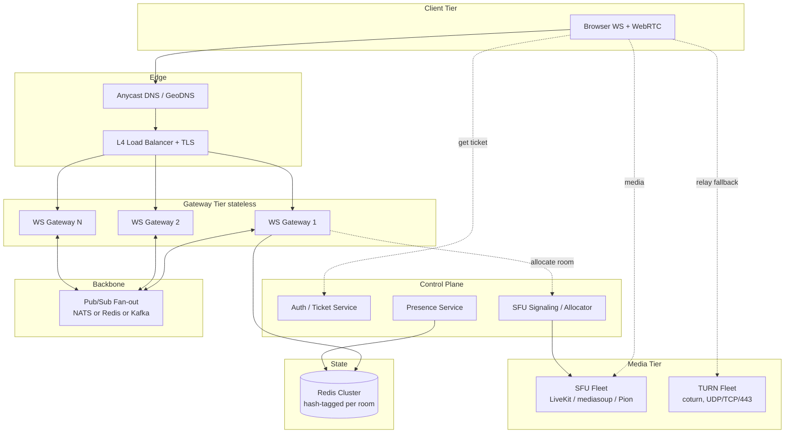

The core idea: **gateways become stateless pipes**. They terminate WebSockets
and translate between the client and the backbone. All shared truth lives in the
backbone (for live fan-out) and Redis Cluster (for durable room state). Media
goes to a separate SFU/TURN tier that the gateways never touch.

Each tier scales independently:

- **Edge**: absorb connect storms, terminate TLS, spread load.
- **Gateways**: hold the millions of sockets. Add nodes to add capacity.
- **Backbone**: move messages between gateways so any client can reach any room.
- **Presence**: who is online, in which room, on which gateway.
- **Redis Cluster**: durable room metadata, members, message history (TTL).
- **SFU + TURN**: media at scale.

---

## 4. Edge: DNS, load balancers, TLS, stickiness

### 4.1 L4 vs L7

- **L4 (TCP) load balancer** (e.g. NLB, IPVS, HAProxy in TCP mode): forwards
  bytes, cheap, extremely high throughput, no per-message cost, happy to hold
  millions of long-lived connections. It cannot route on URL path or do
  per-message logic. For a WebSocket fleet this is usually what you want in
  front: you only need to pick a gateway at connect time and then leave the
  pipe alone.
- **L7 (HTTP) load balancer** (e.g. ALB, Envoy, nginx): understands the HTTP
  upgrade, can route by path/host, do auth, rate-limit per request. Costs more
  CPU per connection and sometimes caps idle connection duration (watch idle
  timeouts — they kill WebSockets). Use L7 if you need path routing or want the
  LB to enforce the ticket check; otherwise L4 is leaner.

A common pattern: **L7 for the HTTP API** (`/createRoom`, `/requestToJoin`,
ticket issuance) and **L4 for `/ws`**.

### 4.2 TLS termination

Terminate TLS at the edge (LB or a dedicated layer) so gateways speak plaintext
internally — saves gateway CPU and centralizes cert management. If you need
end-to-end encryption to the gateway (compliance), terminate on the gateway and
accept the CPU cost, or use TLS passthrough on an L4 LB.

### 4.3 Sticky sessions: do you need them?

A WebSocket connection is inherently sticky *for its lifetime* — once the TCP
connection lands on gateway G, it stays on G until it closes. You do **not**
need cookie/IP stickiness for correctness, because the backbone (§5) makes any
gateway able to serve any room. That is the whole point of making gateways
stateless.

You *might* want "resume affinity": on reconnect, prefer the same gateway so an
in-flight session resumes cheaply. But if you store resumable state in Redis
(last-seen sequence per connection), reconnect can land anywhere. **Prefer no
stickiness**; it makes draining and failover far simpler.

---

## 5. The fan-out backbone (pub/sub)

This is the heart of multi-gateway scaling. When a client on gateway A sends a
message to room R, every member of R — including those connected to gateways B,
C, D — must receive it. The backbone carries that message between gateways.

### 5.1 Two routing patterns

**Pattern (a): broadcast every message to all gateways.**
Every gateway subscribes to one firehose. When A publishes a room-R message,
every gateway receives it and each checks "do I have any member of R?" and
delivers locally.

- Simple. No routing table.
- Wastes CPU/bandwidth: every gateway processes every message even for rooms it
  has nobody in. At N=20 gateways and 20k msg/s that is 400k message-filters/s
  of pure waste. Does **not** scale with gateway count.

**Pattern (b): room-to-gateway subscription routing.**
Each gateway subscribes only to the rooms it actually has local members in
(e.g. a NATS subject `room.<id>` or a Redis Pub/Sub channel per room, or a Kafka
topic/partition per room-shard). A gateway subscribes to `room.R` when its first
local member of R connects and unsubscribes when the last one leaves.

- A message to R only reaches gateways that have R members. Scales with
  gateway count because work is proportional to real fan-out, not fleet size.
- Needs subscription management (subscribe/unsubscribe on join/leave) and the
  backbone must handle many subjects/channels efficiently. NATS subjects and
  Redis Pub/Sub channels are cheap; Kafka topics-per-room are **not** (Kafka
  wants few, large topics — you'd shard rooms onto a fixed number of
  partitions instead; see §6).

**Pattern (b) is the right default.** Pattern (a) is acceptable only at small
fleet sizes or when nearly every gateway has nearly every room (rare).

### 5.2 Message across two gateways via pub/sub

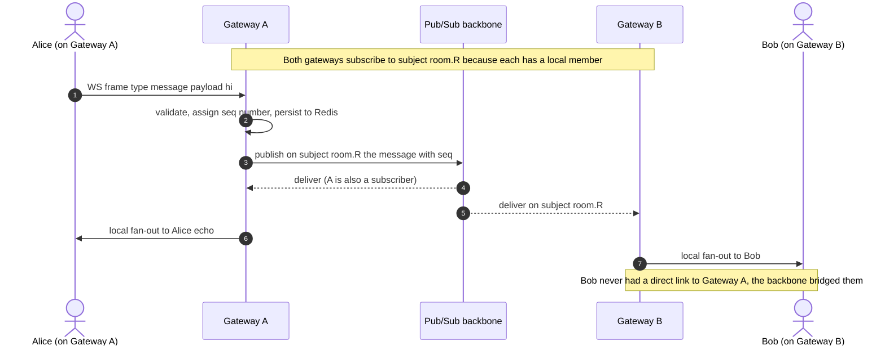

The gateway does three jobs per inbound message: **validate**, **persist +
sequence** (§8), **publish**. Then it does **local fan-out** when it receives
from the backbone. A gateway treats its own locally-originated messages the same
way (publish, then deliver on receive) so there is a single ordering path — the
sequence number is assigned once, by the publishing gateway, and everyone
including the sender replays the same ordered stream.

### 5.3 Backbone comparison

| Property | Redis Pub/Sub | Redis Streams | NATS Core | NATS JetStream | Kafka |
|---|---|---|---|---|---|
| Delivery guarantee | at-most-once (fire-and-forget) | at-least-once (consumer groups + ack) | at-most-once | at-least-once | at-least-once |
| If subscriber offline | message lost | buffered up to maxlen/retention | lost | persisted | persisted (retention) |
| Ordering | per-channel best-effort | per-stream | per-subject best-effort | per-stream | per-partition strict |
| Latency | very low (sub-ms LAN) | low | lowest | low | low-moderate |
| Retention / replay | none | yes (trim by len/time) | none | yes | yes (long) |
| Throughput | high | high | very high | high | very high |
| Ops cost / complexity | low (you likely already run Redis) | low-med | low | medium | high (ZK/KRaft, partitions) |
| Fit for live fan-out | good, lossy | good + replay | great | great | great but heavy |

**How to choose:**

- **Live chat fan-out where a dropped frame during a blip is acceptable** and
  the client can re-sync from Redis history on reconnect: **Redis Pub/Sub** or
  **NATS Core**. Lowest latency, simplest. This matches an ephemeral chat
  product well — the durable copy already lives in `room:messages`.
- **You want the backbone itself to guarantee delivery and replay** (no separate
  history store, or you want exactly-once-ish semantics): **NATS JetStream** or
  **Redis Streams**. More moving parts, but gateways can replay missed messages
  straight from the backbone on reconnect.
- **Kafka**: pick it when you also need a durable event log for analytics,
  cross-service consumption, long retention, and you already run it. For pure
  low-latency chat fan-out it is heavier than you need, and topic-per-room is an
  anti-pattern — you'd hash rooms onto a fixed partition count.

A very common production shape: **NATS (Core for signaling, JetStream for
anything that must not be lost)** or **Redis Pub/Sub + Redis for history**. Both
are defensible; say *why* in an interview (latency vs delivery guarantee vs ops
cost).

---

## 6. Room sharding and ownership

Pattern (b) answers "which gateways get a message." A related question is "who
*owns* a room" — who assigns sequence numbers, who is the authority for presence
and membership. For big rooms you want a single owner per room to serialize
writes; otherwise two gateways could both assign sequence number 42.

### 6.1 Consistent hashing / rendezvous hashing

Map each `roomId` to an owner shard deterministically so any node can compute
the owner without a central registry.

- **Consistent hashing (ring):** place nodes on a hash ring; a room's owner is
  the next node clockwise from `hash(roomId)`. Adding/removing a node only
  remaps the keys between two ring positions (~1/N of rooms move).
- **Rendezvous (HRW) hashing:** for a room, compute `hash(roomId, nodeId)` for
  every node and pick the max. Also moves only ~1/N of rooms when the node set
  changes, needs no ring bookkeeping, and gives you a *ranked* fallback list for
  free (2nd-highest node is the natural backup). Slightly more compute per
  lookup but simpler to reason about. **Prefer rendezvous for a modest node
  count.**

The owner shard is a *room coordinator* (could be a dedicated service, or a role
played by one of the gateways). It owns: the room's sequence counter, the
authoritative member set in memory (write-through to Redis), and the admin
identity (replacing the in-memory `admins` map). Gateways route control
operations (join approval, sequence assignment) to the owner.

### 6.2 Room-sharded routing with a shard lookup

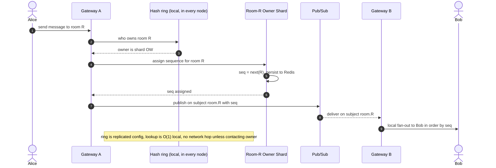

Note the trade-off: adding a shard-owner hop per message buys you a single
authoritative sequence per room, but it adds latency and a dependency. For
small, chatty rooms you may skip the owner and let the publishing gateway
sequence optimistically (accepting that cross-gateway ordering is only
"best-effort consistent" and the client dedupes). **Reserve the strict
owner model for rooms that need it.**

### 6.3 Owner failover

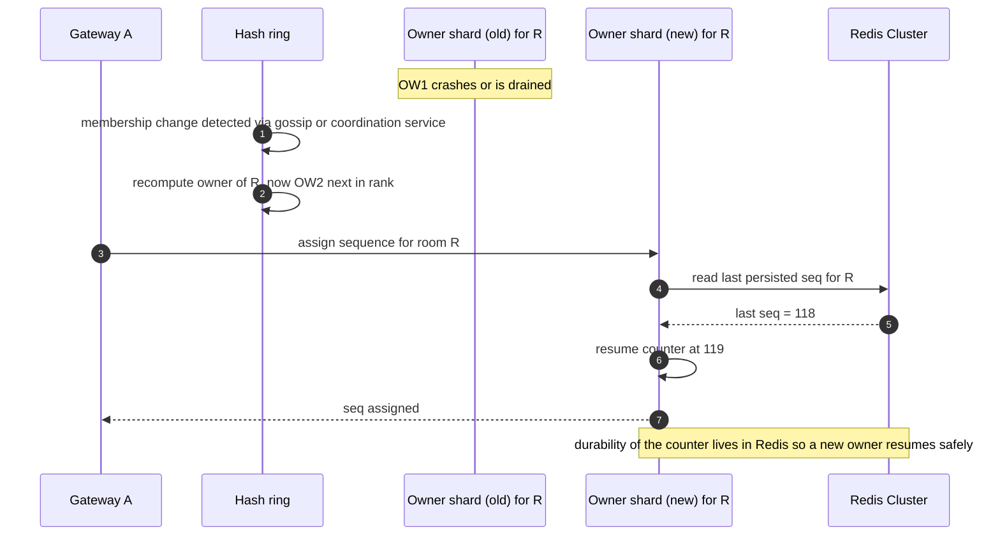

The counter's durability must live in Redis (or the backbone), never only in the
owner's memory — otherwise failover resets sequence numbers and clients see
duplicates/gaps. This is the distributed-systems version of the current repo's
"state dies on restart" problem.

---

## 7. Message persistence: Redis Cluster, hash tags, TTL

Horizontally scale Redis with **Redis Cluster** (16,384 hash slots across
nodes). The catch: multi-key operations and transactions only work if all keys
are in the **same slot**. A room touches several keys (`room:<id>`,
`room:members:<id>`, `room:messages:<id>`, `room:memberKey:<id>:<uid>`). If
those land in different slots, you can't `MULTI`/`EXEC` or pipeline them
atomically, and you can't `EXPIRE` them together cleanly.

**Hash tags** fix this. Redis Cluster hashes only the substring inside the first
`{...}` when computing the slot. So rewrite keys as:

```
room:{<id>}            HASH   metadata
room:{<id>}:members    SET
room:{<id>}:messages   LIST
room:{<id>}:memberKey:<uid>  STRING
```

Now every key for room `<id>` shares the slot of `<id>` and lives on one node.
Benefits: atomic multi-key ops per room, cheap pipelines, and a single node to
reason about per room. Downside: a hot room is a hot slot on one node — you
cannot spread a single room's keys across nodes (fine, because a room is small).

**TTL in cluster** behaves the same per key as standalone — `EXPIRE` is a
per-key operation and works identically on a slot. The important fix carries
over: set the TTL *after each* `RPUSH` to `room:{id}:messages` (ideally in the
same pipeline), or copy the room's remaining TTL, so messages actually expire.
In a cluster you can `PEXPIRE` all of a room's co-located keys in one pipeline
because the hash tag keeps them together. This directly repairs the Phase 0 bug
from §1.4.

---

## 8. Ordering and delivery guarantees

Distributed fan-out means messages can arrive out of order, duplicated, or be
missed during a blip. Design for it.

### 8.1 Per-room sequence numbers

The room owner (§6) assigns a monotonic `seq` per room. Every delivered message
carries `(roomId, seq, payload)`. Clients render by `seq`, not arrival order,
and can detect gaps (`got 44 but last was 42 → missing 43`).

### 8.2 At-least-once + idempotent client dedupe

Durable backbones give at-least-once; the client may see a message twice (e.g.
after a reconnect replay). The client keeps `lastSeenSeq` per room and drops any
`seq <= lastSeenSeq`. That makes the whole pipeline idempotent from the user's
perspective without needing exactly-once (which is expensive and often
impossible end-to-end).

### 8.3 Resumable reconnect with last-seen id

On reconnect the client sends its `lastSeenSeq`. The gateway reads
`room:{id}:messages` from Redis (or replays from the backbone if it retains) and
sends everything after that seq, then resumes the live stream. This is the
scaled-up version of the current repo's `/getChats` fetch, but incremental.

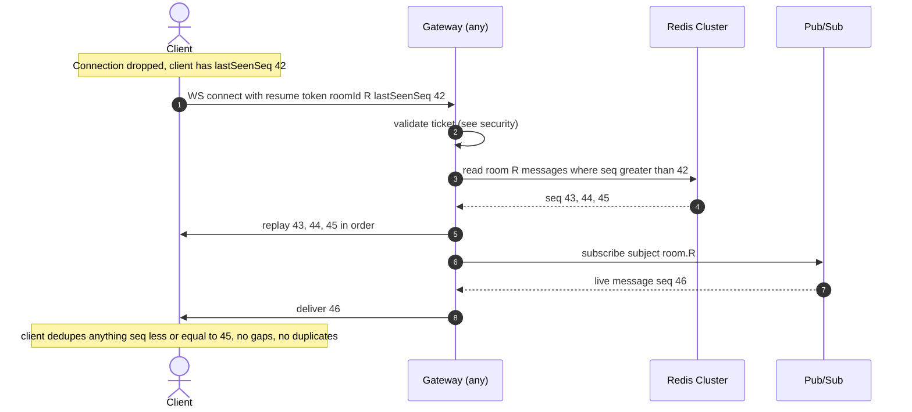

---

## 9. Backpressure, load shedding, rate limiting

### 9.1 Backpressure (the egress buffer, scaled)

Today each client has `egress chan Event` buffered to 64, and
`BroadcastToRoom` does a non-blocking send: on a full buffer it fires
`go m.removeClient(client)` to evict the slow consumer (and, as a known issue,
does not close the conn/egress, so the writer lingers until ping fails — see
[03](./03-goroutines-and-concurrency.md)). That instinct is right: **never let
one slow client block fan-out to a whole room.** At scale, formalize it:

- Bounded per-connection send queue (like `egress`), with a clear policy when
  full: drop-oldest, drop-newest, or disconnect-and-let-them-resume. For an
  ephemeral chat, **disconnect + resumable reconnect** (§8.3) is clean: the slow
  client reconnects and replays from `lastSeenSeq`.
- Measure egress queue depth as a first-class metric (§13). Rising queue depth =
  slow clients or an overloaded gateway.

### 9.2 Load shedding

When a gateway is near its limit (CPU, memory, queue depth, connection count),
shed load *before* it falls over:

- Refuse new WebSocket upgrades with `503` so the LB routes elsewhere.
- Emit a GOAWAY-style "please reconnect" to the least-active connections to
  redistribute (§11 reconnect handling).
- Drop non-critical events (typing indicators, presence churn) before dropping
  chat.

### 9.3 Rate limiting per connection and per IP

- **Per connection:** token bucket on inbound messages (e.g. 10 msg/s burst 20).
  Protects the room and the backbone from a single abusive client. Rejected
  messages get an error frame, repeat offenders get disconnected.
- **Per IP / per user:** a shared counter in Redis (sliding window or token
  bucket) so one IP can't open 10,000 connections or spam across many rooms. Do
  the connection-count check at the *edge* and the message-rate check at the
  *gateway*.

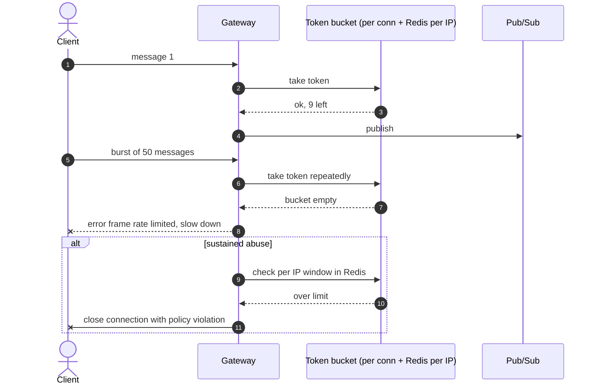

---

## 10. Security at scale

- **Ticket-based WS auth.** Replace the query-string `userId`/`roomId` trust in
  `ServeWS`. Flow: the HTTP API (already authenticated by `userKey` in the
  middleware) issues a **short-lived, single-use signed ticket** (JWT or an HMAC
  token with a 30–60s expiry) bound to `(userId, roomId)`. The client passes the
  ticket on the `/ws` upgrade (ideally in a header or a `Sec-WebSocket-Protocol`
  value, *not* a long-lived secret in the query string — proxies log URLs). The
  gateway verifies the signature and expiry at upgrade time, then discards it.
  This fixes the impersonation hole without putting the long-lived `userKey` on
  the wire. See [02](./02-websocket-architecture.md).
- **Origin allow-list, exact match.** The current `checkOrigin` uses
  `strings.HasPrefix(origin, FRONTEND_FULL_URL)` and fails open when the env is
  unset. `https://app.vercel.app.evil.com` passes a prefix check against
  `https://app.vercel.app`. Replace with an **exact-match allow-list** (a set of
  known origins) and fail *closed*. Add Vercel preview URLs explicitly if you
  need them.
- **DDoS.** L4/L7 edge with SYN cookies, connection-rate limits per IP,
  per-IP connection caps, and a WAF on the HTTP API. Anycast spreads volumetric
  attacks across regions (§12).
- **Abuse.** Per-user rate limits (§9.3), message size caps (the repo already
  caps `maxMessageSize = 32 KB`), and admin tooling to kick/ban
  (`RemoveUserFromRoom` scaled to route through the room owner).

---

## 11. Reconnect storms, draining, zero-downtime deploys

Long-lived connections make deploys hard: killing a gateway drops every
connection on it at once. With 20 gateways, a rolling deploy that cycles one
node drops ~50k clients who all reconnect within seconds — a **reconnect storm**
that can cascade (the storm overloads the next node, which sheds load, which
causes more reconnects).

### 11.1 Connection draining + GOAWAY

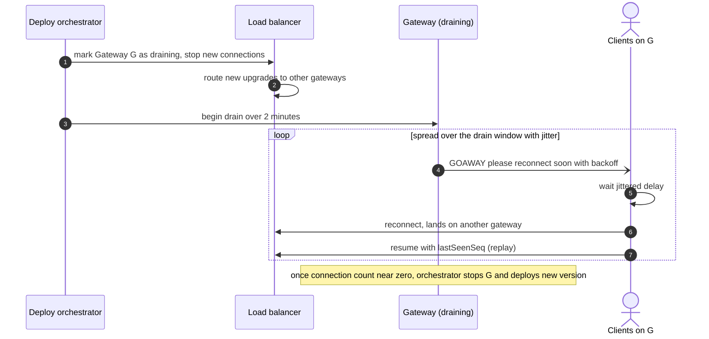

Key techniques:

- **Drain, don't kill.** Mark the node out of the LB, stop accepting new
  connections, then ask existing clients to leave gradually.
- **GOAWAY-style message.** Send a "reconnect" event with a *per-client jittered
  delay* so they don't all reconnect at the same instant. Spread reconnects over
  the drain window (e.g. 60–120s).
- **Jittered exponential backoff on the client.** On any disconnect the client
  waits `random(0, min(cap, base * 2^attempt))`. The current frontend just
  redirects to `/not-found` on `ws.onclose` with *no reconnect* — that must
  change to a resilient reconnect loop for any of this to work.
- **Resume on reconnect** (§8.3) so a reconnect is cheap and lossless.
- **Capacity headroom.** Keep enough spare gateway capacity (e.g. N+2) so a
  drained node's clients fit elsewhere without triggering load shedding.

### 11.2 Zero-downtime deploy strategies

- **Rolling with slow drain** (above) — simplest, works with the techniques
  above.
- **Blue/green** — stand up a new fleet, shift traffic by DNS/LB, drain old.
  More infra but cleaner rollback.
- **Connection handoff / graceful upgrade** — some systems pass listening
  sockets to a new process (SO_REUSEPORT, fd passing) so existing connections
  survive a binary swap. Powerful but complex; most teams just drain + resume.

---

## 12. Multi-region

At a million global users you want gateways near users (latency) and often data
residency compliance.

- **Geo routing.** Anycast or GeoDNS sends each client to the nearest region's
  edge. Latency to the gateway drops to a regional round trip.
- **Room home region.** A room is *homed* in one region (where it was created or
  where most members are). The room owner (§6) and the authoritative Redis
  Cluster for that room live in the home region. Clients in other regions
  connect to a *local* gateway, which bridges to the home region over the
  backbone.
- **Cross-region replication latency.** Inter-region RTT is tens to ~150+ ms.
  You cannot assign a single global sequence per message cheaply across regions,
  so keep the sequence authority in the room's home region and accept that
  remote-region members see messages one cross-region hop later. For *chat* this
  is fine (humans don't notice 100ms). For *media* you cascade SFUs (§13.3)
  rather than route raw media across regions repeatedly.
- **Data residency.** If a room's data must stay in the EU, home it in an EU
  region and never replicate its Redis/history out. Routing must respect this —
  a US client in an EU-homed room still has its data stored in the EU.

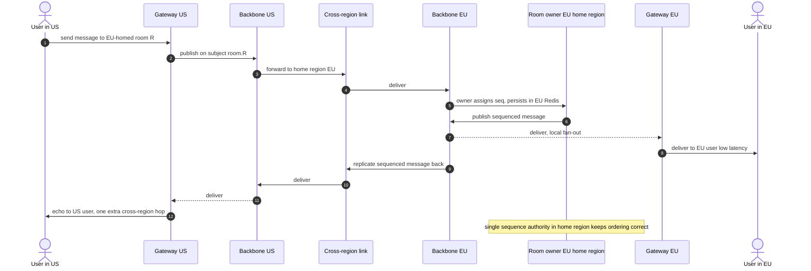

---

## 13. Media at scale: from mesh to SFU

### 13.1 Why mesh stops at ~4–8

Recall `maxVoiceParticipants = 8` and the full-mesh topology from `voice.go`.
In an `n`-person mesh call each participant maintains `n-1` peer connections and
**uploads `n-1` copies of its own media**. With this repo's ~500 kbps video cap:

| Room size n | Peer connections total | Each peer uploads | Each peer downloads |
|---|---|---|---|
| 3 | 3 | ~1 Mbps | ~1 Mbps |
| 5 | 10 | ~2 Mbps | ~2 Mbps |
| 8 | 28 | ~3.5 Mbps | ~3.5 Mbps |
| 20 | 190 | ~9.5 Mbps | ~9.5 Mbps |

The uplink is the killer — home upstream often can't sustain `n-1` copies, and
CPU for `n-1` encodes melts laptops. Mesh is great precisely because the server
carries *zero* media, but it caps hard at a handful of publishers.

### 13.2 SFU architecture

A **Selective Forwarding Unit** inverts the cost: each peer uploads its media
**once** to the SFU, and the SFU forwards (selectively) to the others. Upload
becomes O(1) per peer; the *server* carries the fan-out. Compared to an MCU
(which decodes and re-encodes a mixed stream, very CPU-heavy), an SFU just
forwards packets — much cheaper and lower latency.

Options:

- **LiveKit** (Go, Pion-based) — batteries-included SFU with a server SDK, room
  management, simulcast, recording. Easiest path for a Go shop.
- **mediasoup** (C++/Node) — library/toolkit, very performant, you build the
  room logic.
- **Janus** (C) — mature, plugin-based, general-purpose.
- **Pion / ion-sfu** (Go) — build-your-own with the Pion WebRTC stack; most
  control, most work. Natural fit if you want to grow the existing Go backend
  into the SFU.

### 13.3 Simulcast / SVC and layer selection

With many subscribers of different bandwidths, the publisher sends **multiple
quality layers**:

- **Simulcast:** encode the same video at e.g. low/medium/high (separate
  encodings). The SFU forwards the layer each subscriber can afford — a user on
  a phone over cellular gets the low layer, a user on fiber gets high. The SFU
  switches layers per subscriber based on their estimated bandwidth (REMB/
  transport-cc feedback).
- **SVC (scalable video coding, e.g. VP9/AV1):** one layered bitstream; the SFU
  drops higher layers for constrained subscribers without re-encoding. More
  efficient than simulcast but needs codec support.

This replaces the repo's single fixed ~500 kbps encode. Layer selection is a
core SFU responsibility and a great interview topic (congestion control feedback
→ which layer to forward).

### 13.4 Client joining an SFU room

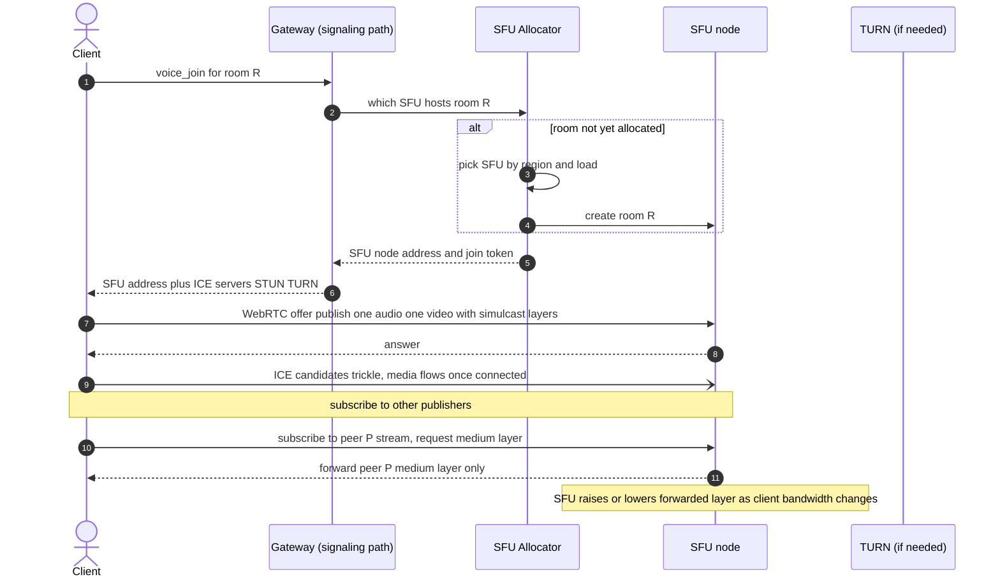

The signaling plumbing you already have (the `voice_signal` relay in `voice.go`)
is reused, but now the client's single peer is the **SFU**, not every other
participant. The glare-free "only the joiner offers" rule becomes "the client
always offers to the SFU." The **allocator** replaces the implicit "peers in the
same room" logic with explicit room→SFU-node placement (by region and load),
mirroring the room-owner concept from §6.

### 13.5 TURN fleet

STUN alone (the repo uses `stun:stun.l.google.com:19302`) only discovers public
addresses; it fails for peers behind symmetric NATs or restrictive firewalls.
Those connections need a **TURN relay** — a server that forwards media when a
direct path is impossible.

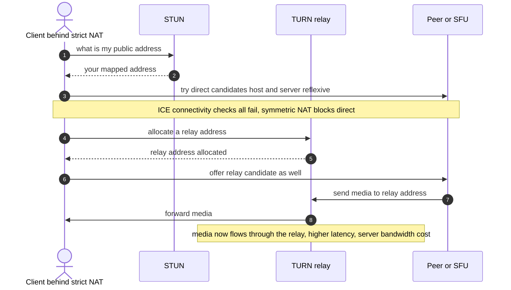

TURN at scale:

- **coturn** is the standard. Run a **fleet** behind anycast or geo-DNS so
  clients hit a nearby relay.
- **Transport fallbacks:** offer TURN over **UDP** (best), **TCP**, and **TLS on
  port 443** (last resort, punches through almost every corporate firewall that
  only allows outbound 443). Clients try in that order.
- **Deployment note from this repo's context:** Render serves only HTTP(S) and
  cannot host a UDP TURN server, so TURN must live elsewhere (a VM/cloud with UDP
  ingress). Plan for it separately from the gateway tier.
- **Credentials:** do **not** ship static TURN username/password to the browser
  (the repo's `NEXT_PUBLIC_TURN_USERNAME/CREDENTIAL` env does exactly that).
  Issue **ephemeral TURN REST credentials** — a short-lived username
  `expiry:userId` and an HMAC of it keyed by a shared secret, minted by the
  backend per session. See [04](./04-webrtc-signaling.md).
- **Cost model:** TURN *relays media*, so you pay egress for every relayed
  stream. Typically 10–20% of connections need TURN (estimate; depends on your
  users' networks). At, say, 100k concurrent relayed media streams × ~1 Mbps
  that is ~100 Gbps of egress — a serious bill. Minimize TURN usage (good
  STUN/ICE, prefer SFU which gives a single well-connected media endpoint) and
  place relays close to users to cut cost and latency.

---

## 14. Presence service

Presence (who is online, in which room, on which gateway) is pulled out of the
in-memory `rooms`/`clients`/`admins` maps into a dedicated service backed by
Redis with **TTL heartbeats** — the same ephemeral philosophy as the rest of the
system, applied to liveness.

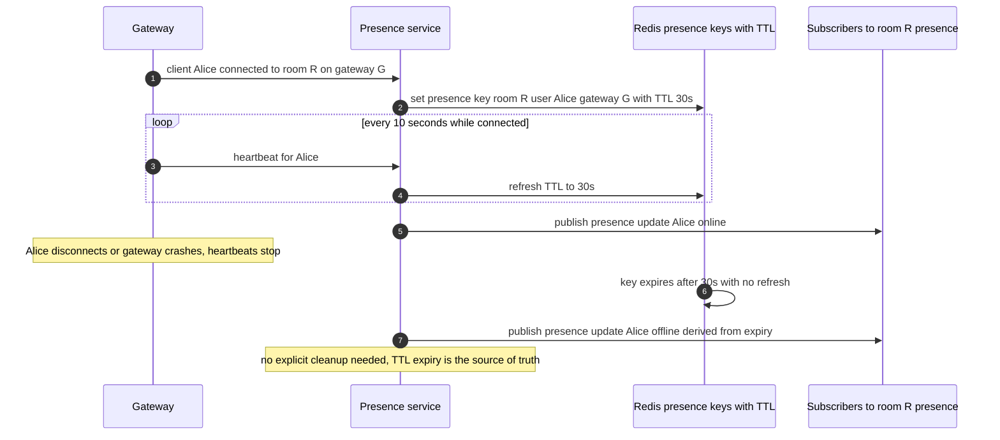

Why TTL heartbeats: if a gateway crashes, it cannot send a clean "user left" for
its thousands of connections. With TTL presence, those keys simply expire and
the system converges to the truth automatically — no stuck "ghost online" users.
This also replaces the fragile in-memory `admins` map: the admin identity for a
room is a presence/ownership record in Redis, so an admin reconnecting to *any*
gateway is still recognized, fixing the "`REQUEST_TO_JOIN` lost after restart"
problem from §1.1.

Tune the heartbeat/TTL ratio: TTL ≈ 3× heartbeat interval tolerates one or two
missed beats before declaring offline, trading detection speed for flap
resistance.

---

## 15. Observability and SLOs

You can't operate a million connections blind. Instrument from day one.

**Core metrics (per gateway and fleet-wide):**

- **Concurrent connections** (gauge) — the headline capacity number; alert
  before per-node limits.
- **Connection churn** — connects/sec and disconnects/sec; spikes reveal
  reconnect storms.
- **Fan-out latency p50/p95/p99** — time from inbound message to delivered to
  the last room member. The real UX metric for chat.
- **Egress queue depth** (per connection distribution, and max) — the scaled
  version of "is `egress` full"; rising depth predicts slow-consumer evictions.
- **Dropped messages / evicted slow consumers** — directly tied to the
  `BroadcastToRoom` eviction path.
- **Backbone publish/subscribe latency and lag** — Redis/NATS/Kafka health.
- **Redis ops/sec, latency, slot distribution** — cluster hot-spotting.
- **WebRTC: ICE success rate, TURN usage %, SFU CPU, forwarded bitrate per
  node** — media health; ICE success rate is the single best "are calls
  working" signal.

**Tracing:** propagate a trace/span id from the HTTP ticket issuance through the
WS upgrade, through the backbone publish, to delivery, so you can follow one
message end to end across gateways.

**Structured logs:** JSON logs with `roomId`, `userId`, `gatewayId`, `seq`,
`event` — not the current `fmt.Println("inside for !!")` debug prints, which at
a million connections would drown the log pipeline (and should be removed as
Phase 0 cleanup).

**SLOs (example targets — pick and defend your own):**

- Message delivery p99 < 250 ms in-region.
- WS connect success > 99.9%.
- ICE/call setup success > 99% (with TURN fallback).
- Availability 99.95% monthly for the gateway tier.

Define **error budgets** against these so deploys/experiments have a quantified
risk ceiling.

---

## 16. Phased migration roadmap

You do not jump from this repo to the §3 architecture in one step. Here is the
order, with *what changes in code* at each phase.

### Phase 0 — Fix correctness and safety (no architecture change)

Do this before scaling anything, because scaling multiplies bugs.

- **TTL bug:** in `CreateChatRoom`, stop the `RPUSH __init__ ; LPOP ; EXPIRE`
  dance. Set the TTL after each `RPUSH` in `SaveRoomMessage` (same pipeline), or
  copy the room's remaining TTL. Verify messages actually expire.
- **Hub self-send deadlock:** in `addClient`/`removeClient`, call
  `BroadcastToRoom` directly (they already run inside `Run()`), or add a
  dedicated fan-out goroutine. Never send to `m.broadcast` from inside `Run()`.
- **`RemoveUserFromRoom` deadlock:** add `defer m.Unlock()`; it currently
  `return`s with the lock held when the room is missing. Make a single owner
  close `egress` (use `sync.Once` / a `done` channel) so writers never write to
  a closed channel.
- **Slow-consumer eviction:** when `BroadcastToRoom` evicts, also close the conn
  so the writer goroutine exits instead of lingering.
- **WS auth:** validate a ticket (or at least `userKey`) at upgrade; stop
  trusting raw query params.
- **Origin check:** exact-match allow-list, fail closed.
- **Reconnect:** change the frontend `ws.onclose` from "redirect to /not-found"
  to a jittered reconnect loop (prerequisite for every later phase).
- **Observability:** replace debug `Println`s with structured logs + basic
  metrics. Run `go test -race` (the race detector couldn't run in the authoring
  env due to no cgo — run it in CI).

### Phase 1 — Multi-instance with a pub/sub backbone

Goal: run N gateways behind a load balancer, correctly.

- Make the gateway **stateless for fan-out**: on inbound chat message, publish to
  `room.<id>` on the backbone (Redis Pub/Sub or NATS) instead of (only) local
  `BroadcastToRoom`. On receiving from the backbone, do local fan-out to that
  room's local members.
- **Subscription management:** subscribe to `room.<id>` when the first local
  member joins, unsubscribe when the last leaves (pattern (b), §5).
- Move **presence and admin identity** to Redis with TTL heartbeats (§14) so
  `SendToAdmin`/`REQUEST_TO_JOIN` works regardless of which gateway the admin is
  on, and survives restarts.
- Add **sequence numbers** written to `room:{id}:messages` and sent to clients;
  implement **resume on reconnect** (§8.3).
- Deploy behind an L4 LB, no stickiness required.

Code impact: a new `backbone` package the gateway publishes/subscribes through;
`BroadcastToRoom` becomes "local fan-out only"; a `presence` package replacing
the `admins` map and augmenting `rooms`.

### Phase 2 — Shard rooms / room ownership

Goal: scale fan-out past "every gateway filters every message" and get a single
sequence authority per room.

- Introduce **rendezvous hashing** of `roomId → owner shard` (§6), replicated as
  config to all nodes.
- Route sequence assignment and admin/approval operations to the room owner.
- Move Redis to **Redis Cluster with hash-tagged keys** `room:{id}:...` (§7).
- Implement **owner failover** with the sequence counter durable in Redis.

Code impact: a `ring` package (HRW); the room owner role (either a dedicated
coordinator service or a gateway playing owner); Redis key rewrites with
`{...}` hash tags; cluster-aware Redis client.

### Phase 3 — SFU for media

Goal: calls bigger than ~8, and server-side media control.

- Stand up an **SFU** (LiveKit easiest for Go, or grow a Pion-based SFU).
- Add an **allocator**: `roomId → SFU node` by region and load (§13.4).
- Clients offer to the **SFU** instead of meshing; enable **simulcast** and
  per-subscriber **layer selection**.
- Deploy a **TURN fleet** (coturn) off Render (UDP), with **ephemeral REST
  credentials** minted by the backend, UDP/TCP/TLS-443 fallbacks (§13.5).

Code impact: the `voice_*` signaling path is retargeted from peer-to-peer relay
to client-to-SFU negotiation; a new `media-allocator` service; backend endpoint
to mint TURN credentials; keep mesh as a fallback for tiny rooms if you like.

### Phase 4 — Multi-region

Goal: global latency and residency.

- **Geo routing** (anycast/GeoDNS) to regional edges.
- **Home region per room**; cross-region bridging over the backbone (§12).
- **SFU cascading** across regions so media doesn't traverse the globe per
  subscriber.
- Enforce **data residency** in routing and storage.

Code impact: region-aware allocator and ring; cross-region backbone links; home
region recorded in room metadata; SFU cascade configuration.

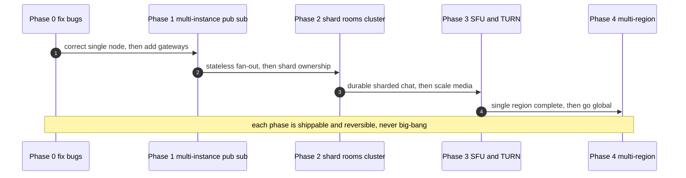

---

## 17. Summary cheat-sheet

- **Single-process blockers:** in-memory `rooms`/`voice`/`admins` maps (no
  cross-node sharing, lost on restart), single hub goroutine (serialization +
  self-send deadlock risk), single Redis, mesh media capped at 8, query-string
  auth.
- **Capacity math:** inbound connections aren't port-limited (4-tuple); memory
  (~50–150 KB/conn est.) and fan-out (`room_size × msg_rate`) are the real
  caps; ~100k–500k conns per tuned Go node; ~5–20 gateways for 1M.
- **Target shape:** edge (L4 + TLS, no stickiness) → stateless gateways →
  pub/sub backbone (NATS/Redis for low latency, JetStream/Streams/Kafka for
  durability) with per-room subscriptions → room-owner shards (rendezvous
  hashing) → Redis Cluster (hash tags per room) → presence via TTL heartbeats.
- **Correctness at scale:** per-room sequence numbers, at-least-once + client
  dedupe, resumable reconnect; backpressure via bounded egress + resume; rate
  limit per conn and per IP; drain + GOAWAY + jittered backoff for deploys.
- **Media at scale:** mesh → SFU (simulcast/SVC layer selection), SFU allocator
  per room, SFU cascade across regions, coturn TURN fleet with ephemeral creds
  and UDP/TCP/443 fallback — watch the egress bill.
- **Roadmap:** Phase 0 fix bugs → Phase 1 pub/sub multi-instance → Phase 2 shard
  + cluster → Phase 3 SFU/TURN → Phase 4 multi-region. Each phase shippable.

Next: [06 — Interview Guide](./06-interview-guide.md) for how to present all of
this under interview pressure.
