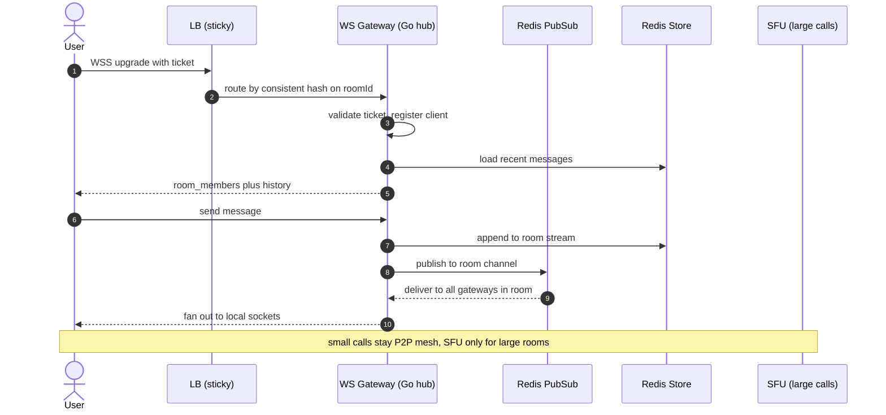
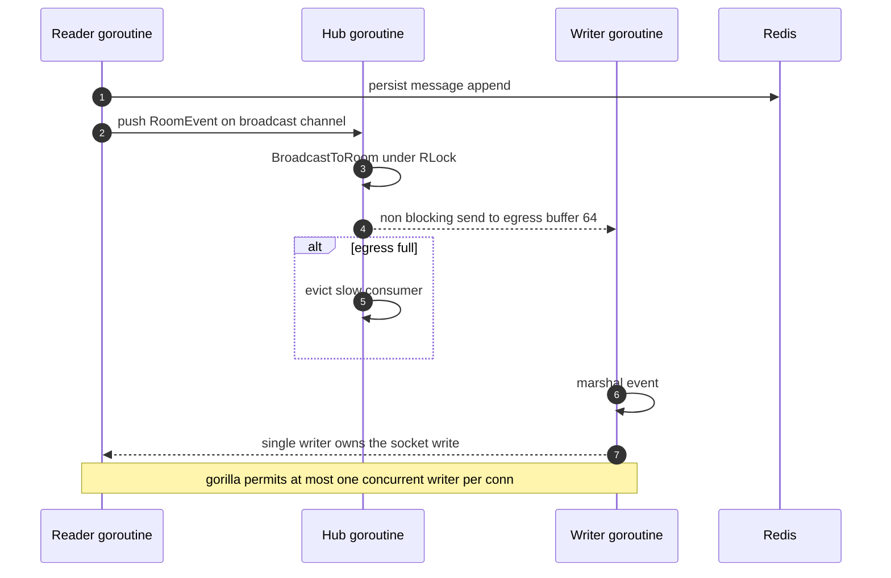
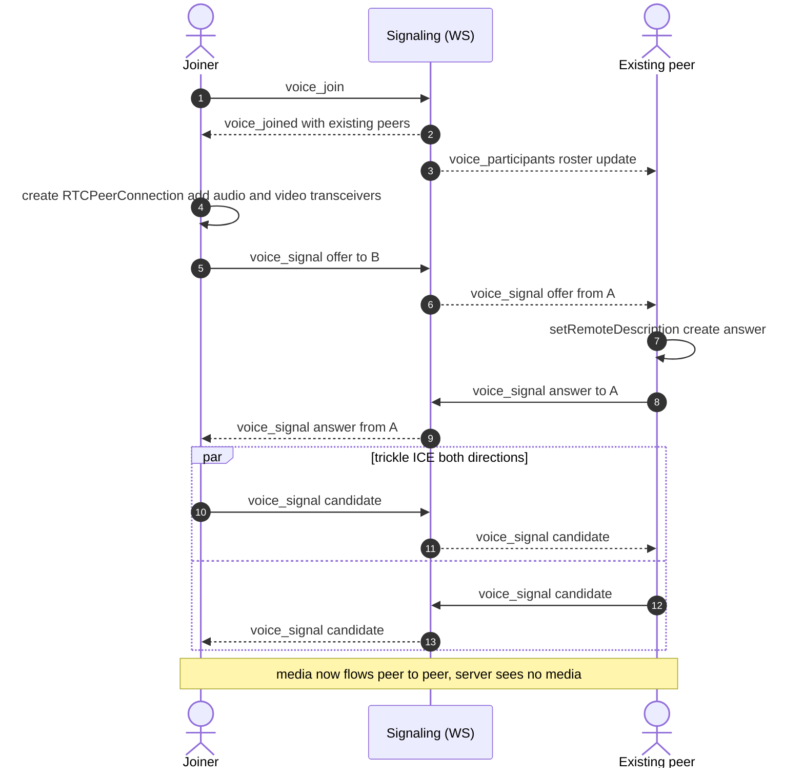
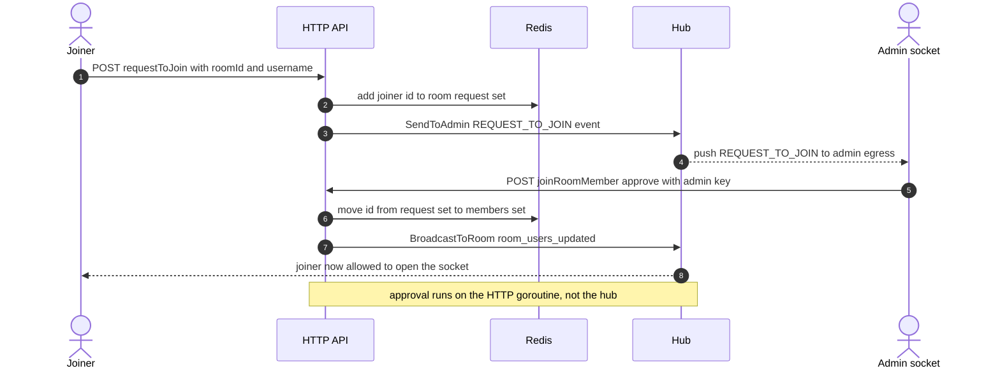
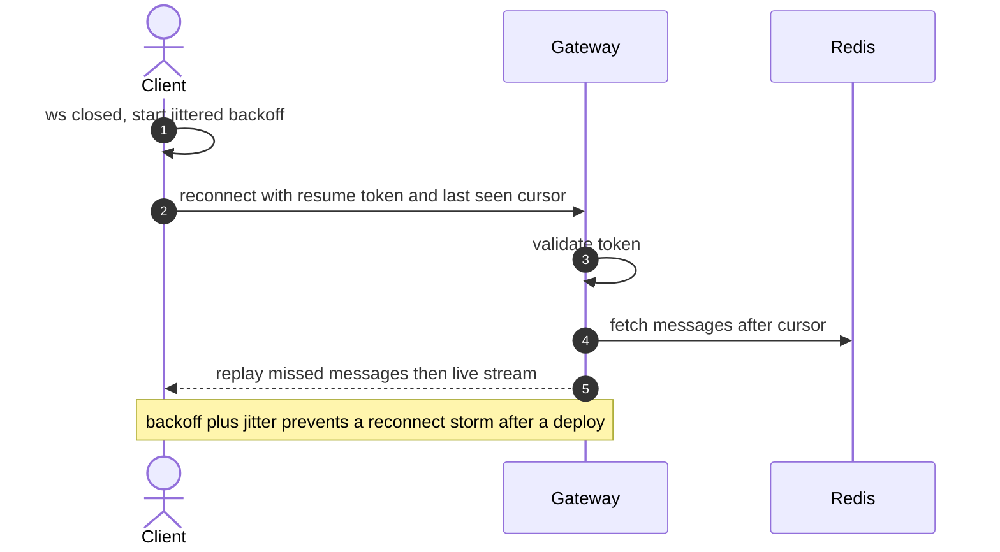
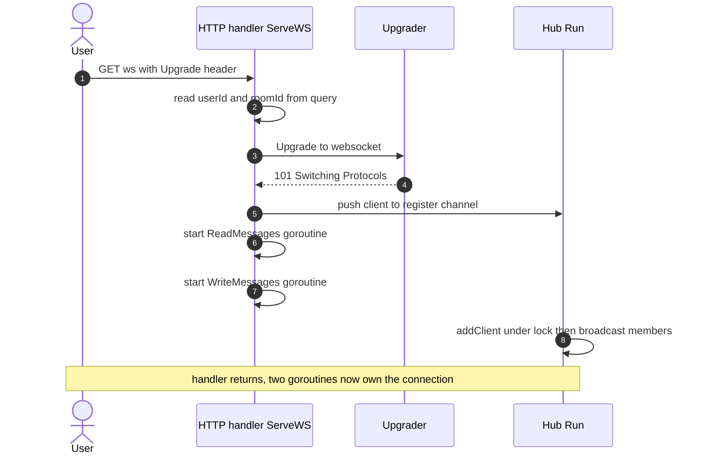
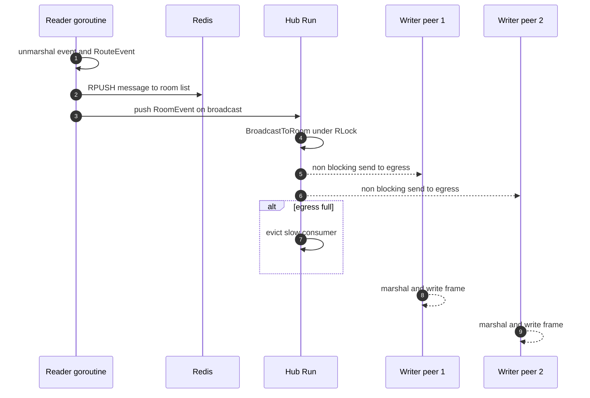
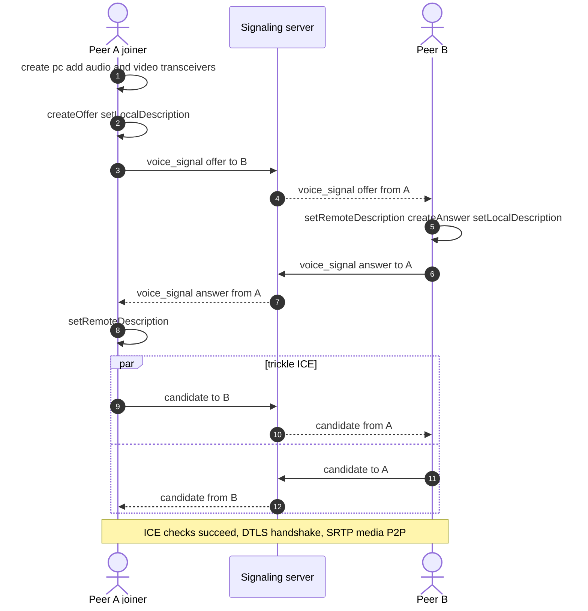
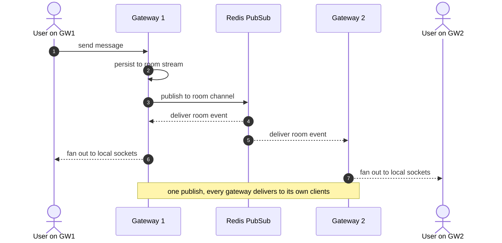
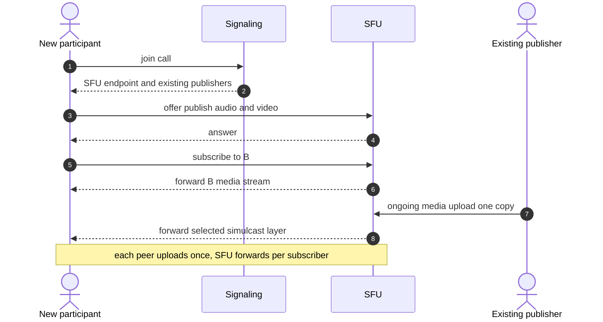

# 06 — Interview Guide: Real-Time Systems (WebSocket + WebRTC)

This is the "walk into the room and talk" companion to the architecture docs. It is written for engineers prepping for senior / staff real-time-systems interviews. It uses **this exact project** as the running example so your answers are concrete, not hand-wavy. Where the repo does something clever, we say so. Where it has a bug or a sharp edge, we say that too — interviewers love candidates who can critique their own code.

Cross-references:
- [01 — System Overview](./01-system-overview.md)
- [02 — WebSocket Architecture](./02-websocket-architecture.md)
- [03 — Goroutines and Concurrency](./03-goroutines-and-concurrency.md)
- [04 — WebRTC Signaling](./04-webrtc-signaling.md)
- [05 — Scaling to Millions](./05-scaling-to-millions.md)

The project in one line: **ephemeral TTL-based chat rooms (Redis + gorilla/websocket) with optional full-mesh WebRTC voice/video, where the Go server is signaling-only and media never touches it.**

---

## 1. How to pitch this project

### The 60-second pitch

> I built an ephemeral chat system. You create a room, it gets a random ID and a TTL — say one hour — and when the TTL expires Redis deletes everything: metadata, messages, membership. No permanent storage, no accounts.
>
> Real-time messaging runs over WebSockets. The Go backend uses gorilla/websocket. Each connection gets two goroutines — one reader, one writer — plus a buffered egress channel. A single hub goroutine owns the room-to-client map and fans messages out. That's the classic "hub" pattern: concurrency by communicating over channels instead of sharing memory.
>
> On top of that there's voice and video over WebRTC. Here the server is **only a signaling relay** — it forwards SDP offers/answers and ICE candidates over the same WebSocket. Media is full-mesh peer-to-peer, so audio and video bytes never hit my server. I cap rooms at 8 because mesh is O(n²).
>
> The interesting parts are the concurrency model, the signaling design that avoids glare, and the honest story of what breaks when you try to scale a single in-memory hub to millions of users.

That hits: ephemeral/TTL, WebSocket hub, goroutine model, WebRTC signaling-only, mesh trade-off, and a hook into scaling. Stop there and let them pull the thread they care about.

### The 5-minute pitch

Structure it as **problem → data model → messaging → media → honesty**.

1. **Problem & shape (45s).** Ephemeral rooms. Admin creates a room via `GET /createRoom` (`internal/handler/handler.go`), gets back `chatID`, a `userId`, and a `userKey`. Users request to join (`POST /requestToJoin`), the admin approves (`POST /joinRoomMember`), and then they open a WebSocket. No JWT, no sessions — the client stores `userId` + `userKey` in `localStorage` and the HTTP middleware compares `userKey` against `room:memberKey:<roomId>:<userId>` in Redis.

2. **Data model & TTL (45s).** Redis is the only datastore. `room:<id>` is a HASH, `room:members:<id>` a SET, `room:messages:<id>` a LIST of JSON blobs, plus per-user key/name strings. TTL is set with `EXPIRE` at room creation (`CreateChatRoom` in `internal/service/ChatService.go`). When it expires, the room is simply gone. O(1) access, automatic cleanup, stateless-ish backend.

3. **Messaging path (60s).** `ServeWS` upgrades the HTTP request, builds a `Client`, pushes it to the `register` channel, and starts `ReadMessages` + `WriteMessages` goroutines. The reader unmarshals an `Event{type, payload}` and calls `RouteEvent`, which dispatches to a handler **on the reader goroutine**. `SendMessage` persists to Redis (`SaveRoomMessage`, an `RPUSH`) and pushes a `RoomEvent` onto the `broadcast` channel. The single hub goroutine (`Manager.Run`) drains `broadcast` and calls `BroadcastToRoom`, which does a **non-blocking** send into each client's `egress` channel. Each client's writer goroutine is the only writer to its socket — because gorilla allows at most one concurrent writer.

4. **Voice/video (60s).** `voice_join` over the same WebSocket. The server keeps an **in-memory** voice roster (`manager.voice`, never in Redis). It tells the joiner who's already in the call; the **joiner** creates the offers (so two peers never offer simultaneously — glare avoided by design). SDP and ICE candidates are relayed via `voice_signal`, with the server stamping the `from` field so you can't spoof another user. Media is mesh P2P with STUN for NAT traversal and optional TURN as a relay fallback. Camera on/off is `replaceTrack` with no renegotiation.

5. **Honesty / what I'd change (30s).** It's a single instance with in-memory room state, so it doesn't scale horizontally yet — I'd move presence to Redis pub/sub, shard rooms, and add a sticky WebSocket gateway tier. There's a real TTL bug on the messages list, a self-send channel pattern in the hub that can deadlock under burst, and the `/ws` endpoint trusts query params without validating the key. I can walk through fixes for each.

That last beat is what separates mid from senior: you own the limitations.

---

## 2. System design walkthrough: "Design real-time chat with voice/video for millions"

This is the full-length answer. Follow the standard structure so the interviewer can track you. Narrate the structure out loud ("let me start with requirements, then estimates, then high-level, then deep dives").

### 2.1 Requirements

**Functional**
- Create/join ephemeral rooms with a TTL.
- Real-time text messaging with history for the room's lifetime.
- Presence (who's online in a room).
- Optional voice + video in small groups.
- Admin controls: approve joiners, remove users, delete room.

**Non-functional**
- Low latency: message fan-out p99 under ~150 ms within a region.
- Scale: millions of concurrent connections, hundreds of thousands of rooms.
- Availability: a gateway crash should drop at most its own connections, and clients should reconnect.
- Cost: media must not flow through our servers for small calls (mesh); larger calls use an SFU.
- Ephemerality & privacy: nothing persists past TTL; media is end-to-end-ish (DTLS-SRTP, server never sees plaintext media).

Call out explicitly what you are **not** doing: no message durability beyond TTL, no read receipts, no federation, no E2E-encrypted *text* (text passes through the server and Redis).

### 2.2 Back-of-envelope estimates

State assumptions, then multiply. Label everything approximate.

- 1,000,000 concurrent WebSocket connections.
- Per-connection memory: 2 goroutines × ~4 KB stack + gorilla read/write buffers (1 KB + 1 KB, as configured here) + a 64-slot egress channel of small `Event` structs ≈ **~16–40 KB per connection** all-in once you add TCP socket buffers and TLS state. Call it ~50 KB to be safe. → **~50 GB RAM** across the fleet just for connections. That alone says you need many boxes: so **shard**.
- If each box holds ~100k connections comfortably, you need ~10 WebSocket gateways (plus headroom → ~15–20).
- Messaging: assume 1 msg/user/10s average → 100k msgs/s globally. If average room size is 10, each message fans out to ~10 recipients → **~1M egress writes/s**. That's the real load, not the inbound rate.
- Voice/video: mesh caps at ~8. For a 4-person call each peer uploads 3 copies; at 500 kbps video that's ~1.5 Mbps up per peer, 0 server bandwidth. If you need 50-person calls you switch to an **SFU** and now server egress = n × stream bitrate (e.g. 50 × 1.5 Mbps = 75 Mbps per room on the SFU).

The headline insight: **fan-out, not ingest, is the scaling cost for chat; and media topology decides whether media cost is $0 (mesh) or large (SFU/MCU).**

### 2.3 API sketch

- `POST /rooms` → `{roomId, ttl}`
- `POST /rooms/:id/join` → short-lived signed **WS ticket** (not a long-lived key in a query string)
- `GET /rooms/:id/messages?after=<cursor>` → history page
- `WSS /ws?ticket=<jwt>` → upgrade, server validates ticket, binds connection to `(roomId, userId)`
- Over the socket, one envelope: `{type, payload}`. Types: `message`, `room_members`, `user_joined`, `user_left`, and the `voice_*` family.

This repo uses `GET /createRoom` and passes `userId`/`roomId` as raw query params on `/ws` — fine for a demo, but in the design answer I upgrade that to a one-time ticket (see security section).

### 2.4 Data model

- Room metadata: `room:<id>` HASH, TTL via `EXPIRE`.
- Members: `room:members:<id>` SET, TTL.
- Messages: a **list or stream** per room. This repo uses a `LIST` (`RPUSH` JSON). For scale and cursors I'd prefer a Redis **Stream** (`XADD`/`XRANGE`) — it gives ordered IDs you can page from and consumer groups for fan-out workers.
- Presence: ephemeral; Redis with short TTL per connection heartbeat, or a dedicated presence service.

### 2.5 High-level design

Key moves for scale:
- **Sticky routing** so a user's connection lands on a predictable gateway (consistent hashing on `roomId` keeps a room's members co-located, reducing cross-gateway chatter).
- **Redis pub/sub (or Kafka/NATS)** as the inter-gateway bus. A gateway publishes a room event once; every gateway subscribed to that room delivers to its local sockets. This is the piece this repo is missing — its hub is in-memory and single-instance.
- **Media stays off the control plane.** Mesh for ≤~6–8, SFU above that.

### 2.6 Deep dive A — the WebSocket gateway internals

Explain the "why": the reader and writer are split because a WebSocket is a full-duplex single TCP connection, and gorilla's `Conn` is **not safe for concurrent writes**. One writer goroutine draining a channel serializes all writes without a mutex. The buffered `egress` channel (size 64 here) is **per-connection backpressure**: a slow client fills its buffer, and you choose a policy — drop, disconnect, or block. This repo's `BroadcastToRoom` chooses "evict on full" via a non-blocking `select`.

### 2.7 Deep dive B — WebRTC call setup

The design decision worth naming: **only the joiner offers.** The server computes the peer list under its lock in `VoiceJoin` (`internal/websocket/voice.go`), so two users joining at the same moment never both send offers to each other. That sidesteps **glare** entirely without implementing perfect negotiation. In a general SFU/mesh design you'd use perfect negotiation (polite/impolite peers) instead.

### 2.8 Bottlenecks and how you'd attack them

- **Fan-out amplification** → shard rooms across gateways, use pub/sub, batch writes.
- **Slow consumers** → per-connection bounded buffer + eviction (this repo) or shed load.
- **Reconnect storms** after a deploy → jittered exponential backoff on the client, connection draining on the server, resume tokens.
- **Hot rooms** (one room, millions of viewers) → that's broadcast, not chat; use a fan-out tree or a CDN-like relay, not a mesh.
- **Media** → mesh collapses past ~6–8 peers; move to SFU; add simulcast/SVC so the SFU can forward a lower layer to weak receivers.
- **TURN cost** → ~10–20% of calls need a relay; TURN uses real server bandwidth, so budget for it and issue time-limited credentials.

### 2.9 Deep dive C — join approval flow (admin gating)

This repo gates joins through the admin, which is a nice detail to narrate because it mixes HTTP and WebSocket paths.

The gotcha to flag: approval calls `BroadcastToRoom` **directly from the HTTP goroutine** (not through the hub channel), so two goroutine contexts now mutate shared state behind the mutex. And `SendToAdmin` looks up the admin in the **in-memory** `admins` map, which is empty after a restart — so on a cold instance, join requests silently never reach the admin.

### 2.10 Deep dive D — reconnect and resume (what I'd add)

This repo has **no reconnect** (the frontend's `ws.onclose` redirects to `/not-found`). In the design answer I'd add a resume path:

The trade-off: a resume cursor needs ordered, cursorable history (Redis Streams, not a plain LIST), and the client must dedupe by message ID.

### 2.11 Trade-offs summary

| Decision | Chose | Trade-off |
|---|---|---|
| State store | Redis + TTL | Ephemeral, O(1), but no durability past TTL |
| Hub model | Single goroutine + channels | Simple, race-free owner; but single instance, no HA |
| Media topology | Mesh (≤8) | Zero server media cost; O(n²), small rooms only |
| Signaling | Reuse chat WS | One connection, less infra; couples media control to chat liveness |
| Auth | userId+key in localStorage | No session infra; weak, query-string key leaks |
| Message store | Redis LIST | Simple append; no cursors, and the empty-list TTL bug |
| Presence/admin | In-memory maps | Fast, lock-protected; lost on restart, single instance |
| Reconnect | None (redirect) | Storm-proof but terrible UX; no missed-message replay |

---

## 3. 60+ interview questions with senior-level answers

Each answer names a trade-off and, where relevant, points at this repo.

### 3.1 WebSocket protocol

**Q1. What is the WebSocket handshake?** An HTTP/1.1 `GET` with `Upgrade: websocket`, `Connection: Upgrade`, a `Sec-WebSocket-Key`, and `Sec-WebSocket-Version: 13`. The server replies `101 Switching Protocols` with `Sec-WebSocket-Accept` (SHA-1 of key + magic GUID, base64). After that the TCP connection is a bidirectional frame stream. Trade-off: it starts as HTTP so it traverses proxies/LBs, but those must be configured to not buffer/time out the upgraded connection. Here: `websocketUpgrader.Upgrade` in `ServeWS`.

**Q2. Why does the client mask frames but the server does not?** Masking (XOR with a per-frame 32-bit key) prevents a malicious script from crafting bytes that intermediary caches/proxies misinterpret as a separate HTTP request (cache poisoning). Only client→server frames are masked because that's the attacker-controllable direction. Trade-off: tiny CPU cost per frame; gorilla handles it for you.

**Q3. WebSocket vs SSE vs long polling?** WebSocket is full-duplex binary/text; SSE is server→client text only over plain HTTP (auto-reconnect, simpler, no custom protocol); long polling is a fallback with high overhead. Choose SSE when you only push down (notifications feed); WebSocket when the client also streams up frequently (chat, signaling). This repo needs upstream (messages, `voice_signal`), so WebSocket.

**Q4. How do you keep a WebSocket alive?** Protocol-level ping/pong frames. Server sends `PingMessage` on a ticker; client's pong resets the read deadline. Here `pingInterval = 9s`, `pongWait = 10s`, and `pongHandler` extends `SetReadDeadline`. Trade-off: too aggressive wastes battery/bandwidth; too lax lets dead connections linger and leak goroutines. Also LBs often idle-timeout at 60s, so pings must beat that.

**Q5. What are WebSocket close codes?** 1000 normal, 1001 going away, 1006 abnormal (no close frame — e.g. TCP reset), 1011 server error, 1009 message too big. Gorilla's `IsUnexpectedCloseError` is used here to decide what to log. Trade-off: 1006 is common and non-actionable; don't alert on it.

**Q6. How big can a WebSocket message be and why cap it?** You set a read limit to bound memory and resist DoS. This repo raised `maxMessageSize` from 512 B to **32 KB** specifically because SDP offers are 2–6 KB and larger once JSON-escaped (`SetReadLimit(maxMessageSize)` in `ReadMessages`). Trade-off: too small breaks signaling; too large invites memory abuse.

**Q7. Text vs binary frames?** Text is UTF-8 validated; binary is opaque. JSON control messages here go as text. For high-throughput media metadata you'd use binary (protobuf/flatbuffers) to cut CPU and bytes. Trade-off: debuggability vs efficiency.

**Q8. How does backpressure work on a WebSocket?** You can't push faster than the TCP send window drains. In app terms you need a bounded outbound queue (the `egress` channel). When full you drop, disconnect, or block. This repo evicts the client. Trade-off: dropping loses messages; blocking stalls the hub; disconnecting is honest but churns.

**Q9. Why one writer per connection?** Gorilla's `Conn` write path isn't safe for concurrent use; interleaved writes corrupt frames. The single writer goroutine serializes writes via the channel. Trade-off: all writes for a connection are serialized (fine) and you must never write from another goroutine (e.g. don't write the close frame from the reader).

**Q10. How do you authenticate a WebSocket?** During the HTTP upgrade (cookies, `Authorization`, or a one-time ticket). Browsers can't set custom headers on `new WebSocket()`, so use a cookie or a short-lived ticket in the URL. This repo trusts raw `userId`/`roomId` query params with **no key check in `ServeWS`** — a known weakness; fix is to validate `userKey` or a signed ticket at upgrade.

### 3.2 Go concurrency, goroutines, channels

**Q11. What is a goroutine and how is it cheap?** A user-space green thread multiplexed onto OS threads by the Go runtime (M:N scheduler). Starts with a ~2–8 KB growable stack. Blocking I/O parks the goroutine and the netpoller (epoll/kqueue) wakes it — so a blocked goroutine costs no OS thread. That's why 1M connections × 2 goroutines is feasible. Trade-off: cheap to start, but leaking them leaks memory; always have an exit path.

**Q12. Explain the hub pattern in this repo.** One `Manager.Run` goroutine owns `rooms`/`clients` and `select`s over `register`, `unregister`, `broadcast`. Everyone else communicates by sending on those channels. "Don't communicate by sharing memory; share memory by communicating." Trade-off: single owner is race-free and simple, but it's a serialization point and a single instance.

**Q13. What happens if you send on a closed channel?** Panic. Receiving from a closed channel returns the zero value with `ok=false`. This matters here: `RemoveUserFromRoom` closes `egress`, and if `BroadcastToRoom` later does `client.egress <- event` on that same client you get a panic. Rule: only the sender's owner closes a channel, exactly once (use `sync.Once` or a `done` channel).

**Q14. What's the self-send deadlock in this hub?** `addClient` and `removeClient` run **inside** `Run`, yet they do `m.broadcast <- ...` — a channel only `Run` drains. It works while the 128-slot buffer has room; under a burst of joins/leaves the buffer fills, the hub blocks sending to itself, and the whole server stalls. Fix: call `BroadcastToRoom` directly inside the hub, or use a separate fan-out goroutine, or never send to your own input channel.

**Q15. Why can't you hold a lock while sending on a channel?** If the receiver needs the same lock to make progress, you deadlock: sender blocks on a full channel holding the lock, receiver blocks on the lock. General rule: do I/O and channel sends **outside** the critical section. This repo mostly does this correctly — e.g. `VoiceJoin` computes the roster under the lock, `Unlock`s, then sends — but the hub's self-send violates the spirit.

**Q16. Buffered vs unbuffered channels?** Unbuffered = synchronous rendezvous (sender blocks until a receiver takes it). Buffered = async up to capacity, then blocks. The `egress` buffer (64) absorbs bursts so a momentarily slow writer doesn't block the hub. Trade-off: buffering hides backpressure and adds latency/memory; size it to the burst you actually expect.

**Q17. How do you avoid goroutine leaks?** Every goroutine needs a guaranteed exit: a closed channel, a `context` cancellation, or a connection close that breaks the read loop. Here the reader exits on read error and signals `unregister`; the writer exits when `egress` closes or a write fails. Risk: `BroadcastToRoom` evicts a slow client with `go m.removeClient` but never closes its conn/egress, so the writer lingers until a ping fails.

**Q18. `sync.Mutex` vs channels — when each?** Mutex for protecting a small piece of shared state with short critical sections (a map). Channels for ownership transfer and coordination. This repo mixes both: a hub **and** an embedded `sync.RWMutex` that HTTP handlers and voice handlers lock directly. That's a smell — pick one owner. Trade-off: mutexes are faster for pure state; channels model workflows better.

**Q19. What does `select` do, and what's `default`?** Waits on multiple channel ops, picks one ready at random; `default` makes it non-blocking. `BroadcastToRoom` uses `select { case egress<-ev: default: evict }` to never block the hub on a slow client. Trade-off: non-blocking means you must define the drop policy.

**Q20. How does the Go scheduler interact with blocking syscalls?** On a blocking syscall the runtime can hand the goroutine's P (processor) to another M (thread) so other goroutines keep running. Network I/O is special: it goes through the netpoller, so the goroutine parks without consuming a thread. That's the backbone of C1M in Go.

**Q21. What is `GOMAXPROCS` and why care?** Number of OS threads executing Go code simultaneously (default = CPU count). For a WebSocket gateway you're I/O-bound, so raising it rarely helps; watch for lock contention on the single hub mutex instead.

**Q22. How would you detect data races here?** `go test -race`. The fact sheet notes the race detector couldn't run in this environment (no cgo); that's a gap. In CI you'd run `-race` on the websocket package, especially around `rooms`/`voice` map access.

**Q23. Why key the client map by userId, and what's the bug?** `clients map[userId]*Client` is **global across rooms**, so the same user in two rooms collides — the second registration overwrites the first. Fix: key by `(roomId, userId)` or by connection ID. Trade-off: convenience of a flat map vs correctness for multi-room users.

### 3.3 Backend design of this repo

**Q24. Walk the lifecycle of a chat message.** Client sends `{type:"message", payload:text}` → reader unmarshals → `RouteEvent` → `SendMessage` (`internal/websocket/event.go`) builds a `ChatMessage`, calls `SaveRoomMessage` (`RPUSH` to `room:messages:<id>`), then pushes a `RoomEvent` on `broadcast` → hub `BroadcastToRoom` → each client's `egress` → writer → socket. Note: persistence happens **on the reader goroutine**, so a slow Redis slows that user's reads. Fix: offload to a worker or add a timeout/context.

**Q25. Why is the TTL on messages broken?** `CreateChatRoom` does `RPUSH __init__` then `LPOP` then `EXPIRE` on `room:messages`. The `LPOP` empties the list, Redis **auto-deletes empty keys**, so `EXPIRE` targets a non-existent key and returns 0. The first real message then `RPUSH`es a fresh list with **no TTL** (`TTL` = -1) — messages never expire. Verified with redis-cli. Fix: `EXPIRE` after each `RPUSH` in the same pipeline, or copy the room's remaining TTL. Great example of "Redis deletes empty collections" biting you.

**Q26. Why does Redis delete an empty list/set/hash?** Redis has no concept of an empty aggregate type — removing the last element removes the key. This keeps the keyspace clean but means any `EXPIRE`/`TTL` you set before emptying is lost, and type-specific commands on a missing key behave as "empty." It's the root cause of Q25.

**Q27. Why `EXPIRE` at creation vs on first message?** The README claims TTL starts on "start chat / first message," but the code sets `EXPIRE` in `CreateChatRoom` at creation. Trade-off: creation-time TTL is simpler and bounds abandoned rooms, but a room created and joined 59 minutes later only has 1 minute left. Lazy-start TTL is friendlier but needs a trigger and touches every key.

**Q28. Is the backend stateless?** Mostly for HTTP (Redis holds the truth), but the WebSocket layer holds **in-memory** `rooms`, `voice`, and `admins`. On restart (e.g. Render free-tier spin-down) that's lost: the `admins` map empties, so `REQUEST_TO_JOIN` can't reach the admin, and the frontend's `ws.onclose` redirects to `/not-found` with no reconnect. Fix: externalize presence/admin to Redis and add client reconnect.

**Q29. How is admin tracked?** `SetRoomAdmin` stores `admins[roomId]=userId` in memory; `SendToAdmin` looks up the admin's live client to push `REQUEST_TO_JOIN`. Trade-off: fast, but non-durable and single-instance — in a multi-gateway world the admin may be on another box, so this must go through pub/sub.

**Q30. Why does `joinRoomMember` call `BroadcastToRoom` directly from the HTTP goroutine?** Because approval happens over HTTP, not the socket. It locks the manager and fans out `room_users_updated`. Trade-off: it bypasses the hub, so now two goroutine contexts (HTTP + hub) touch shared state — relying on the mutex, not the single-owner model. Consistency hazard if the models drift.

**Q31. What's the auth model and its weaknesses?** No sessions/JWT. `userId`+`userKey` in `localStorage`; middleware compares `userKey` to `room:memberKey:<id>:<uid>`. Weaknesses: `/ws` never checks the key; CORS is `*`; `checkOrigin` prefix-matches `FRONTEND_FULL_URL` (so `https://app.vercel.app.evil.com` passes). Fixes: exact-origin allow-list, validate key/ticket on upgrade, scope CORS.

**Q32. Why Redis and not Postgres here?** Ephemeral data with native TTL, O(1) ops, pub/sub for later scale, and no schema. Trade-off: no durability, limited query, memory-bound. For permanent chat you'd pair Redis (hot path) with a durable store (Cassandra/DynamoDB for message history).

### 3.4 WebRTC fundamentals

**Q33. What problem does WebRTC solve?** Low-latency, peer-to-peer, encrypted audio/video/data in the browser without plugins, including NAT traversal. Trade-off: complex setup (signaling, ICE, DTLS) and P2P doesn't scale past small groups.

**Q34. What is SDP?** Session Description Protocol — a text blob describing media (codecs, directions, ICE/DTLS parameters, candidates). Offer/answer exchange negotiates a compatible session. SDP is 2–6 KB, which is why the WS read limit was raised. You almost never hand-edit it; you munge specific lines (e.g. codec preferences) if needed.

**Q35. What is ICE?** Interactive Connectivity Establishment: both peers gather candidate addresses (host, server-reflexive via STUN, relay via TURN), exchange them via signaling, and run connectivity checks (STUN binding requests) to find a working path, preferring direct. Trade-off: gathering adds setup latency; trickle ICE hides it by sending candidates as they're found.

**Q36. STUN vs TURN?** STUN tells a peer its public (NAT-mapped) address so peers can try a direct path — cheap, no media relay. TURN relays the actual media when direct fails (symmetric NAT, strict firewall) — expensive, uses your bandwidth. This repo uses Google's public STUN and optional TURN from env. ~10–20% of calls typically need TURN.

**Q37. What is a symmetric NAT and why does it break P2P?** Symmetric NAT allocates a different external port per destination, so the address STUN discovered for one peer won't accept packets from another. Direct hole-punching fails and you fall back to TURN. Trade-off: you can't avoid it client-side; you must provision TURN.

**Q38. What is DTLS-SRTP?** WebRTC media is always encrypted. DTLS handshake over the peer connection establishes keys; SRTP encrypts the RTP media. The SDP carries a **DTLS fingerprint** (hash of each peer's cert); you must trust that the fingerprint belongs to the right peer — which is the signaling channel's job. If signaling is MITM'd, media can be MITM'd. So secure your signaling (WSS + auth).

**Q39. What are RTP and RTCP?** RTP carries media packets (timestamp, sequence number, payload type). RTCP carries control/stats (receiver reports, NACK, PLI/FIR for keyframes, REMB/TWCC for bandwidth). An SFU reads RTCP to drive congestion control and request keyframes. Trade-off: RTP over UDP tolerates loss (better for real-time) vs TCP's head-of-line blocking.

**Q40. What's a transceiver and why pre-add audio+video?** An `RTCRtpTransceiver` bundles a sender+receiver for one media line (m-line). This repo's offerer adds exactly **two sendrecv transceivers (audio, video)** up front, and the answerer attaches tracks via `sender.replaceTrack`. Pre-adding both means toggling the camera is just `replaceTrack(track|null)` — **no renegotiation**, verified in headless Firefox (bytes 0→61559 on camera-on, `onnegotiationneeded` never fired). Trade-off: you always negotiate a video slot even for audio-only, costing a little SDP.

**Q41. How do you mute without renegotiating?** Set `track.enabled = false` — it still sends (silence/black) but no SDP change. The repo also emits `voice_mute` so the UI roster updates. Trade-off: muted-but-sending wastes a little bandwidth vs `removeTrack` which would renegotiate.

**Q42. How do you cap bitrate?** `RTCRtpSender.setParameters` with `encodings[0].maxBitrate` (500 kbps here) plus capture constraints (640×360, ≤30 fps) and `contentHint="motion"`. Trade-off: hard cap protects the mesh uplink but can look soft under motion; adaptive bitrate (let congestion control move it) is better when you have an SFU.

**Q43. What is trickle ICE and the candidate-before-remote-description problem?** Instead of waiting for all candidates, you send each as gathered to shorten setup. But `addIceCandidate` before `setRemoteDescription` throws. The hook buffers early candidates in `pendingCandidates` and flushes them after the remote description is set. Trade-off: a little buffering code for much faster connect.

### 3.5 Signaling design

**Q44. What is signaling and why isn't it part of WebRTC?** The out-of-band exchange of SDP and ICE candidates to bootstrap the peer connection. WebRTC deliberately leaves transport unspecified so you can use anything (WS, HTTP, carrier pigeon). This repo reuses the chat WebSocket. Trade-off: fewer connections, but media control dies if the chat socket drops.

**Q45. How does this repo prevent spoofing in signaling?** The server stamps the `from` field itself in `voice_signal` (`voiceSignalOut.From = c.UserID`) rather than trusting the client, and only relays if both sender and target are in the same room's voice map **and** the sender's session belongs to this exact `*Client`. Trade-off: a little server-side bookkeeping (`voiceMember` binds session→connection) for real anti-spoofing.

**Q46. Why bind a voice session to a specific connection?** `voiceMember{client *Client,...}` ensures a **stale** connection (old tab before reload) can't tear down or hijack a **new** session for the same user. On reconnect, `addClient` drops the stale voice session and tells peers to clean up. Trade-off: more state, but it kills a whole class of reload bugs.

**Q47. How does this design avoid glare?** Only the **joiner** sends offers, and the peer list is frozen under the manager lock in `VoiceJoin`. So two simultaneous joiners never offer to each other at once. Trade-off: simpler than perfect negotiation but assumes a server-ordered join; a fully symmetric P2P app would need perfect negotiation.

**Q48. What is perfect negotiation?** A pattern where each peer is "polite" or "impolite." On glare (both offer at once), the polite peer rolls back its offer and accepts the other's; the impolite peer ignores the incoming offer. It lets either side renegotiate anytime. This repo doesn't need it because of the joiner-only rule. Trade-off: perfect negotiation is more flexible but more code and edge cases.

**Q49. What happens if both peers create offers?** Glare: both are in `have-local-offer`, and a naive implementation errors or deadlocks. Solutions: perfect negotiation (rollback), or a protocol rule that only one side offers (this repo). Classic gotcha.

**Q50. Where would you add a SFU to this signaling?** Insert the SFU as a "peer" the client offers to; the SFU answers and then forwards each publisher's track to subscribers. Signaling stays similar but now targets the SFU instead of N peers. Trade-off: server now handles media (cost, ops) but rooms scale to dozens/hundreds.

### 3.6 Media topologies

**Q51. Mesh vs SFU vs MCU?** Mesh: every peer connects to every other, uploads n-1 copies — O(n²) connections, zero server media, best for ≤~6–8 (this repo caps at 8). SFU (Selective Forwarding Unit): each peer uploads once to the server, which forwards streams — scales to dozens/hundreds, moderate server cost, no transcoding. MCU (Multipoint Control Unit): server mixes everything into one stream — lightest client, heaviest server (CPU for decode/mix/encode). Trade-off ladder: client cost ↓ and server cost ↑ as you go mesh→SFU→MCU.

**Q52. Why does mesh fail to scale?** n participants → n(n-1)/2 connections and each uploads n-1 encodings. At 8 people that's 7 uploads per peer; at 20 it's absurd for both uplink and CPU. That's why `maxVoiceParticipants = 8`.

**Q53. What is simulcast?** A publisher sends multiple resolutions/bitrates (e.g. 180p/360p/720p) as separate RTP streams; the SFU forwards the layer each subscriber can handle. Trade-off: more uplink and encoder cost for the publisher, but the SFU can serve weak and strong receivers without transcoding.

**Q54. What is SVC (scalable video coding)?** One stream encoded in layers (temporal/spatial) so the SFU can drop layers per subscriber without the publisher sending separate streams (e.g. VP9/AV1 SVC). Trade-off: more efficient than simulcast but needs codec support and is CPU-heavier to encode.

**Q55. When MCU over SFU?** When clients are very constrained (low-end devices, must receive exactly one stream) or you need server-side recording/compositing. Trade-off: huge server CPU and added latency from decode/encode; rarely the first choice today.

### 3.7 Scaling and distributed systems

**Q56. How do you scale WebSocket connections horizontally?** Many gateway instances behind an L4/L7 LB with sticky sessions; an inter-gateway bus (Redis pub/sub, NATS, Kafka) so a message published once reaches members on any gateway. This repo is single-instance in-memory — the first thing to change. Trade-off: pub/sub adds a hop and at-most-once semantics unless you add acks.

**Q57. How do you route a user to the right gateway?** Consistent hashing on `roomId` keeps a room's members on the same gateway (local fan-out, less bus traffic). Or hash on `userId` and accept cross-gateway fan-out. Trade-off: room-affinity concentrates hot rooms on one box; user-affinity spreads load but increases bus chatter.

**Q58. How do you do presence at scale?** Each gateway writes `presence:<room>` members to Redis with a short TTL refreshed by heartbeats; publish join/leave deltas. On gateway crash, TTL expiry cleans up. Trade-off: eventual consistency — presence can be briefly wrong after a crash. This repo keeps presence purely in memory, so it's lost on restart.

**Q59. Message ordering guarantees?** Within one room on one gateway, the single hub serializes order. Across gateways via pub/sub you get per-publisher order at best; for a global order use a sequence from Redis Streams (`XADD` IDs) or a per-room sequencer. Trade-off: strict total order costs a serialization point (throughput).

**Q60. Delivery guarantees — at-most-once vs at-least-once?** This repo's non-blocking `egress` send is **at-most-once** (drops on full buffer, no acks). At-least-once needs client acks + server resend + dedup IDs. Exactly-once is a myth end-to-end; you approximate with idempotency keys. Trade-off: reliability vs latency and complexity.

**Q61. How do you handle backpressure across the fleet?** Bounded per-connection queues (egress), bounded bus consumer lag monitoring, and load shedding (reject new connections, degrade to lower fan-out). Trade-off: shedding protects the fleet but drops some users; better than cascading failure.

**Q62. Reconnect storms — what and how to survive?** A deploy or network blip drops thousands of connections that all retry at once, hammering the LB and auth. Mitigate with **jittered exponential backoff** on the client, server-side connection draining on deploy, and resume tokens so reconnection is cheap. This repo's frontend has **no reconnect** (it redirects to `/not-found`), which is actually storm-proof but terrible UX.

**Q63. How do you shard rooms?** Partition by `roomId` across gateways/bus channels. Hot room (one room too big for a box) → split into a fan-out tree or dedicate a broadcast path. Trade-off: sharding complicates admin/presence operations that span a room.

**Q64. Where does Redis pub/sub fall short, and the alternative?** Redis pub/sub is fire-and-forget — no persistence, a subscriber that's down misses messages, no consumer groups. For durability/replay use Redis **Streams** or Kafka/NATS JetStream. Trade-off: pub/sub is dead simple and low-latency; Streams/Kafka add durability and ops weight.

**Q65. How do you place TURN/SFU geographically?** Near users to cut RTT; use anycast or geo-DNS to pick the closest region. For a call spanning regions, a cascaded SFU (SFUs relay to each other) avoids trans-continental mesh. Trade-off: more infra and inter-SFU bandwidth.

### 3.8 Reliability and observability

**Q66. What metrics would you emit from the gateway?** Concurrent connections, goroutine count, egress drop/evict rate, broadcast latency, per-room size, Redis op latency, ping/pong timeouts, upgrade failures. Trade-off: high-cardinality per-room metrics explode storage — sample or aggregate.

**Q67. How would you load-test this?** A WebSocket load tool (e.g. k6, Gatling, or a custom Go client) opening N connections, joining rooms, sending at target rate; watch goroutine count and egress drops. For WebRTC, headless browsers (the fact sheet verified behavior in headless Firefox). Trade-off: synthetic load misses real network diversity (NAT types, mobile).

**Q68. How do you deploy without dropping everyone?** Drain: stop accepting new connections, let the LB shift traffic, send a `going away` (1001) so clients reconnect to new instances with backoff. Trade-off: zero-downtime needs client cooperation (reconnect logic this repo lacks).

**Q69. What's your health check for a stateful gateway?** Liveness (process up) separate from readiness (can accept new WS? bus connected? under connection cap?). A gateway at capacity should fail readiness so the LB stops routing. This repo exposes `GET /health` but not capacity-aware readiness.

### 3.9 Security

**Q70. What is CSWSH (Cross-Site WebSocket Hijacking)?** WebSocket upgrades aren't subject to CORS, and cookies are sent automatically, so a malicious site can open a WS to your server as the logged-in user. Defense: validate the `Origin` header on upgrade (exact allow-list) and/or use a non-cookie token. This repo's `checkOrigin` **prefix-matches** `FRONTEND_FULL_URL`, so `https://app.vercel.app.evil.com` passes — a real CSWSH hole. Fix: exact match.

**Q71. Why not put a long-lived key in the WS URL?** URLs are logged by proxies, LBs, and browser history. The key leaks. Use a **one-time, short-lived ticket** (signed, single-use) exchanged at upgrade, then discard it. This repo passes `userId`/`roomId` (and the broader design implies the key) in the query string — the recommended fix is a ticket.

**Q72. How should TURN credentials be issued?** Not static env creds exposed to the browser (as here via `NEXT_PUBLIC_TURN_*`). Use the **TURN REST API**: backend issues time-limited HMAC credentials (username = expiry timestamp, password = HMAC(secret, username)). They expire quickly, so a leak is low-impact. Trade-off: a backend endpoint and clock sync, but far safer.

**Q73. Who do you trust in DTLS-SRTP?** The DTLS fingerprint in the SDP binds the media encryption to the peer, but you only know it's the *right* peer if **signaling is authenticated and integrity-protected**. So WSS + authenticated signaling is what makes media trustworthy. A MITM on signaling = MITM on media.

**Q74. CORS `*` — why is it a problem here?** `Access-Control-Allow-Origin: *` plus credential-ish auth means any site can call your HTTP API. Combined with weak WS origin checks, it widens the attack surface. Fix: scope to the exact frontend origin(s).

**Q75. How do you rate-limit / prevent abuse on signaling?** Cap messages per connection per second, bound room/voice sizes (this repo caps voice at 8), validate payloads (it rejects bad `voice_signal`), and authenticate the socket. Trade-off: limits can throttle legit bursts (lots of ICE candidates) — tune thresholds.

### 3.10 Deeper WebSocket and transport

**Q76. What sits under a WebSocket — one TCP connection or many?** Exactly one TCP connection, upgraded in place from HTTP. All frames (text, binary, ping, pong, close) multiplex over it. That's why one slow large frame can head-of-line-block the control pings on the same socket — a reason to keep messages small and bounded (the 32 KB cap here).

**Q77. Can you run WebSocket over HTTP/2 or HTTP/3?** RFC 8441 defines WebSockets over HTTP/2 (`:protocol = websocket`), and there's work on HTTP/3. Benefits: share one connection, better multiplexing. Reality: gorilla and most stacks still do HTTP/1.1 upgrade, and many LBs don't support 8441. Trade-off: 8441 reduces connection count but has patchy support.

**Q78. What is permessage-deflate and should you enable it?** A WebSocket extension that compresses frames. Helps for repetitive JSON (chat), but costs CPU and memory per connection (compression context), and can enable CRIME-style attacks on secrets. Trade-off: bandwidth vs CPU/memory/security; often off for high connection counts.

**Q79. How do you fairly share one socket between chat and signaling?** They share the egress channel here, so a burst of ICE candidates competes with chat for the 64-slot buffer. If signaling floods, chat events can be dropped on eviction. In a stricter design you'd use separate queues/priorities or a separate signaling channel. Trade-off: one socket is simpler and uses fewer resources but couples the two workloads.

### 3.11 Deeper Go runtime

**Q80. What is the netpoller and why does it matter for C1M?** Go's runtime integrates an epoll/kqueue-based poller. When a goroutine blocks on socket I/O, it parks and its P is freed for other goroutines; the netpoller wakes it when the fd is ready. So a million mostly-idle connections cost ~a million parked goroutines (cheap stacks), not a million OS threads. That's the whole reason Go is good at this.

**Q81. How does a goroutine stack grow?** It starts small (~2 KB) and the runtime grows it by copying to a larger segment when a function prologue detects it would overflow (stack-copy, not segmented stacks since Go 1.4). Trade-off: deep recursion or large stack frames per connection multiply memory across a million goroutines.

**Q82. What is false sharing / lock contention risk in this hub?** Every broadcast takes the manager `RWMutex` (RLock), and joins/leaves take the write lock. Under heavy churn the write lock serializes everything, so the single hub becomes a contention point. Fix: shard the manager by room (lock striping) or per-room goroutines. Trade-off: more locks/goroutines vs less contention.

**Q83. When would you use `context.Context` here?** For cancellation and timeouts on Redis calls. `SaveRoomMessage` uses `context.Background()` with no timeout, so a stalled Redis blocks the reader goroutine indefinitely. Pass a per-request context with a deadline. Trade-off: timeouts can abort legitimately slow ops; pick a sane budget.

**Q84. `sync.Once` — where would it help in this code?** To close a channel exactly once. `RemoveUserFromRoom` closing `egress` while other paths might also close/send is a double-close/send-on-closed risk. Wrapping the close in `sync.Once` (or using a dedicated `done` channel) guarantees one close.

### 3.12 Deeper WebRTC and media

**Q85. What is BUNDLE and rtcp-mux?** BUNDLE multiplexes all media (audio+video) over a single ICE/DTLS transport (one port pair) instead of one per m-line; rtcp-mux puts RTCP on the same port as RTP. Both cut the number of ports and ICE checks. Modern WebRTC uses them by default. Trade-off: none practically; legacy endpoints without them need fallback.

**Q86. How does congestion control work in WebRTC?** Transport-Wide Congestion Control (TWCC) or REMB estimates available bandwidth from feedback (loss, delay gradients) and the sender adapts bitrate/resolution. With a hard `maxBitrate` cap (500 kbps here) you override the upper bound. Trade-off: a hard cap protects the mesh uplink but prevents using spare bandwidth for quality.

**Q87. Audio vs video loss handling?** Audio uses Opus with in-band FEC and PLC (packet loss concealment) — it degrades gracefully. Video uses NACK/RTX for retransmit and PLI/FIR to request a fresh keyframe when frames are undecodable. Trade-off: video keyframes are large; too many PLIs spike bandwidth.

**Q88. Why render remote audio and video separately in this app?** `VideoGrid` renders `<video muted>` tiles and `VoiceAudio` renders hidden `<audio>` elements — audio only plays through the audio elements to avoid double playback/echo from the video tiles. Trade-off: two element sets to manage, but clean audio.

**Q89. What is contentHint and why "motion"?** `track.contentHint = "motion"` tells the encoder to prioritize frame rate/smoothness over detail (vs "detail" for screen share). The app sets "motion" for camera video. Trade-off: smoother motion, softer still detail.

**Q90. What breaks WebRTC behind corporate firewalls?** UDP blocked entirely, only 443 open. Then you need TURN over TLS on 443 (TCP) to tunnel media. This is also why you can't host TURN on a platform that only exposes HTTP(S) — TURN needs UDP (and ideally many ports). Trade-off: TURN/TCP/443 works everywhere but adds latency and server bandwidth.

### 3.13 Deeper distributed systems

**Q91. How do you avoid duplicate delivery across gateways?** If a client could be connected to two gateways briefly (reconnect race), both might deliver. Use a single authoritative connection per `(roomId, userId)` (evict the old one — this repo does evict stale connections in `addClient`) and idempotent message IDs so the client dedupes.

**Q92. Pub/sub vs message queue for fan-out?** Pub/sub (Redis, NATS core) is broadcast, fire-and-forget, low-latency, no backlog. A queue (Kafka, SQS) gives durability, replay, consumer groups, ordering per partition. For live chat fan-out you want pub/sub speed; for history/analytics you tee into a durable log. Trade-off: latency vs durability; many systems run both.

**Q93. How do you shard a single hot room (one room, 1M viewers)?** That's broadcast, not group chat. Build a fan-out tree: one source gateway publishes to a tier of relay gateways, each serving a slice of viewers. Or treat it like live streaming (HLS/LL-HLS/CDN) if latency tolerance allows. Trade-off: tree depth adds latency; CDN adds seconds but scales to millions.

**Q94. How do you handle clock skew for message ordering?** Don't trust client timestamps. Assign server-side monotonic sequence numbers per room (Redis Streams IDs or an atomic counter). Clients order by that, not wall-clock. Trade-off: a per-room sequencer is a serialization point; for most chat, per-gateway order plus server receive time is good enough.

**Q95. What is a thundering herd on room expiry?** When a popular room's TTL fires, every connected client's next action fails at once and they all retry/redirect simultaneously. Mitigate with jittered client handling and server-side graceful room-closed events. This repo just lets keys vanish, and clients hit `/not-found`.

**Q96. How do you migrate connections during a region failover?** You can't migrate live TCP sockets; you drain and force reconnect to a healthy region (DNS/anycast steering + client backoff). State must be in Redis/replicated so the new region can resume. Trade-off: a brief reconnect blip for everyone vs complex connection migration (generally not worth it).

### 3.14 Observability, reliability (more)

**Q97. How do you alert without alerting on noise?** Alert on symptoms users feel — egress drop rate, broadcast latency p99, upgrade failure rate, Redis error rate — not on 1006 closes or normal churn. Trade-off: fewer alerts risk missing slow burns; pair alerts with dashboards and SLOs.

**Q98. How do you trace a message end to end?** Attach a message ID at ingest; log it at persist, publish, and each gateway deliver. For WebRTC, correlate on the signaling `from/to` and the ICE connection state transitions. Trade-off: high-cardinality IDs cost storage; sample traces.

**Q99. What's your capacity planning signal to add gateways?** Connections-per-box approaching the RAM budget, egress drop rate climbing, or hub lock contention (broadcast latency rising). Readiness should fail at the cap so the LB stops adding load. Trade-off: scaling too early wastes money; too late drops users.

---

## 4. Gotcha questions interviewers love

**G1. Why does gorilla allow only one concurrent writer?** Because a WebSocket write isn't atomic at the frame level in gorilla's buffer; two goroutines writing interleave bytes and corrupt frames. The library documents "at most one concurrent writer." The fix is the writer-goroutine-per-connection pattern draining a channel — exactly what `WriteMessages` does. Corollary gotcha: you must also send the **close** frame from that same writer, not the reader.

**G2. What happens if you send on a closed channel?** Immediate panic (`send on closed channel`). Receiving is safe (zero value, `ok=false`). This is a live hazard in `RemoveUserFromRoom`, which closes `egress` while other code paths may still `egress <- event`. Fix: single owner closes, once, guarded by a `done` channel or `sync.Once`.

**G3. Why did an empty Redis list cause a TTL bug?** Redis deletes a collection key when its last element is removed. `CreateChatRoom` does `RPUSH __init__; LPOP; EXPIRE`. After `LPOP` the list is empty → key gone → `EXPIRE` returns 0 (nothing to expire). The next `RPUSH` recreates the key with no TTL (`TTL = -1`), so messages live forever. Fix: `EXPIRE` after each real `RPUSH` (same pipeline) or `EXPIRE ... NX` copying the room TTL.

**G4. Why can't you hold a lock while sending on a channel?** If the goroutine that must receive needs that lock, you deadlock: sender blocks on a full channel holding the lock, receiver can't take the lock to drain. Always release the lock before the channel send (compute under lock, send after). The hub's self-send is a variant: it sends to a channel only *it* drains, so under buffer pressure it blocks itself.

**G5. Why is the client→server WebSocket frame masked but not the reverse?** To stop a malicious page from crafting bytes that confuse intermediaries (proxies/caches) into treating payload as a separate request (cache poisoning). Only the attacker-controlled direction (client→server) is masked; servers are trusted not to be the attacker toward themselves.

**G6. What happens to WebRTC when both peers create offers?** Glare — both end up in `have-local-offer` and negotiation stalls/errors. Fix with perfect negotiation (polite peer rolls back) or a rule that only one side offers. This repo uses the latter: only the **joiner** offers, decided under the manager lock, so glare can't occur.

**G7. Why does toggling the camera not renegotiate?** Because the transceivers (audio+video) are added up front and the camera toggle just swaps the track via `videoSender.replaceTrack(track|null)`. `replaceTrack` doesn't change the SDP, so `onnegotiationneeded` never fires (verified: signaling stayed `stable`). If you instead `addTrack`/`removeTrack`, you'd renegotiate.

**G8. Why does the server lose the admin on restart?** The `admins` map is in memory only. On restart it's empty, so `SendToAdmin` finds no admin and `REQUEST_TO_JOIN` is dropped — new users can't be approved. Fix: persist admin→room in Redis and look it up (and/or publish over the bus to whichever gateway holds the admin's socket).

**G9. Why can a slow client stall or get evicted?** The hub does a non-blocking `select` into `egress`; if the 64-slot buffer is full (client not draining fast enough), it `go m.removeClient(client)`. But it doesn't close the conn/egress there, so the writer goroutine lingers until a ping fails — a slow leak and a potential double-remove race.

**G10. Why is per-connection memory, not CPU, usually the WebSocket limit?** Each idle connection holds goroutine stacks, buffers, and kernel socket memory even when silent. CPU is near zero when idle. So you size boxes by RAM-per-connection × connections, and the netpoller lets you park millions of mostly-idle goroutines cheaply.

**G11. Why does `RemoveUserFromRoom` risk a permanent deadlock?** It does `m.Lock()` then `return`s early (`if !ok { return }`) **without unlocking** when the room is missing. Every subsequent attempt to lock the manager — every broadcast, join, leave — blocks forever. Fix: `defer m.Unlock()` right after `Lock()`. This is the single most dangerous bug to fix first.

**G12. If handlers run on the reader goroutine, is that concurrent?** Yes across connections — each connection has its own reader, so N users' handlers run on N goroutines in parallel. But within one connection it's serial, and a slow handler (blocking Redis call with no timeout) stalls *that* user's reads and lets their read deadline expire. The parallelism is free; the lack of a timeout is the risk.

**G13. Why does the `clients` map overwrite across rooms?** It's `map[userId]*Client`, not keyed by room. The same `userId` in two rooms maps to one slot, so the second connection clobbers the first in `clients` (though `rooms[roomId][userId]` is still per-room). `SendToAdmin` and stale-connection logic rely on `clients`, so this is a correctness bug for multi-room users. Fix: key by connection ID or `(roomId, userId)`.

**G14. Why can `checkOrigin` be bypassed?** It uses `strings.HasPrefix(origin, FRONTEND_FULL_URL)`. `https://app.vercel.app` is a prefix of `https://app.vercel.app.evil.com`, so the evil origin passes. It also returns `true` when origin is empty or the env var is unset (fail-open). Fix: exact-match against an allow-list and fail closed.

**G15. Why does only the joiner offering actually prevent glare here?** The peer list is computed **under the manager lock** in `VoiceJoin`. Two users joining at the same instant are serialized by the lock: whoever the lock lets in first is "already present" for the second, so only the second offers to the first. The lock turns a potential race into a deterministic order. Remove the lock and glare can return.

---

## 5. One-page cheat sheet (typical / approximate values)

> All numbers are **typical or approximate** — know the order of magnitude, not the exact figure.

**Go runtime**
- Goroutine initial stack: ~2 KB (grows to 8 KB and beyond as needed).
- Per-WS-connection here: 2 goroutines + 64-slot `egress` + gorilla 1 KB read / 1 KB write buffers → budget ~16–50 KB all-in with sockets/TLS.
- Rule of thumb: ~100k connections per well-tuned box; millions = tens of boxes.

**WebSocket**
- Ping interval here: 9 s; pong wait: 10 s; max message size here: 32 KB.
- LB idle timeouts: often 60 s (AWS ALB default 60 s, many proxies 30–120 s) → ping must beat it.
- Close codes: 1000 normal, 1001 going away, 1006 abnormal (no close frame), 1009 too big, 1011 server error.

**WebRTC media**
- SDP offer/answer: ~2–6 KB (bigger JSON-escaped).
- Opus audio: ~6–40 kbps (typical voice ~24–32 kbps).
- Video bitrates (VP8/VP9, approximate): 180p ~150 kbps, 360p ~500 kbps (this repo's cap), 480p ~1 Mbps, 720p ~1.5–2.5 Mbps, 1080p ~3–4.5 Mbps.
- Mesh cap here: 8 participants; connections = n(n-1)/2; each peer uploads n-1 copies.
- TURN relay fraction: ~10–20% of calls typically need a relay.

**STUN/TURN ports**
- STUN/TURN: UDP/TCP **3478**; TURN over TLS: **5349**; many deployments also offer TURN on **443** to punch through restrictive firewalls.
- Google public STUN used here: `stun:stun.l.google.com:19302`.

**Topology cost ladder**
- Mesh: server media = 0, client cost O(n). SFU: server forwards n streams, client uploads 1. MCU: server decodes+mixes+encodes (heaviest server, lightest client).

**Redis**
- Empty list/set/hash is auto-deleted (root of the TTL bug).
- Prefer Streams (`XADD`/`XRANGE`) over LIST for ordered, cursorable history at scale.

---

## 6. Whiteboard drills — draw these from memory

If you can reproduce these five on a whiteboard, you can carry a real-time-systems interview.

### Drill 1 — WebSocket upgrade and registration

### Drill 2 — message fan-out through goroutines

### Drill 3 — WebRTC offer/answer plus trickle ICE

### Drill 4 — multi-gateway pub/sub fan-out

### Drill 5 — SFU join (large call)

---

## 7. Scenario drills — "what happens if…"

Interviewers probe failure modes. Rehearse these out loud; each ends with the fix.

### 7.1 "A user opens the same room in two tabs"

Tab 1 connects: `addClient` stores it in `rooms[room][user]` and `clients[user]`. Tab 2 connects with the **same** `userId`: it overwrites `rooms[room][user]` and `clients[user]`, and `addClient` detects the stale voice session and drops it. When tab 1's socket later closes, `removeClient` sees `current != c` (tab 2 is now registered) and **ignores** the stale removal — correct. The hazard: if the user is in *another* room too, the global `clients[user]` was clobbered, so `SendToAdmin` to that user could target the wrong connection. Fix: key `clients` by connection, not `userId`.

### 7.2 "Redis goes down mid-session"

`SaveRoomMessage` runs on the reader goroutine with `context.Background()` and no timeout. If Redis hangs, that reader blocks indefinitely — the user can't send or receive new reads, and the connection eventually dies on ping timeout. Other users are unaffected (separate goroutines) until the hub needs Redis. Fix: context with a deadline, circuit-breaker, and degrade to in-memory delivery (skip persistence) when Redis is unavailable.

### 7.3 "10,000 users join one room in 10 seconds (deploy / viral spike)"

Each join pushes **two** events (`room_members`, `user_joined`) onto the 128-slot `broadcast` channel, and `addClient` runs inside the hub while *also* sending to `broadcast` — the self-send. The buffer fills fast; the hub blocks sending to itself; the entire server stalls (see the G-series and [03](./03-goroutines-and-concurrency.md)). Fix: call `BroadcastToRoom` directly inside the hub (no self-send), coalesce `room_members` updates (send one roster snapshot per tick instead of per-join), and shard the hub per room.

### 7.4 "A client stops reading but keeps the socket open (slow consumer)"

Its 64-slot `egress` fills. `BroadcastToRoom`'s non-blocking `select` hits `default` and fires `go m.removeClient(client)`. But the conn/egress aren't closed there, so the writer goroutine lingers until the next ping write fails (~9 s) and `removeClient` may run twice (eviction + reader-error unregister) — a double-remove race. Fix: close the connection on eviction so the writer exits promptly, and guard removal with `sync.Once`.

### 7.5 "Two users behind symmetric NAT try to call"

STUN can't produce a usable direct path (each NAT maps a different port per destination). ICE checks all fail, and without TURN the connection never reaches `connected` — the call silently fails. With TURN, both relay through the TURN server and it works, consuming your bandwidth. This is why ~10–20% of real-world calls need TURN and why you must provision it (and can't host it on an HTTP-only platform). Fix: deploy a TURN server with UDP + TLS/443, issue ephemeral HMAC credentials.

### 7.6 "The server restarts (Render free-tier spin-down)"

All in-memory state — `rooms`, `voice`, `admins` — is gone. Redis still has room metadata and members (if TTL hasn't fired). But `admins` is empty, so `SendToAdmin` drops `REQUEST_TO_JOIN` and no new users can be approved. Existing clients' sockets drop; the frontend `onclose` sends them to `/not-found` with no reconnect. Fix: persist admin→room and presence in Redis, add client reconnect with backoff, and rehydrate hub state on startup.

### 7.7 "A malicious user connects to someone else's room"

`ServeWS` reads `userId` and `roomId` from the query string and never validates the `userKey`. Anyone who learns a `roomId` and a `userId` can open a socket as that user — read messages, send messages, join voice. Fix: validate `userKey` (or a one-time signed ticket) during the upgrade, before `register`.

---

## 8. Known-bug fix table (own these in the interview)

| Bug | Where | Symptom | Fix |
|---|---|---|---|
| Messages never expire | `CreateChatRoom` RPUSH/LPOP/EXPIRE | `TTL room:messages = -1` | EXPIRE after each RPUSH in same pipeline, or copy room TTL |
| Hub self-send stall | `addClient` / `removeClient` send to `broadcast` | server stalls under join/leave burst | call `BroadcastToRoom` directly in hub |
| Deadlock on missing room | `RemoveUserFromRoom` early return after `Lock()` | all locks block forever | `defer m.Unlock()` |
| Send on closed channel | `RemoveUserFromRoom` closes `egress` | panic / writer close race | single owner closes once (`sync.Once` / `done`) |
| Slow-consumer leak | `BroadcastToRoom` go removeClient | writer goroutine lingers, double-remove | close conn on evict, guard with `sync.Once` |
| Global clients map | `clients map[userId]*Client` | multi-room user collisions | key by connection or `(roomId, userId)` |
| WS trusts query params | `ServeWS` | impersonation | validate key/ticket at upgrade |
| Origin prefix match | `checkOrigin` | CSWSH via lookalike domain | exact-match allow-list, fail closed |
| No Redis timeout | `SaveRoomMessage` `context.Background()` | reader blocks if Redis hangs | context with deadline + breaker |
| In-memory presence/admin | `rooms` / `voice` / `admins` maps | lost on restart | externalize to Redis + rehydrate |
| TURN creds in browser | `NEXT_PUBLIC_TURN_*` | credential leak | ephemeral HMAC TURN REST creds |

---

## Closing advice

- Lead with the **concurrency model** and the **media topology trade-off** — those are the two ideas this project is actually about.
- When asked "would this scale?", answer honestly: *no, not as-is* — single in-memory hub, in-memory presence/admin, no reconnect — then walk the path to a sharded, pub/sub, SFU-capable design in [05 — Scaling to Millions](./05-scaling-to-millions.md).
- Keep a running list of this repo's **known bugs** (messages-TTL, self-send deadlock, unlock-on-early-return in `RemoveUserFromRoom`, global `clients` map, `/ws` auth, prefix-match origin). Volunteering them signals seniority far more than pretending the code is perfect.
- Finally, remember the one-sentence framing: *the server is a signaling relay and a fan-out hub; it never touches media and it owns room state in one goroutine.* Everything else is a variation on those two ideas.
